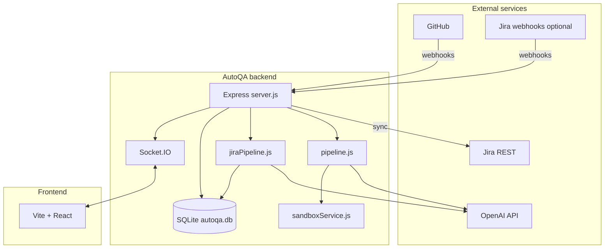
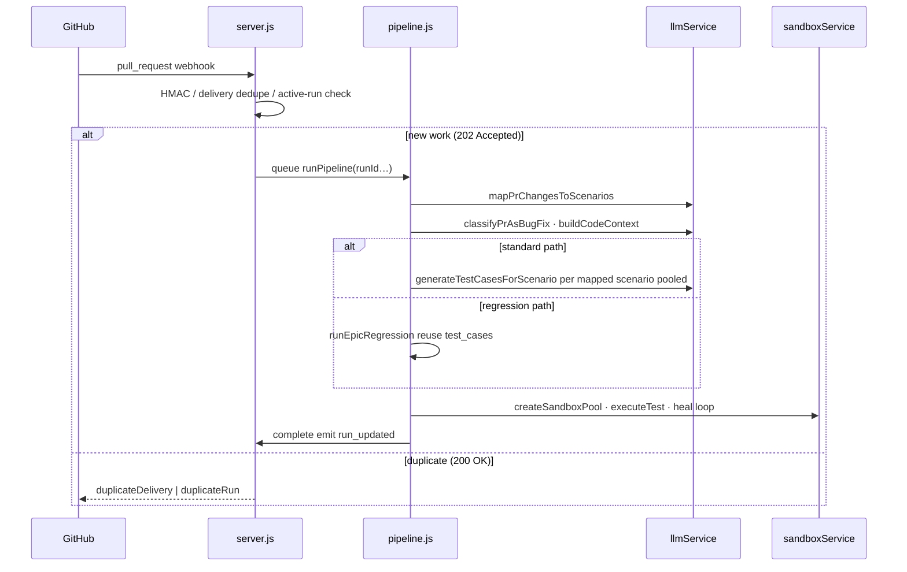

# AutoQA

AutoQA is a local, **AI-assisted quality workflow** for teams that use **Jira** for requirements and **GitHub** for code. It maintains an **RTM-style** catalog of test **scenarios** in SQLite, links each AutoQA **project** to a Jira space and a GitHub repository, and runs a **PR pipeline** that: maps PR changes to relevant scenarios, calls the **OpenAI API** to generate or reuse **executable test scripts**, runs them in an isolated **Docker** sandbox (**Jest**, **Playwright Test**, or **pytest**), and on failure can **heal** (rewrite) the failing script up to a limit. A **React + Vite** dashboard talks to a **Node.js Express** backend over **REST** and **Socket.IO**.

This README is a **deep technical reference**: architecture, **end-to-end flows**, **what the OpenAI model is asked on every pipeline step** (static **instructions** vs variable **input**, **schemas**, **stateful threads**), **worked examples**, **sandbox / Playwright behavior**, **repository and per-file roles**, configuration, APIs, and operations.  
**Note:** “Commands” in this stack are of two kinds: (1) **HTTP calls to OpenAI’s Responses API** (`client.responses.create` in [`llmService.js`](code/backend/services/llmService.js) and sibling modules), which carry **prompts** and **context**; (2) **host/Docker commands** that run after generation (git, `npm install`, Jest, Playwright) — see [Sandbox execution](#sandbox-execution-and-test-healing).

---

## Table of contents

1. [Overview and goals](#overview-and-goals)
2. [High-level architecture](#high-level-architecture)
3. [Worked example: GitHub PR pipeline](#worked-example-github-pr-pipeline-from-webhook-to-complete)
4. [Worked example: Jira to RTM scenarios](#worked-example-jira-to-rtm-scenarios)
5. [Application flow summaries](#application-flow-summaries)
6. [LLM: Responses API, prompts, and variable context](#llm-responses-api-prompts-and-variable-context)
7. [LLM context reference (exhaustive)](#llm-context-reference-exhaustive)
8. [Recent repository changes (structural)](#recent-repository-changes-structural)
9. [Repository layout (tree)](#repository-layout-tree)
10. [File encyclopedia (every source file)](#file-encyclopedia-every-source-file)
11. [Data model](#data-model)
12. [Workflow: Jira to scenarios](#workflow-jira-to-scenarios-rtm)
13. [Workflow: GitHub PR to test run](#workflow-github-pr-to-test-run)
14. [Bug-fix classification and epic regression](#bug-fix-classification-and-epic-regression)
15. [Sandbox execution and test healing](#sandbox-execution-and-test-healing)
16. [Code context pruning (`astPrunerService`)](#code-context-pruning-astprunerservice)
17. [Run outcome semantics](#run-outcome-semantics)
18. [Platform updates: persistence, webhooks, sandboxes, LLM quality](#platform-updates-persistence-webhooks-sandboxes-llm-quality)
19. [HTTP API reference](#http-api-reference)
20. [Real-time events (Socket.IO)](#real-time-events-socketio)
21. [Frontend map](#frontend-map)
22. [Configuration (environment variables)](#configuration-environment-variables)
23. [First-party Playwright E2E (this repo)](#first-party-playwright-e2e-this-repo)
24. [Local development and operations](#local-development-and-operations)
25. [Failure handling and dead letter queue](#failure-handling-and-dead-letter-queue)
26. [Security notes](#security-notes)
27. [Troubleshooting](#troubleshooting)
28. [**GitHub PR pipeline — complete file \& API reference**](#github-pr-pipeline--complete-file--api-reference) (authoritative detail for `runPipeline`)

---

## Overview and goals

- **Scenarios** (`rtm_scenarios` in SQLite) are the backbone of traceability: they tie Jira epics/stories/ACs to testable conditions consumed by PR mapping and generation.
- **GitHub webhooks** drive PR runs: qualifying `pull_request` events are **deduplicated** by **`X-GitHub-Delivery`** and by an **active run** row in SQLite (same `prUrl`, `status='running'`). Responses: **202** `{ accepted: true, runId }` when a new run starts; **200** `{ duplicateDelivery: true }` or `{ duplicateRun: true, runId }` when replay-safe no-ops apply. [`runPipeline`](code/backend/pipeline.js) continues asynchronously.
- **Jira** feeds scenario generation via REST sync, manual **sync-jira**, and optional **Jira webhooks** (queued via [`jiraWebhookQueueService`](code/backend/services/jiraWebhookQueueService.js)).
- **OpenAI** (official `openai` SDK in [`llmService.js`](code/backend/services/llmService.js) and specialised modules under [`code/backend/services/`](code/backend/services/)) powers: Jira→scenario authoring (separate from the PR pipeline), **PR→scenario mapping**, **bug-fix classification**, **per-mapped-scenario test generation**, and **healing** of failing scripts. *Unmapped PR files no longer get a separate “fallback smoke” generation path—[`classifyChangedFiles`](code/backend/pipeline.js) is only used for the early **noop** gate (see [§27](#github-pr-pipeline--complete-file--api-reference)).*
- **Docker** sandboxes clone the PR head (or receive flat file payloads), install dependencies, run the harness, then **cleanup** containers and temp dirs.

**Audience:** developers and QA operating the dashboard, wiring webhooks, or extending prompts and execution. For **exact prompt assembly and API fields**, start at [LLM: Responses API, prompts, and variable context](#llm-responses-api-prompts-and-variable-context).

---

## High-level architecture



- **Single process:** [`server.js`](code/backend/server.js) creates an `http.Server`, mounts Express, attaches Socket.IO (`global.io`).
- **Persistence:** [`db.js`](code/backend/db.js) uses `better-sqlite3` with WAL. Projects also live in **`data/projects.json`** via [`projectStore.js`](code/backend/services/projectStore.js).
- **Orchestration:** [`pipeline.js`](code/backend/pipeline.js) (PRs), [`jiraPipeline.js`](code/backend/jiraPipeline.js) (Jira→scenarios).

---

## Worked example: GitHub PR pipeline (from webhook to complete)

Assume project **P** links `ACME/acme-app` and Jira project **ACME**, with scenarios already in SQLite from a prior Jira sync.

1. **GitHub** sends `pull_request` (`opened` / `synchronize` / `reopened`) to `POST /api/webhooks/github`.
2. [`server.js`](code/backend/server.js) verifies **HMAC** (if `GITHUB_WEBHOOK_SECRET` is set — see [Troubleshooting](#troubleshooting)), inserts **`webhook_deliveries`** keyed by **`X-GitHub-Delivery`** (replay ⇒ **200** `duplicateDelivery`). If project P is linked, checks **`run_history`** for **`prUrl` + `status='running'`** (⇒ **200** `duplicateRun` with existing **`runId`**). Otherwise allocates **`runId`**, responds **202** `{ accepted: true, runId }`, emits **`pr_opened`** / **`refresh_data`**, schedules **`runPipeline`**.
3. **`runPipeline(runId, prUrl, repoFullName)`** starts in the same Node process **`createRun(..., prUrl)`** (partial unique index: at most one **`running`** row per **`prUrl`**). Duplicate insert races exit without noisy failure.
4. **Fetch PR** metadata and **files** ([`githubService.js`](code/backend/services/githubService.js)).
   - **Load scenarios** for P’s Jira key into a **catalog JSON** for mapping.
   - **LLM:** `mapPrChangesToScenarios` — variable `input` includes **SCENARIO CATALOG**, **PR title/branch**, **changed files** with **patch** and **content** caps, and **project document** text slices (see [LLM matrix](#call-matrix-instructions-vs-variable-input)). **Scenario mapping stats** (`map_attempts` / `map_hits` on **`rtm_scenarios`**) update after mapping.
   - **`classifyChangedFiles`** (in [`pipeline.js`](code/backend/pipeline.js)) classifies changed paths as frontend/backend “testable” for an **early exit** only: if **no** scenarios mapped **and** **no** such testable files → **`complete.success: true`** and the run stops. If there are testable files but **zero** mapped scenarios, the run continues into the **standard** branch: **no** LLM test generation runs, but **`overall_success`** is still computed as **`[].every(...)` → true** (vacuous pass) while the sandbox pool may still be created — see **[run outcome semantics](#run-outcome-semantics)** and [§27](#github-pr-pipeline--complete-file--api-reference). If scenarios **are** mapped but **generation yields zero** test cases for one of them ⇒ that scenario counts as failure under the same semantics.
5. **`setLlmRunContext(runId)`** for the pipeline lifetime wires **SQLite LLM traces** + **per-run token rollups** (see [LLM traces and token rollups](#llm-traces-and-token-rollups)).
6. **Parallel work:** `classifyPrAsBugFix` (if regression enabled) and **`buildCodeContext`** (full files, inferred tests, **dependency** text). Large files may be **pruned** ([`astPrunerService.js`](code/backend/services/astPrunerService.js)).
7. **Branch — regression vs generation:**
   - If **bug-fix** and **`REGRESSION_ENABLED`** **and at least one scenario was mapped:** [`runEpicRegression`](code/backend/pipeline.js) loads **existing** `test_cases` for all scenarios under the touched epics, **skips** new **`generateTestCasesForScenario`** calls, waits for the **sandbox pool**, and executes those scripts with the same **`executeTestCaseWithRetries`** / heal loop (**`regressionMode: true`**). On success after a heal, cases can be stamped **`adapted`** vs **`clean_pass`** (see §27). There is **no** follow-up “fallback smoke” phase in the current tree.
   - **Else (standard path):** **`sandboxTask`** runs in parallel with generation/execution; **`generateTestCasesForScenario`** runs for each mapped scenario behind a **concurrency pool** (`AUTOQA_LLM_MAX_CONCURRENT_GENERATION`) with a **sliding-window** `alreadyGeneratedSummary` (`AUTOQA_LLM_ALREADY_GENERATED_MAX_ENTRIES`). Each result **upserts** `test_cases` with **conversation / response ids** for later heals. Generated cases are **queued** for the background executor as soon as they are persisted.
8. **Syntax check** ([`validateSyntaxLocal`](code/backend/services/sandboxService.js)): cheap `new Function` / Python `ast` parse before Docker.
9. **Sandbox pool** ([`createSandboxPool`](code/backend/services/sandboxService.js)): **`SANDBOX_MAX_CONCURRENT`** global semaphore; per pool slot, temp dir; **`git clone`** via **`http.extraHeader` Basic auth** (`x-access-token` + `GITHUB_TOKEN`) when configured—clone URL stays **`https://github.com/org/repo.git`** without embedding the secret in the URL string. **`npm install`** for app if `package.json`, preinstall **Jest**, **`@playwright/test@` + `PLAYWRIGHT_VERSION`**, **`wait-on`**, etc.
10. **executeTest:** Jest path **or** Playwright path (detected by `@playwright/test` substring). Playwright: **`npm run dev` / start** wrapped so the shell writes **`/tmp/autoqa-dev.pid`**; teardown **`kill $PID`** then fallback **`pkill`**. Copies **screenshots/traces** to `data/artifacts/...` when configured.
11. On **failure:** **`repairTestCaseScript`** asks the model for **structured JSON** `{ "testScript": "..." }` (with string fallback parsing). It may prepend **`heal_patterns`** hints for that **`scenarioId`**. Retry up to **`MAX_HEAL_ATTEMPTS`**. Exhaustion sets **`test_cases.heal_exhausted`** and persists final **`fail`**.
12. **`cleanupSandboxPool`**, **`complete`** or **`failed`** with **`overall_success`** on **`run_history`**, **`setLlmRunContext(null)`**, **`refresh_data`**.



---

## Worked example: Jira to RTM scenarios

1. Operator triggers **`POST /api/projects/:id/sync-jira`** or Jira sends **`jira:issue_updated`** to **`/api/webhooks/jira`** with transition into **`JIRA_TRIGGER_STATUS`**.
2. Job hits **[`jiraWebhookQueueService`](code/backend/services/jiraWebhookQueueService.js)** (serialized worker).
3. **`runJiraPipeline`** loads **Jira documents** for the AutoQA project, **`extractTextFromFiles`**, groups stories by epic where applicable.
4. **LLM:** **`generateTestScenariosForEpic`** (batch) or per-story **`generateTestScenarios`** — both use cached **`SCENARIO_SYSTEM_INSTRUCTION`** plus epic/story text and doc chunks (see [matrix](#call-matrix-instructions-vs-variable-input)).
5. **`upsertScenario`** for each structured scenario; optional **`postScenarioComment`** on Jira stories.
6. **`jira_scenarios_generated`**, **`refresh_data`**, and **`jira_queue_updated`** (when the webhook queue mutates) emitted.

---

## Application flow summaries

### Jira → scenarios ([`runJiraPipeline`](code/backend/jiraPipeline.js))

See [Workflow: Jira](#workflow-jira-to-scenarios-rtm) and the worked example above.

### GitHub PR → tests ([`runPipeline`](code/backend/pipeline.js))

See [Workflow: GitHub](#workflow-github-pr-to-test-run) and the worked example above.

---

## LLM: Responses API, prompts, and variable context

This section is the **authoritative narrative** for what the model receives. Implementation lives primarily in [`llmService.js`](code/backend/services/llmService.js), [`prScenarioMappingService.js`](code/backend/services/prScenarioMappingService.js), and [`prClassificationService.js`](code/backend/services/prClassificationService.js).

### What “command” means here

- **To OpenAI:** Each LLM step is a **`client.responses.create({...})` call** (official Node SDK). There is no shell involved. Typical fields:
  - **`model`** — defaults to `OPENAI_MODEL` or `gpt-5.4-mini`.
  - **`instructions`** — long, **static** system-style rules. Kept stable per call-type so **prompt caching** (`prompt_cache_key` + optional `prompt_cache_retention`) can discount repeated prefix tokens.
  - **`input`** — **variable** user message: scenario text, PR diffs, file contents, etc. Often a single string; in **ZDR** mode it can become a **multi-item** list after **`applyStatefulInput`** (see below).
  - **`text.format`** — usually **`type: 'json_schema'`** with **`strict: true`**, enforcing structured outputs (`mappings`, `testCases`, `testScript`, Jira `scenarios`, classifier verdict).
  - **`reasoning`** — `{ effort, summary }` per step; effort is **env-tuned per task** (scenario authoring vs test generation vs heal).
  - **`store`** — `true` for most calls so threads can continue; **`false`** in ZDR mode.
  - **Threading:** `conversation` (Conversations API id) or `previous_response_id` chaining — see **Stateful modes**.
- **To the sandbox (after the model returns code):** Separate **`docker` / `npm` / `npx playwright test` / `jest`** invocations in [`sandboxService.js`](code/backend/services/sandboxService.js). Those are **not** passed as LLM prompts; they execute the generated `testScript`.

### `instructions` vs `input` (and why it matters for caching)

OpenAI’s Responses API treats **`instructions`** as a stable prefix. AutoQA mirrors that design:

- **Mapping** ([`PR_MAPPING_INSTRUCTIONS`](code/backend/services/prScenarioMappingService.js)) — short analyst rules (“map only to catalog IDs”, confidence 0–1, `unresolvedChanges`, JSON shape).
- **Bug-fix classification** ([`CLASSIFIER_INSTRUCTIONS`](code/backend/services/prClassificationService.js)) — definition of “just a bug fix” vs feature/refactor, title/body heuristics, required JSON fields.
- **Jira → RTM scenarios** ([`SCENARIO_SYSTEM_INSTRUCTION`](code/backend/services/llmService.js)) — narrative + ID patterns (`SCN-<storyKey>-n`), UI-vs-API phrasing, four scenario types.
- **PR test generation** ([`TESTCASE_GENERATION_INSTRUCTIONS`](code/backend/services/llmService.js)) — long block: Playwright-first strategy, **testData** vs **testScript** separation, CommonJS, `getByRole`/`getByLabel`, Jest+supertest **only** for API-only surfaces, steps schema `{ action, expectedResult }`, file-store reset rules, etc.
- **Heal** ([`HEAL_INSTRUCTIONS`](code/backend/services/llmService.js)) — fix failing script, never redeclare `testData`, return **only** `{ "testScript": "..." }`.

Everything **repository-specific** (this PR’s diff, file bodies, catalog JSON, Jira story text) goes in **`input`** so the **`instructions`** hash stays identical across runs of the same call type → **better `cached_tokens` hits** (see server logs: `[LLM usage] caller: in=… cached=…`).

### Stateful modes (`OPENAI_STATEFUL_MODE`)

| Mode | `responses.create` extras | Effect on `input` |
|------|---------------------------|-------------------|
| **`conversation`** (default) | `store: true`, `conversation: <id>` | Full string `input`; prior turns live server-side on that conversation. **`generateTestCasesForScenario`** creates a conversation per **scenario** when needed; **`repairTestCaseScript`** serializes heals per **conversationId** to avoid API races. |
| **`chain`** | `store: true`, `previous_response_id` when continuing | Same string `input`; continuity via last response id (30-day retention on OpenAI side). |
| **`zdr`** | `store: false`, `include: ['reasoning.encrypted_content']` | **`applyStatefulInput`** may **prepend** prior turn **`reasoning`** items so encrypted chain-of-thought is replayed; base `input` wraps as `{ role: 'user', content: ... }` when needed. |

Helpers: **`buildStatefulParams`**, **`stripInternalParams`**, **`applyStatefulInput`** in [`llmService.js`](code/backend/services/llmService.js).

### Reasoning effort and model defaults (env)

| Env var | Default | Used on |
|---------|---------|---------|
| `OPENAI_MODEL` | `gpt-5.4-mini` | All callers unless overridden. |
| `OPENAI_SCENARIO_EFFORT` | `low` | `generateTestScenarios`, `generateTestScenariosForEpic`. |
| `OPENAI_TESTCASE_EFFORT` | `medium` | `generateTestCasesForScenario`, and **PR mapping** (`mapPrChangesToScenarios` — same tier as test-case work today). |
| `OPENAI_HEAL_EFFORT` | `high` | `repairTestCaseScript`. |
| `OPENAI_CLASSIFIER_EFFORT` | `low` | `classifyPrAsBugFix`. |

`OPENAI_PROMPT_CACHE_RETENTION` (e.g. `24h`), `OPENAI_OUTPUT_VERBOSITY`, and `OPENAI_REASONING_SUMMARY` apply across calls.

### Token budget and trimming

Before each **`responses.create`**, variable text is checked against **`PROMPT_TOKEN_BUDGET`** (~90% of **`MAX_TOKENS_ALLOWED`**, measured with **tiktoken `o200k_base`**). **`ensureWithinBudget`** may **truncate from the middle** of oversized `input` with a visible marker so the pipeline does not hard-fail on huge PRs. Mapping prefers keeping the **scenario catalog** at the top of the payload (see comment in [`prScenarioMappingService.js`](code/backend/services/prScenarioMappingService.js)).

### Call-by-call: what goes into `input` (variable context)

**1. `mapPrChangesToScenarios`** ([`prScenarioMappingService.js`](code/backend/services/prScenarioMappingService.js))

- **`instructions`:** `PR_MAPPING_INSTRUCTIONS` (impact analyst, catalog-only IDs, `unresolvedChanges`).
- **`input`** string blocks, in order:
  1. **`SCENARIO CATALOG`** — `JSON.stringify` of normalized RTM rows (`id`, `title`, `description`, `type`, `storyId`, `relatedReq`, …); only non-obsolete scenarios.
  2. **`PULL REQUEST CONTEXT`** — `Title`, `Branch`.
  3. **`CHANGED FILES`** — for each **code** file (extension filter): `filename`, `status`, **`patch`** capped at **6000** chars, **`fullContent`** capped at **6000** chars (from PR list-files fetch).
  4. **`PROJECT DOCUMENTS`** — up to **5** slices of extracted document text from linked uploads (non-code files excluded from file list earlier).
- **Schema output:** `mappings[]` + `unresolvedChanges[]` (`MAPPING_RESPONSE_SCHEMA`).

**2. `classifyPrAsBugFix`** ([`prClassificationService.js`](code/backend/services/prClassificationService.js))

- Skipped when linked Jira types already include **Bug** and **`REGRESSION_CLASSIFIER_LLM_EVEN_IF_JIRA_BUG`** is not set and blend weight is 0.
- **`instructions`:** `CLASSIFIER_INSTRUCTIONS`.
- **`input`:**
  - `PR TITLE`, `PR BRANCH`, full `PR BODY`.
  - **`LINKED JIRA ISSUES`** — JSON of `{ key, issueType }` from REST.
  - **`CHANGED FILES`** — `buildDiffDigest`: up to **20** files, each **`patch`** truncated to **1500** chars + note if more files omitted.
- **Schema:** `isBugFix`, `confidence`, `rationale`.

**3. `generateTestScenarios` (single story)** / **`generateTestScenariosForEpic` (batch)**

- **`instructions`:** `SCENARIO_SYSTEM_INSTRUCTION` (same for both).
- **`input`:** Free-form **English + embedded Jira text**, not diffs:
  - Per-story: epic key/summary, story key, title, description, acceptance criteria, **`Supporting Documents`** extracted text, optional **`[ALREADY ASSIGNED SCENARIO IDs]`** to avoid duplicate IDs/coverage.
  - Epic batch: epic line, **`Supporting Documents`**, **`Valid storyId values`**, **`Valid epicId value`**, then **all stories** with description + AC separated by `---`.
- **Schema:** `{ scenarios: [ ... ] }` (`SCENARIO_RESPONSE_SCHEMA`).
- **One-shot:** no conversation chaining for Jira scenario generation.

**4. `generateTestCasesForScenario` (PR pipeline)**

- **`instructions`:** `TESTCASE_GENERATION_INSTRUCTIONS` (Playwright-first, testData rules, steps shape, server cleanup, etc.).
- **`input`** string is assembled in code order:
  1. **Scenario header** — `ID`, optional `Title`, `Description`, `Type`, `Priority`, optional **`Acceptance Criteria (refs)`**.
  2. **`[FRONTEND DETECTION]`** — if [`detectFrontendFiles`](code/backend/services/llmService.js) sees UI paths, injects a **hard override**: only Playwright, no Jest+supertest.
  3. **`[REFINEMENT]`** — if superseding an existing case: prior **`testScript`** and version (from [`detectRefinementCandidates`](code/backend/pipeline.js)).
  4. **`[ALREADY COVERED IN THIS RUN — avoid duplicating…]`** — sliding window **`alreadyGeneratedSummary`**: prior scenarios’ titles, types, **`coveredInputs`** (from [`buildGenerationSummaryEntry`](code/backend/pipeline.js)); capped by **`AUTOQA_LLM_ALREADY_GENERATED_MAX_ENTRIES`**.
  5. **`[CHANGED CODE DIFF]`** — `prDiffSection` from pipeline (PR-anchored diff text).
  6. **`[FULL FILE CONTENTS]`** — `codeContextSection`: full files + inferred tests; large files may be **AST-pruned** first ([`astPrunerService.js`](code/backend/services/astPrunerService.js)).
  7. **`[DEPENDENCIES / PACKAGE INFO]`** — `dependenciesSection` (package manifests / pins).
  8. **`[REFERENCE EXAMPLES]`** — **structural** few-shot snippets (`FEW_SHOT_EXAMPLES.javascript` / `.python`), explicitly “format only, not this repo”.
  9. **`[REPOSITORY-STYLE EXAMPLES]`** — optional rows from **`reference_examples`** table (top Playwright/Jest/pytest snippets by `use_count`), truncated ~3500 chars each.
  10. **Closing task lines** — e.g. `TCN-${scenario.id}-<index>` pattern, 2–4 cases, `isRefinement`, and **`CRITICAL OVERRIDE`** block if frontend detected.
- **Post-processing:** **`enforceTestData`** backfills empty `testData` from script references; **`normalizeTestCaseSteps`** coerces steps to `{ action, expectedResult }` for DB/UI.
- **Schema:** `testCases[]` (`TESTCASE_RESPONSE_SCHEMA`); `testData` remains free-form JSON inside each case.

**5. `repairTestCaseScript` (heal)**

- **`instructions`:** `HEAL_INSTRUCTIONS`.
- **Stateful `input` (short):** When **`conversationId`** or **`previousInteractionId`** exists, only **new** material is sent: attempt number, **`[SANDBOX FAILURE OUTPUT]`**, failed **`testScript`**, “Fix the script.”, optional **`heal_patterns`** hint block (scenario-scoped past successful heal summaries from SQLite).
- **Stateless `input` (long):** If no chain or stale chain: full **`[WHAT THIS TEST VERIFIES]`**, **`[PREVIOUS ATTEMPT HISTORY]`**, **`heal_patterns`**, **`[CURRENT FAILED SCRIPT]`**, **`[CURRENT SANDBOX FAILURE OUTPUT]`**, **`[RELEVANT SOURCE CODE CONTEXT]`** (`codeContextSection`), **`[TEST DATA]`** as JSON, plus anti-repetition instructions.
- **Schema:** `{ testScript: string }` (`HEAL_RESPONSE_SCHEMA`). Parse fallbacks strip markdown fences if needed.

### Observability: what operators see of prompts

- **Live:** Socket.IO **`llm_trace`** events (`phase: 'request' | 'response'`) with truncated **`prompt`** / **`response`**, **`usage`** (input/output/**cached** tokens), **`caller`** label matching the rows above.
- **Persisted:** While **`setLlmRunContext(runId)`** is active in the PR pipeline, responses also append **`llm_trace_rows`** and roll up tokens on **`run_history`**. **`GET /api/runs/:runId/llm-traces`** and **`/llm-traces?run=<runId>`** in the UI replay them.

---

## LLM context reference (exhaustive)

The subsections below **summarize** the same surface (matrix, schemas, tracing) in compact form; the [preceding section](#llm-responses-api-prompts-and-variable-context) is the **detailed** walkthrough of prompts and variable context.

Every production LLM step uses the OpenAI **Responses** API (`client.responses.create`): a **fixed `instructions`** string participates in **prompt caching** via **`buildCacheParams`** / **`CACHE_KEYS`** in [`llmService.js`](code/backend/services/llmService.js); the **`input`** field holds variable context. **`emitLlmTrace`** (when enabled) publishes **`llm_trace`** over Socket.IO for the **Agent Console**.

### Cross-cutting mechanics (`llmService.js`)

- **`OPENAI_STATEFUL_MODE`:** `conversation` (default) — thread via **conversation** attachments; `chain` — **`previous_response_id`**; `zdr` — **`store: false`** with encrypted reasoning replay through **`applyStatefulInput`**.
- **Caching:** **`CACHE_KEYS`** includes **`qa:pr:mapping`**, **`qa:testcases:generate`**, classifier keys, Jira scenario keys, etc., plus **`prompt_cache_retention`** (e.g. `24h`). A stale **`qa:fallback:generate`** key may still exist in the constant object but has **no** live caller in the PR pipeline.
- **Token limits:** **`MAX_TOKENS_ALLOWED`** (30 000) via **tiktoken `o200k_base`**; **`OPENAI_PROMPT_BUDGET`** (~90% of ceiling); **`ensureWithinBudget`** trims **middle** of oversized **`input`** slices with a visible marker.
- **Traces:** **`llm_trace`** Socket.IO events stream request/response-shaped payloads live; **`llm_trace_rows`** + **`GET /api/runs/:runId/llm-traces`** persist the same for later inspection when a run **`runId`** is known.

### Call matrix: `instructions` versus variable `input`

| Trace label | When | Instructions (cached) | Variable `input` (high level) |
|-------------|------|-------------------------|------------------------------|
| **`mapPrChangesToScenarios`** | After PR fetch + doc load in [`pipeline.js`](code/backend/pipeline.js) | [`PR_MAPPING_INSTRUCTIONS`](code/backend/services/prScenarioMappingService.js) | **Scenario catalog** JSON (all RTM rows for the Jira project); **PR title/branch**; **changed files** with `filename`, `status`, **`patch`** capped (~6k) and **`fullContent`** capped (~6k); **project document text** up to 5 slices (non-code extensions omitted from mapping). Implemented in [`mapPrChangesToScenarios`](code/backend/services/prScenarioMappingService.js). |
| **`classifyPrAsBugFix`** | After mapping when `REGRESSION_ENABLED` | [`CLASSIFIER_INSTRUCTIONS`](code/backend/services/prClassificationService.js) | **PR title/body/branch**; **linked Jira issue types** from REST; **`CHANGED FILES`** digest: up to 20 files, **`patch`** truncated ~1500 chars each + note if truncated further ([`buildDiffDigest`](code/backend/services/prClassificationService.js)). Skipped when env disables regression; may skip LLM when Jira says **Bug** unless **`REGRESSION_CLASSIFIER_LLM_EVEN_IF_JIRA_BUG`**. |
| **`generateTestScenarios`** | Single-story path in [`jiraPipeline.js`](code/backend/jiraPipeline.js) | [`SCENARIO_SYSTEM_INSTRUCTION`](code/backend/services/llmService.js) | Epic/story keys and narrative; **acceptance criteria** text; **`Supporting Documents`** extracted text; optional **existing scenario IDs** hint to avoid duplicates ([`generateTestScenarios`](code/backend/services/llmService.js)). |
| **`generateTestScenariosForEpic`** | Batch epic path in [`jiraPipeline.js`](code/backend/jiraPipeline.js) | Same **`SCENARIO_SYSTEM_INSTRUCTION`** | Epic summary line; **concatenated stories** (description + AC); **`Supporting Documents`**; validated **`storyId` / `epicId`** enumerations ([`generateTestScenariosForEpic`](code/backend/services/llmService.js)). Falls back per-story on failure. |
| **`generateTestCasesForScenario`** | PR pipeline per mapped scenario (unless regression-only path) | [`TESTCASE_GENERATION_INSTRUCTIONS`](code/backend/services/llmService.js) plus schema discipline | **Scenario** block: `scenarioId`, narrative, type, priority, **`acceptanceCriteriaRef`**; **`[CHANGED CODE DIFF]`** (`prDiffSection`); **`[FULL FILE CONTENTS]`** (**`codeContextSection`**, possibly AST-pruned); **`[DEPENDENCIES / PACKAGE INFO]`**; **`testData`** rules (injected at runtime — must not be redeclared in scripts); optional **`[REFINEMENT]`** previous `testScript` when superseding; **`alreadyGeneratedSummary`** (sliding window from earlier scenarios in the same run); **`[REFERENCE EXAMPLES]`** (**`FEW_SHOT_EXAMPLES`**) — JS/TS/Python structural templates **only in `input`** so they are not part of cached instructions. **Threads** `conversationId` / `previousInteractionId` from DB when continuing a chain. Playwright-oriented wording in instructions: **CommonJS**, **`getByRole`/`getByLabel`**, respect **`AUTOQA_E2E_BASE_URL`** when present for `page.goto` origin, web-first **`expect(locator)...`**. Returns structured **`testCases`** JSON from **`responses.create`**. |
| **`repairTestCaseScript`** | After sandbox or local syntax failure (≤ **`MAX_HEAL_ATTEMPTS`** in [`pipeline.js`](code/backend/pipeline.js)) | [`HEAL_INSTRUCTIONS`](code/backend/services/llmService.js) | **Primary:** OpenAI **`text.format.type: json_schema`** enforcing **`{ "testScript": string }`**, with tolerant parsing if the model emits markdown. **Stateful:** when **`conversationId`** / **`previous_response_id`** chain is valid, the user turn can be **minimal** — last **`failureOutput`** + failing **`testScript`**. Otherwise a **manual history** fallback rebuilds context. **ZDR / reasoning:** prior encrypted **`reasoning`** items can be replayed across heal attempts. **`heal_patterns`** (per **`scenarioId`**) may prepend short summaries of past successful heals. |

### JSON / schema outputs

Structured outputs are constrained by **JSON schemas** wired into **`responses.create`** / **`text.format`** in [`llmService.js`](code/backend/services/llmService.js) — including PR **mapping**, **bug-fix classifier**, **`generateTestCasesForScenario`** (`testCases` array), **heal** (`testScript` string), and Jira **scenario** generators (separate from the PR pipeline).

---

## Recent repository changes (structural)

These are **engineering refactors** documented for operators upgrading long-lived clones:

| Area | Change |
|------|--------|
| **Dead code removed** | Deleted unused frontend pages/components that were **never routed** or **never imported** (`PipelineRunDetail`, `ExecutionStepper`, `DetailTabs`, `MetricCard`, `RTMMatrix`) and **`selectedRun`** state removed from [`App.jsx`](code/frontend/src/App.jsx). |
| **Alternate Jira service removed** | **`jiraScenarioService.js`** deleted; production Jira RTM uses **`llmService`** only (`generateTestScenarios*`). |
| **`BranchPolicyMatrix`** | No longer reads **empty** placeholder data from `AppContext`; uses a **local** empty list and an explicit **“no policies loaded”** empty state. **`AppContext`** trimmed of unused keys (`dashboardMetrics`, `branchPolicies`, `sandboxMatrix`, `healingHistory`, `auditLogs`). |
| **Dev scripts consolidated** | All hand-run utilities live under **`code/devscripts/`** (see [Local development](#local-development-and-operations)). Root **`start.js`**, **`clear.js`**, **`installbeforerun.js`** are thin **forwarders**. The legacy **`code/backend/scripts/`** directory was removed; **`npm run jira:*`** in [`code/backend/package.json`](code/backend/package.json) invokes **`node ../devscripts/...`**. |
| **Path helper** | **[`code/devscripts/_paths.js`](code/devscripts/_paths.js)** exposes `repoRoot`, `backendRoot`, `frontendRoot`, and **`loadBackendEnv()`** via `createRequire(backend/package.json)` so scripts work when run from any cwd. |
| **Playwright sandbox** | **`PLAYWRIGHT_VERSION`** in [`sandboxService.js`](code/backend/services/sandboxService.js) pins **Docker image** `mcr.microsoft.com/playwright:v{VERSION}-jammy` and **`@playwright/test@{VERSION}`** npm install. **`resolveDevCommandAndTargetUrl`** respects **`AUTOQA_E2E_BASE_URL`**, parses **`vite.config.*` `server.port`** heuristically, and reads **`-p` / `--port` / `PORT=`** from **`package.json` scripts**. Generated **`playwright.autoqa.config.cjs`** supports **`AUTOQA_PLAYWRIGHT_*` timeout/retry** envs and **`baseURL`** from **`AUTOQA_E2E_BASE_URL`**. |
| **First-party E2E** | **[`code/e2e/`](code/e2e/)** hosts **`@playwright/test`** smoke specs; **[`.github/workflows/playwright.yml`](.github/workflows/playwright.yml)** installs **Chromium** only and runs **`npx playwright test`** with **`webServer`** starting the Vite dev server on **`http://localhost:5173`**. |
| **Unmapped-file “fallback smoke” removed** | Earlier builds could LLM-generate smoke tests for PR files without scenario coverage (**`scenarioId: 'FALLBACK'`**). The current [`pipeline.js`](code/backend/pipeline.js) does **not** call that path; [`llmService.js`](code/backend/services/llmService.js) no longer exports a fallback generator. **`classifyChangedFiles`** remains only for the **early noop** gate. Legacy DB rows / UI badges may still show **`source: 'fallback'`**. |
| **Platform persistence + quality** | **`db.js`** migrations (**`webhook_deliveries`**, **`llm_trace_rows`**, **`heal_patterns`**, **`reference_examples`**, **`run_history`/`rtm_scenarios`/`test_cases` columns**—see [Platform updates](#platform-updates-persistence-webhooks-sandboxes-llm-quality)); **`overall_success`** semantics; **`SANDBOX_MAX_CONCURRENT`**; clone via **`http.extraHeader`**; **`npm test`** backend suites. |
| **Sayarat seed gitignore** | Path is now **`code/devscripts/seedSayaratJiraIssues.js`** (still **gitignored** for local datasets). |

---

## Repository layout (tree)

```text
QAPipeline/
├── .gitattributes
├── .gitignore
├── README.md
├── start.js                 # forwarder → code/devscripts/start.js
├── clear.js                 # forwarder → code/devscripts/clear.js
├── installbeforerun.js      # forwarder → code/devscripts/installbeforerun.js
├── .github/
│   └── workflows/
│       └── playwright.yml   # CI: Playwright smoke against frontend
└── code/
    ├── backend/
    │   ├── .env.example
    │   ├── SCHEMA_CHANGELOG.md
    │   ├── __tests__/
    │   │   ├── astPrunerService.test.js
    │   │   └── pipeline.integration.test.js
    │   ├── db.js
    │   ├── jiraPipeline.js
    │   ├── package-lock.json
    │   ├── package.json
    │   ├── pipeline.js
    │   ├── schemas.js
    │   ├── server.js
    │   └── services/
    │       ├── astPrunerService.js
    │       ├── documentAssociationStore.js
    │       ├── documentParserService.js
    │       ├── githubService.js
    │       ├── jiraService.js
    │       ├── jiraWebhookQueueService.js
    │       ├── llmService.js
    │       ├── prClassificationService.js
    │       ├── prScenarioMappingService.js
    │       ├── projectStore.js
    │       └── sandboxService.js
    ├── devscripts/          # operator utilities (see devscripts README)
    ├── e2e/                  # first-party Playwright (package.json, playwright.config.cjs, tests/)
    └── frontend/
        ├── .env.example
        ├── index.html
        ├── package-lock.json
        ├── package.json
        ├── postcss.config.js
        ├── tailwind.config.js
        ├── vite.config.js
        └── src/
            ├── App.jsx
            ├── index.css
            ├── main.jsx
            ├── components/
            ├── lib/
            └── pages/
```

### Runtime / gitignored artifacts

| Path | Purpose |
|------|---------|
| `**/node_modules/` | npm dependencies |
| `code/frontend/dist/` | Vite production build |
| **`code/backend/data/autoqa.db*`** (**`AUTOQA_DB_PATH`** overrides) | SQLite database + WAL |
| `code/backend/data/*.json` (except `.gitkeep` patterns) | Projects, requirements maps, baselines, run history JSON, Jira doc index |
| `code/backend/uploads/` | Uploaded requirements / Jira docs |
| `code/backend/data/artifacts/` | Failure screenshots & traces surfaced in UI |
| OS temp `autoqa-sandbox/` | Ephemeral clone roots for Docker mounts |
| `code/e2e/playwright-report/`, `code/e2e/test-results/` | Playwright output (**`code/e2e/test-results/`** is listed in **`.gitignore`**) |
| `code/backend/__tests__/fixture-autoqa-smoke-db-*.db` | Temp SQLite files from **`pipeline.integration.test.js`** (ignored by **`.gitignore`**) |
| `code/devscripts/seedSayaratJiraIssues.js` | Gitignored seed dataset for Sayarat helpers |

---

## File encyclopedia (every source file)

Numbers map **path → responsibility** (production code and tooling).

### Repository root

| Path | Used for |
|------|----------|
| [`.gitattributes`](.gitattributes) | Line-ending normalization (`text=auto`). |
| [`.gitignore`](.gitignore) | Excludes secrets, `node_modules`, builds, DB, uploads, Sayarat seed script, editor folders. |
| [`README.md`](README.md) | This document. |
| [`start.js`](start.js) | Loads [`code/devscripts/start.js`](code/devscripts/start.js); keeps child dev processes attached. |
| [`clear.js`](clear.js) | Runs [`code/devscripts/clear.js`](code/devscripts/clear.js) with repo root cwd for correct path math. |
| [`installbeforerun.js`](installbeforerun.js) | Forwards to [`code/devscripts/installbeforerun.js`](code/devscripts/installbeforerun.js); backend + frontend `npm install`. |

### `.github/workflows`

| Path | Used for |
|------|----------|
| [`playwright.yml`](.github/workflows/playwright.yml) | CI job: Node 22, `npm ci` in `frontend` + `e2e`, **`playwright install chromium --with-deps`**, **`playwright test`**; uploads HTML report artifact on failure. |

### `code/backend` (application server)

| Path | Used for |
|------|----------|
| [`server.js`](code/backend/server.js) | Express routes (projects, runs, Jira, GitHub, uploads, webhooks—including **`GET /api/runs/:runId/llm-traces`**, **`GET /api/dlq`**, **`POST /api/dlq/:id/replay`**, **`GET /api/projects/:projectKey/heal-exhausted`**), Socket.IO attachment, smee client wiring, signature verification helpers, DLQ publishes on critical failures, **`webhook_deliveries`** idempotency. |
| [`db.js`](code/backend/db.js) | SQLite schema/init (**`PRAGMA user_version`** migrations); CRUD for scenarios, runs, test cases, DLQ, story sync log, webhook deliveries, LLM traces, heal patterns, reference examples; **`getActiveRunByPrUrl`**; artifact URL helpers consumed by routes. |
| [`pipeline.js`](code/backend/pipeline.js) | **`runPipeline`**: **`setLlmRunContext`** first; **`createRun`** with **`prUrl`**, partial unique index races; **`attachPrScenarioMapping`** → **`mapPrChangesToScenarios`**; **`classifyChangedFiles`** early-exit noop when **no** mapped scenarios and **no** classifiable files; enrichment of mappings with RTM rows; parallel **`classifyPrAsBugFix`**, **`buildCodeContext`**, **`createSandboxPool`**; bug-fix **+** mapped → **`runEpicRegression`** (reuse DB **`test_cases`**, **`regressionMode`** heal stamps); else **standard** path — **`mapPool`**-bounded **`generateTestCasesForScenario`**, **`generationSummary`** window, background queue **`executeTestCaseWithRetries`** (**`repairTestCaseScript`**, **`upsertHealPattern`**, **`bumpReferenceExample`**, **`incrementScenarioTestOutcome`**). Phases and **`complete`** via **`createEventLogger`**. Constants: **`MAX_HEAL_ATTEMPTS`**, **`LLM_GEN_MAX_CONCURRENT`** (`AUTOQA_LLM_MAX_CONCURRENT_GENERATION`), **`LLM_ALREADY_GENERATED_MAX`** (`AUTOQA_LLM_ALREADY_GENERATED_MAX_ENTRIES`). |
| [`jiraPipeline.js`](code/backend/jiraPipeline.js) | **`runJiraPipeline`**: fetch issues/docs, call scenario LLM(s), upsert scenarios, Jira comments, emit progress. |
| [`schemas.js`](code/backend/schemas.js) | Zod schemas validating API bodies (e.g. webhook payloads, project create); exports **`CURRENT_SCHEMA_VERSION`**. |
| [`SCHEMA_CHANGELOG.md`](code/backend/SCHEMA_CHANGELOG.md) | Human changelog aligned with **`CURRENT_SCHEMA_VERSION`**. |
| [`package.json`](code/backend/package.json) | Backend dependencies, **`npm test`** (**`node --test`** suites), **`jira:*` npm scripts** pointing at **`../devscripts/`**. |
| [`package-lock.json`](code/backend/package-lock.json) | Deterministic backend dependency tree. |
| [`.env.example`](code/backend/.env.example) | Documented environment variables including **Playwright / AutoQA E2E** tuning. |

### `code/backend/__tests__`

| Path | Used for |
|------|----------|
| [`astPrunerService.test.js`](code/backend/__tests__/astPrunerService.test.js) | **`node --test`** coverage for large-file pruning heuristics. |
| [`pipeline.integration.test.js`](code/backend/__tests__/pipeline.integration.test.js) | Lightweight integration checks; **skips** on **`better-sqlite3`** NODE_MODULE_VERSION mismatch. |

### `code/backend/services`

| Path | Used for |
|------|----------|
| [`llmService.js`](code/backend/services/llmService.js) | Shared OpenAI **Responses** client: stateful modes (**`OPENAI_STATEFUL_MODE`**: `conversation` \| `chain` \| `zdr`), **`buildCacheParams`**, **`ensureWithinBudget`**, tracing (**`emitLlmTrace`**, **`llm_trace_rows`** when **`setLlmRunContext`**), token rollups. **PR pipeline exports:** **`generateTestCasesForScenario`**, **`repairTestCaseScript`**. **Jira pipeline exports:** **`generateTestScenarios`**, **`generateTestScenariosForEpic`**. Instruction constants include **`SCENARIO_SYSTEM_INSTRUCTION`**, **`TESTCASE_GENERATION_INSTRUCTIONS`**, **`HEAL_INSTRUCTIONS`**. Mapping and classifier live in sibling modules but use the same utilities. |
| [`githubService.js`](code/backend/services/githubService.js) | Octokit: PR metadata, diff, file contents, dependency discovery, inferred test companion paths. |
| [`jiraService.js`](code/backend/services/jiraService.js) | Jira REST wrappers, ADF helpers, connectivity checks. |
| [`jiraWebhookQueueService.js`](code/backend/services/jiraWebhookQueueService.js) | Serialized async queue for Jira-triggered jobs. |
| [`prScenarioMappingService.js`](code/backend/services/prScenarioMappingService.js) | **`mapPrChangesToScenarios`**: builds prompts, parses structured mapping JSON. |
| [`prClassificationService.js`](code/backend/services/prClassificationService.js) | **`classifyPrAsBugFix`** with Jira type short-circuit + LLM; optional **`REGRESSION_CLASSIFIER_JIRA_LLM_BLEND`**. |
| [`sandboxService.js`](code/backend/services/sandboxService.js) | **`createSandboxPool`**, **`executeTest`**, **`validateSyntaxLocal`**, **`cleanupSandboxPool`**, Playwright **`buildPlaywrightAutoqaConfigSource`**, artifact **`persistPlaywrightArtifacts`**, Windows-safe **`spawnCapture`**, Babel-assisted **dependency extraction** from test scripts for extra `npm installs`. **`PLAYWRIGHT_VERSION`** pins Docker + npm. |
| [`astPrunerService.js`](code/backend/services/astPrunerService.js) | Structural pruning/summarization of large files before **`[FULL FILE CONTENTS]`** prompts. |
| [`documentParserService.js`](code/backend/services/documentParserService.js) | Text extraction pipeline for PDF/Markdown/Office uploads used in Jira/sync flows. |
| [`documentAssociationStore.js`](code/backend/services/documentAssociationStore.js) | Read/write **`jiraDocuments.json`** associations keyed by AutoQA project id. |
| [`projectStore.js`](code/backend/services/projectStore.js) | CRUD for **`projects.json`** (names, GitHub slug, Jira key). |

### `code/devscripts` (manual operator tools)

| Path | Used for |
|------|----------|
| [`_paths.js`](code/devscripts/_paths.js) | Shared `backendRoot`, `frontendRoot`, `repoRoot`; **`loadBackendEnv()`**. |
| [`start.js`](code/devscripts/start.js) | Spawns **`node server.js`** in backend and **`npm run dev`** in frontend with stdio inherited. |
| [`clear.js`](code/devscripts/clear.js) | Wipes DB, JSON stores, uploads, artifacts, sandbox temp; recreates empty dirs. |
| [`installbeforerun.js`](code/devscripts/installbeforerun.js) | Sequential `npm install` backend then frontend. |
| [`checkJiraApi.js`](code/devscripts/checkJiraApi.js) | CLI: fetch one Jira issue by key (validate env). |
| [`simulateJiraWebhook.js`](code/devscripts/simulateJiraWebhook.js) | POST sample Jira webhook payload to local server. |
| [`deleteJiraStoryComments.js`](code/devscripts/deleteJiraStoryComments.js) | Maintenance: strip AutoQA-tagged Jira comments (dry-run default). |
| [`clearPipelineTestData.js`](code/devscripts/clearPipelineTestData.js) | Calls **`clearAllPipelineExecutionData()`** for dev DB hygiene. |
| [`seedTodoJiraIssues.js`](code/devscripts/seedTodoJiraIssues.js) | Seed “Pro To-Do FRD” structure in Jira (`--apply` to write). |
| [`deleteTodoJiraIssues.js`](code/devscripts/deleteTodoJiraIssues.js) | Deletes Todo seed issues (requires explicit flags). |
| [`deleteSayaratJiraIssues.js`](code/devscripts/deleteSayaratJiraIssues.js) | Deletes Sayarat FRD pairs; **`require`s** seed module. |
| [`seedSayaratJiraIssues.js`](code/devscripts/seedSayaratJiraIssues.js) | **Often gitignored** — local seed content for Sayarat flows. |
| [`README.md`](code/devscripts/README.md) | Short index of devscripts commands. |

### `code/e2e` (first-party Playwright)

| Path | Used for |
|------|----------|
| [`package.json`](code/e2e/package.json) | Declares **`@playwright/test`** dev dependency aligned (by policy) with backend sandbox major. |
| [`package-lock.json`](code/e2e/package-lock.json) | Lockfile for CI `npm ci`. |
| [`playwright.config.cjs`](code/e2e/playwright.config.cjs) | **`webServer`** runs `npm run dev` in **`../frontend`**, waits on **`http://localhost:5173`**, sets reporters, Chromium device profile. |
| [`tests/smoke.spec.cjs`](code/e2e/tests/smoke.spec.cjs) | Minimal smoke: home page heading visible. |

### `code/frontend`

| Path | Used for |
|------|----------|
| [`package.json`](code/frontend/package.json) / [`package-lock.json`](code/frontend/package-lock.json) | React 18 + Vite 5 + Tailwind + router + socket.io-client. |
| [`vite.config.js`](code/frontend/vite.config.js) | React plugin, build to `dist/`. |
| [`tailwind.config.js`](code/frontend/tailwind.config.js) | Tailwind theme/content paths. |
| [`postcss.config.js`](code/frontend/postcss.config.js) | Tailwind + autoprefixer pipeline. |
| [`index.html`](code/frontend/index.html) | HTML shell mounting **`src/main.jsx`**. |
| [`.env.example`](code/frontend/.env.example) | `VITE_JIRA_BASE_URL` and related build-time vars. |
| [`src/main.jsx`](code/frontend/src/main.jsx) | React `createRoot`, StrictMode, global CSS import. |
| [`src/index.css`](code/frontend/src/index.css) | Tailwind directives + app-wide styles / dark tokens. |
| [`src/App.jsx`](code/frontend/src/App.jsx) | Router, **`AppContext`** (`activeRuns`, `settings`, `toast`, `sidebarCollapsed`, `refreshKey`, `llmTraces`, `darkMode`, …), Socket.IO wiring, route table, toast UI. |
| [`src/pages/ProjectsHub.jsx`](code/frontend/src/pages/ProjectsHub.jsx) | `/` — list/create projects (`GET/POST /api/projects`). |
| [`src/pages/ProjectDashboard.jsx`](code/frontend/src/pages/ProjectDashboard.jsx) | `/projects/:projectId` — RTM dashboards, epic metrics, PR run workspace via query params, **Sandbox env** tab (.env import into `sandbox-env` store), scenario rows may show mapping / sandbox outcome badges sourced from **`rtm_scenarios`**. |
| [`src/pages/ProjectSettings.jsx`](code/frontend/src/pages/ProjectSettings.jsx) | `/projects/:projectId/settings` — Jira/GitHub linking, **per-project sandbox env** (full-map PUT), **`BranchPolicyMatrix`**, sync button. |
| [`src/pages/PipelineRunsList.jsx`](code/frontend/src/pages/PipelineRunsList.jsx) | `/pipelines` — runs table navigation into dashboard + **`runId`**; renders per-run token totals when present on **`run_history`**. |
| [`src/pages/ScriptDetail.jsx`](code/frontend/src/pages/ScriptDetail.jsx) | Generated script inspector; **Heal exhausted** when **`heal_exhausted`**; neutral **`smoke`** pill when **`source === 'fallback'`** (legacy **`FALLBACK`** data). |
| [`src/pages/AgentChatDebug.jsx`](code/frontend/src/pages/AgentChatDebug.jsx) | `/llm-traces` — rolling **`llm_trace`** from context; append **`?run=<runId>`** to load **`GET /api/runs/:runId/llm-traces`**. |
| [`src/components/Sidebar.jsx`](code/frontend/src/components/Sidebar.jsx) | Primary navigation + collapse. |
| [`src/components/Navbar.jsx`](code/frontend/src/components/Navbar.jsx) | Top chrome: search placeholder, theme toggle. |
| [`src/components/BranchPolicyMatrix.jsx`](code/frontend/src/components/BranchPolicyMatrix.jsx) | Policy matrix placeholder UI with empty-state copy (until API-backed policies exist). |
| [`src/components/EpicStackedChart.jsx`](code/frontend/src/components/EpicStackedChart.jsx) | Stacked visualization using **`epicMetrics`**. |
| [`src/lib/env.js`](code/frontend/src/lib/env.js) | **`import.meta.env`** helpers for external URLs. |
| [`src/lib/epicMetrics.js`](code/frontend/src/lib/epicMetrics.js) | Scenario strict status + per-epic aggregates for dashboards/charts. |

---

## Data model

### SQLite (`db.js`)

| Table | Purpose |
|-------|---------|
| **`rtm_scenarios`** | Scenario rows keyed by **`scenarioId`**, linked to **`projectKey`**, epic/story ids, textual fields, statuses, **`map_attempts`** / **`map_hits`** (PR mapping churn), **`test_pass_count`** / **`test_fail_count`**, **`schema_version`**, timestamps. |
| **`run_history`** | One row per pipeline execution: **`runId`**, **`repoFullName`**, **`prUrl`**, **`status`**, **`completedAt`**, JSON **`events`** / **`logs`**, legacy JSON **`llm_traces`** (UI history), **`scenario_statuses`**, optional **`localProjectId`**, OpenAI **`input_tokens_total`** / **`output_tokens_total`** / **`cached_tokens_total`**, **`overall_success`**. |
| **`test_cases`** | Executable artifacts: **`testScript`**, **`source`** (**`scenario`** \| **`fallback`** legacy), **`schema_version`**, versioning, **`healAttempts`**, **`heal_exhausted`**, **`conversationId`**, **`latestResponseId`**, **`scenarioId`** ( **`FALLBACK`** only on old rows), **`runId`**, optional **`regression`** / **`originalScript`** stamps after epic regression heals. |
| **`webhook_deliveries`** | Idempotency ledger for **`X-GitHub-Delivery`** and Jira synthetic keys (**`delivery_id`**). |
| **`llm_trace_rows`** | Persisted LLM dialog rows tied to **`runId`** (+ step labels / payloads) for **`GET /api/runs/:runId/llm-traces`**. |
| **`heal_patterns`** | Scenario-scoped text snippets from heals that ultimately passed—fed back into **`repairTestCaseScript`** hints. |
| **`reference_examples`** | Structural few-shot snippets for **`[REFERENCE EXAMPLES]`** in generation (**`prompt_key`**, **`use_count`**). |
| **`dead_letter_queue`** | Persisted webhook/pipeline failures for **`GET /api/dlq`** + manual replay tooling. |
| **`story_sync_log`** | Stores per-story hashes to dedupe unchanged Jira content across sync runs. |

### JSON files on disk (`code/backend/data/` — patterns in `.gitignore`)

| File | Owner module | Purpose |
|------|----------------|---------|
| **`projects.json`** | [`projectStore.js`](code/backend/services/projectStore.js) | Canonical AutoQA projects list. |
| **`requirementsMap.json`** | Routes in **`server.js`** | Maps uploaded requirement blobs to repos. |
| **`rtm_baselines.json`** | **`server.js`** | Baseline snapshots for repos. |
| **`jiraDocuments.json`** | [`documentAssociationStore.js`](code/backend/services/documentAssociationStore.js) | Associated Jira document metadata per AutoQA project. |
| **`runHistory.json`** | Parsed by helper in **`server.js`** | **Legacy/auxiliary**; live runs authoritative in **`run_history`**. Still deleted by **`clear.js`** resets. |

### Uploads (`code/backend/uploads/`)

Multipart uploads organized into subfolders; associations recorded through document store routes.

---

## Workflow: Jira to scenarios (RTM)

Detailed behavior (signatures, queue semantics, skipping unchanged stories via **`story_sync_log`**) mirrors the legacy README sections—now backed only by **`llmService` scenario generators**.

- **Manual:** `POST /api/projects/:projectId/sync-jira`
- **Webhook:** `POST /api/webhooks/jira` with **`jira:issue_updated`** transitioning into **`JIRA_TRIGGER_STATUS`**
- Processor calls **`runJiraPipeline`**; emits **`jira_scenarios_generated`**, **`refresh_data`**

Routes of interest remain: `/api/jira/health`, `/api/jira/spaces`, `/api/projects/:id/jira-rtm`, `/api/projects/:id/scenarios`, Jira documents CRUD, `/api/jira/queue`.

---

## Workflow: GitHub PR to test run

- **`POST /api/webhooks/github`** validates optional HMAC (**note:** implementation hashes **`JSON.stringify(req.body)`** when secret set—your GitHub configuration must match that behavior).
- **No fallback-smoke phase:** unmapped “testable” files do **not** currently trigger extra LLM work; see **[§27 GitHub PR pipeline](#github-pr-pipeline--complete-file--api-reference)** for exact gating and edge cases.

| Phase (socket `phase_update`) | Meaning |
|---------------------------------|--------|
| Initializing | Run accepted, metadata loading |
| PR Mapping | `mapPrChangesToScenarios` |
| Classification | Regression classifier (maybe skipped) |
| Code Context | File fetches + prompt assembly |
| Sandbox Setup | Docker pool provisioning |
| Syntax Validation | In-process AST/`new Function` gate before Docker |
| Test Generation | **`generateTestCasesForScenario`** per mapped scenario (bounded concurrency); **skipped** on pure epic-regression path |
| Sandbox Testing | `executeTest` iterations |
| Test Healing | `repairTestCaseScript` cycles |
| Regression Execution | `runEpicRegression` branch (only when PR is classified bug-fix **and** `mappedScenarios.length > 0`) |

Event types (**`run_updated`** `data`): `phase_update`, `log`, `pr_details`, `pr_scenario_mapping`, `pr_classification`, `scenario_execution_updated`, `test_case_attempt`, `test_cases_saved`, `regression_summary`, `run_summary_updated`, **`complete`**, **`error`**.

---

## Bug-fix classification and epic regression

Unchanged **core behavior**; **`REGRESSION_CLASSIFIER_JIRA_LLM_BLEND`** (see [Configuration](#configuration-environment-variables)) adds optional convex combination with linked Jira **Bug** linkage.

- **`REGRESSION_ENABLED`** (string check in pipeline), **`REGRESSION_BUGFIX_CONFIDENCE_THRESHOLD`**, **`REGRESSION_CLASSIFIER_LLM_EVEN_IF_JIRA_BUG`**, **`REGRESSION_CLASSIFIER_JIRA_LLM_BLEND`**
- **`classifyPrAsBugFix`** merges Jira **Bug** shortcut with LLM textual classification (**blend** optional)
- **`runEpicRegression`** runs only when **`REGRESSION_ENABLED`**, the PR is classified as a **bug-fix**, **and** **`mappedScenarios.length > 0`**; it replays existing **`test_cases`** across epic scope under the PR head with the same **`executeTestCaseWithRetries`** / heal loop. Success after a heal can set **`regression`** on the row to **`adapted`** vs **`clean_pass`**. **No mapped scenarios** + bug-fix classification falls through to the **standard** path (which then has **nothing** to generate if the map stayed empty — see [Run outcome semantics](#run-outcome-semantics)).

Refer to [`prClassificationService.js`](code/backend/services/prClassificationService.js) and **`runEpicRegression`** inside [`pipeline.js`](code/backend/pipeline.js).

---

## Sandbox execution and test healing

### Pool creation (`createSandboxPool`)

See [`sandboxService.js`](code/backend/services/sandboxService.js): Windows temp base vs POSIX `/tmp`; **`git clone --depth 1`** with **`http.extraHeader`** token auth when **`GITHUB_TOKEN`** exists (avoid secrets in URLs); **`SANDBOX_MAX_CONCURRENT`** global creation semaphore; overlay **`mock_data.json`** PR files when flagged; **`docker run`** with **`mcr.microsoft.com/playwright:v${PLAYWRIGHT_VERSION}-jammy`**; **`npm install`** for target app plus harness packages (**`jest`**, **`supertest`**, **`jest-environment-node`**, **`@playwright/test@` + pinned version**, **`wait-on`**).

### Playwright path (`executeTest` branch)

Detection: **`@playwright/test` substring** in authored script ⇒ write **`autoqa.spec.js`** (with injected preamble exposing **`testData`**) plus generated **`playwright.autoqa.config.cjs`** exporting:

| Setting | Meaning |
|---------|---------|
| `testMatch` | Locks to **`autoqa.spec.js`** |
| `forbidOnly` | Fail CI-ish misuse of `test.only` |
| `fullyParallel`, `workers: 1` | Deterministic serialized tests with CLI `--workers=1` echo |
| `screenshot`, `trace` | Failure screenshots always; traces per **`AUTOQA_PLAYWRIGHT_TRACE`** |
| **`timeout` / `retries` / `expect.timeout` / `actionTimeout`** | Optional env-driven (see Configuration) |
| **`baseURL`** | From forwarded **`AUTOQA_E2E_BASE_URL`** |

**Dev server inference:** **`resolveDevCommandAndTargetUrl`**: **`AUTOQA_E2E_BASE_URL`** wins; otherwise parse **`vite.config.*`** / npm script port flags / dependency heuristic (Vite ⇒ 5173, Next/Cra ⇒ 3000 fallback). Starts **`npm run dev` or `npm start`** **`docker exec -d`** (shell writes **`/tmp/autoqa-dev.pid`** then **`kill $PID`** on teardown, fallback **`pkill`**), then **`wait-on`** **`targetUrl`** (30 s unless overridden by infra).

**Artifacts:** zipped traces + PNGs harvested into **`code/backend/data/artifacts/<runId>/<testCaseSlug>/`** for REST + UI embedding.

### Jest path

Default when Playwright substring absent: **`jest`**, **`runInBand`**, **`--forceExit`**, **30 s test timeout**.

### Healing

[**`MAX_HEAL_ATTEMPTS`**](code/backend/pipeline.js) retries with **`repairTestCaseScript`** preserving OpenAI conversational context when configured. Exhaustion stamps **`test_cases.heal_exhausted`**. Persisted **`heal_patterns`** surface as hints on later heals; the **`reference_examples`** table feeds **`[REFERENCE EXAMPLES]`** few-shot snippets in generation **`input`**.

---

## Code context pruning (`astPrunerService`)

When a source file destined for **`[FULL FILE CONTENTS]`** exceeds **`LARGE_FILE_CHARS`** (~5000), Babel JSX/TS parses collapse long function bodies while preserving important top-level JSX returns for locator discovery. Python uses lightweight **`def` / `class`** body truncation. Parsing failure returns **original source** untouched.

Budget trimming via **`ensureWithinBudget`** remains a **secondary** scissors on the aggregated prompt after pruning.

---

## Run outcome semantics

- **`complete.success`** mirrors **`overall_success`** on **`run_history`**: **`true`** only when every **scenario that participated in the rollup** finishes with **`failed === 0`** and **`passed > 0`** for that scenario’s tally. Sticky partial success (“one green anywhere makes the whole run green”) **does not** apply on the standard PR path—that rule is **`every` mapped / regressed scenario must be fully green**.
- **Standard generation path (`runPipeline`):** rollup is **`mappedScenarios` only**. Each mapped scenario must have **at least one passing** sandbox run and **zero failures**. If generation returns **zero** test cases for a mapped scenario (after an LLM call that returned an empty array), that scenario’s **`failed`** count is incremented and the run **`complete`**s with **`success: false`**. There is **no** separate **`FALLBACK`** bucket in the rollup anymore.
- **Zero mapped scenarios:** if **`mappedScenarios.length === 0`** **and** **`classifyChangedFiles`** finds **no** frontend/backend-testable paths, the pipeline logs a noop and **`complete`**s **`success: true`**. If there **are** classifiable files but **still** zero mappings, the pipeline continues: **`[].every(...)`** makes **`overallSuccess === true`** even though **no** tests are generated or run — **Docker** may still spin up during the standard-path executor wait (**current behavior**; worth tightening if product requires failure or explicit “no coverage” status).
- **Epic regression (`runEpicRegression`):** rollup is **per epic scenario that had runnable `test_cases`**. If **no epic** resolves from mappings, **no** stored tests exist, or the epic set yields **zero** runnable cases, the regression helper returns **`success: true`** (nothing to regress—distinct from “tests ran and failed”). The PR pipeline does **not** attach any extra post-regression LLM phase.
- Interpret UI **`scenario_execution_updated`** “partial” statuses as **inter-run** aggregates (passed/failed counts), not **`overall_success`**.

---

## Platform updates: persistence, webhooks, sandboxes, LLM quality

This section summarizes **cross-cutting platform work**: SQLite-backed idempotency, run outcomes, tracing, healing memory, concurrency limits, safer git clones, schema versioning, and dashboard hooks. **`SCHEMA_CHANGELOG.md`** (`code/backend/SCHEMA_CHANGELOG.md`) lists column-level deltas against **`CURRENT_SCHEMA_VERSION`** (`code/backend/schemas.js`, currently **`2`**).

### Database migrations (`db.js`)

- **`PRAGMA user_version`** drives incremental DDL (additive migrations on startup).
- **New tables:** **`webhook_deliveries`** (GitHub **`X-GitHub-Delivery`**, Jira synthetic keys), **`llm_trace_rows`** (persisted prompts/responses per run/step), **`heal_patterns`** (summaries of heals that resulted in **`pass`**), **`reference_examples`** (few-shot script skeletons bumped on success).
- **Concurrency / dedupe:** partial **unique index** on **`run_history(prUrl)`** where **`status = 'running'`** so only **one active PR URL run** survives at rest (races **`createRun`** catch **`SQLITE_CONSTRAINT_UNIQUE`**).
- **`run_history`:** **`prUrl`**, token totals (**`input_tokens_total`**, **`output_tokens_total`**, **`cached_tokens_total`**), **`overall_success`** (**`INTEGER`** 0/1).
- **`rtm_scenarios`:** **`map_attempts`**, **`map_hits`**, **`test_pass_count`**, **`test_fail_count`**, **`schema_version`**.
- **`test_cases`:** **`heal_exhausted`**, **`schema_version`** on new inserts, **`source`** (`'scenario'` typical; **`'fallback`** legacy when old smoke rows exist), optional **`scenarioId: 'FALLBACK'`** on those legacy rows only.
- **Override path:** **`AUTOQA_DB_PATH`** relocates **`autoqa.db`** (defaults under **`code/backend/data/`**).

### Webhooks: delivery dedupe and active-run guard

GitHub (**`POST /api/webhooks/github`**): persists **`webhook_deliveries`**; duplicate **`X-GitHub-Delivery`** ⇒ **`200`** with **`duplicateDelivery`**. Queries **`run_history`** for **`prUrl` + `status='running'`** ⇒ **`200`** **`duplicateRun`**. **`_activePipelineRuns`** in-memory dedupe Map was **removed**—SQLite is authoritative.

Jira: enqueue path writes **`webhook_deliveries`** with a deterministic hash idempotency key; emits **`jira_queue_updated`** when queue depth bookkeeping changes (**`jiraWebhookQueueService.js`**).

### DLQ REST and replay

**`GET /api/dlq`** lists **`dead_letter_queue`** rows. **`POST /api/dlq/:id/replay`** re-enqueues **Jira**-shaped payloads when **`payload_json`** parses (see **`server.js`**). There is **no** separate admin token gate in-repo; **`GET /api/dlq/:id`** (single-row) and replay of **GitHub** webhook payloads are **not** implemented—treat DLQ replay as **operator / trusted-network** tooling for now.

### LLM traces and token rollups

**`setLlmRunContext(runId)`** ([`llmService.js`](code/backend/services/llmService.js)): while set, completions append **`llm_trace_rows`**, increment **`run_history`** token columns, and still emit **`llm_trace`** on Socket.IO for **`AgentChatDebug`**. **`GET /api/runs/:runId/llm-traces`** returns persisted rows for forensic review (Agent Console **`?run=<runId>`**).

### Healing memory and examples

Successful heals **`upsert`** **`heal_patterns`** rows (scenario-scoped summaries consumed as hints in **`repairTestCaseScript`**). **`reference_examples`** records structural templates surfaced as **`[REFERENCE EXAMPLES]`** in generation **`input`**; **`bumpReferenceExample`** adjusts usage counts when outcomes succeed.

### Legacy `FALLBACK` rows (historical)

Older builds could persist **`test_cases`** with **`scenarioId: 'FALLBACK'`** and **`source: 'fallback'`** for unmapped-file smoke tests. The **current** orchestrator does not create them. The dashboard may still render the neutral **smoke** pill for such rows if they exist in SQLite.

### PR classifier blend

When **`REGRESSION_CLASSIFIER_JIRA_LLM_BLEND`** is set (**0–1**), **`classifyPrAsBugFix`** can blend linked Jira **Bug** belief with LLM textual classification (**`prClassificationService.js`**) alongside **`REGRESSION_CLASSIFIER_LLM_EVEN_IF_JIRA_BUG`** behavior.

### Sandboxes and git clone hygiene

**`SANDBOX_MAX_CONCURRENT`** serializes **`acquireSandboxCreationSlot`** globally so bursts of **`docker run`** + **`git clone`** do not overwhelm the host. **`git clone`** uses **`http.extraHeader`** Basic auth (**`GITHUB_TOKEN`** as **`x-access-token`**) while keeping the clone URL **`https://github.com/org/repo.git`** (no embedded secret in `git`'s logged URL).

Playwright / dev-server teardown: launcher writes **`/tmp/autoqa-dev.pid`** and prefers **`kill $PID`** before broad **`pkill`** fallback (**`sandboxService.js`**).

### Frontend surfacing

- **`ProjectDashboard`:** scenario badges for mapping stats / test counters where exposed.
- **`PipelineRunsList`:** optional token rollup line from run row fields.
- **`ScriptDetail`:** **Heal exhausted** badge when **`test_cases.heal_exhausted`**; **`smoke`** neutral pill when **`source === 'fallback'`** (**legacy** **`scenarioId`** **`FALLBACK`** rows only).
- **`AgentChatDebug`:** **`/llm-traces?run=<runId>`** hydrates from **`GET /api/runs/:runId/llm-traces`**.
- **`App.jsx`:** listens for **`jira_queue_updated`** to refresh queue UX.

### Backend tests (`npm test`)

From **`code/backend`**, **`npm test`** runs **`node --test`** on **`__tests__/astPrunerService.test.js`** and **`__tests__/pipeline.integration.test.js`**. The integration suite **skips** when **`better-sqlite3`** native ABI mismatches **`process.versions.modules`** (`t.skip`), which often happens immediately after changing Node majors—run **`npm rebuild better-sqlite3`** locally.

---

## HTTP API reference

Base URL **`http://localhost:3001`** unless `PORT` changed.

### Projects

| Method | Path | Description |
|--------|------|-------------|
| GET | `/api/projects` | List |
| POST | `/api/projects` | Create |
| GET | `/api/projects/:projectId` | Fetch |
| GET | `/api/projects/:projectId/sandbox-env` | Per-project env map injected into PR sandboxes (**not** returned from list projects). Trusted/local operator model — add auth before exposing to tenants. |
| PUT | `/api/projects/:projectId/sandbox-env` | Replace full map: body `{ "env": { "KEY": "value" } }` (string values only). **`AUTOQA_` prefix keys rejected (400).** |
| DELETE | `/api/projects/:projectId/sandbox-env` | Remove stored sandbox env file |
| DELETE | `/api/projects/:projectId` | Delete |
| PATCH | `/api/projects/:projectId/jira-link` | Attach Jira project |
| PATCH | `/api/projects/:projectId/github-link` | Attach GitHub slug |
| POST | `/api/projects/:projectId/sync-jira` | Enqueue sync |

### Jira / scenarios

| Method | Path | Description |
|--------|------|-------------|
| GET | `/api/jira/spaces` | Space picker feed |
| GET | `/api/projects/:projectId/jira-rtm` | RTM JSON |
| GET | `/api/projects/:projectId/scenarios` | Scenario list |
| GET/POST/DELETE | `/api/projects/:projectId/jira-documents` | Doc associations |

### GitHub helpers

Common routes: repos listing, requirements mapping upload/delete, branch tree (`/api/github/repos/:owner/:repo/branch-tree`), baseline fetch.

### Runs & tests

| Method | Path |
|--------|------|
| GET | `/api/runs`, `/api/runs/:runId`, `/api/runs/:runId/test-cases`, `/api/runs/:runId/llm-traces` |
| GET | `/api/projects/:projectKey/heal-exhausted` |
| GET | `/api/dlq`, `POST /api/dlq/:id/replay` |
| DELETE | `/api/runs/:runId` |

### Webhooks

| Path | Purpose |
|------|---------|
| `POST /api/webhooks/github` | PR pipeline ingress (`202` with `runId`; **200** on duplicate **X-GitHub-Delivery** or active DB-backed run) |
| `POST /api/webhooks/jira` | Jira enqueue ingress (hashed idempotency key in **`webhook_deliveries`**) |

### Jira telemetry

`/api/jira/health`, `/api/jira/queue`

**Admin:** DLQ rows are listable via **`GET /api/dlq`** and can be re-queued with **`POST /api/dlq/:id/replay`** (Jira payloads re-enqueue when possible).

---

## Real-time events (Socket.IO)

**Authoritatively emitted:** `pr_opened`, **`run_updated`** (rich sub-types), **`jira_story_triggered`**, **`jira_scenarios_generated`**, **`refresh_data`**, **`llm_trace`**, **`jira_queue_updated`** (queue depth changes), and ancillary GitHub lifecycle events emitted from **`server.js`** (for example **`repo_created`**, **`branch_created`**—see [`server.js`](code/backend/server.js) for exact conditions).

**Frontend listeners without matching emitters in stock backend:** `jira_rtm_updated`, `jira_run_updated` are **reserved** hooks—rely on `refresh_data` / HTTP today.

---

## Frontend map

### Routes ([`App.jsx`](code/frontend/src/App.jsx))

| Path | Page component |
|------|----------------|
| `/` | **`ProjectsHub`** |
| `/projects/:projectId` | **`ProjectDashboard`** |
| `/projects/:projectId/settings` | **`ProjectSettings`** |
| `/pipelines` | **`PipelineRunsList`** |
| `/projects/:projectId/run/:runId/scripts` | **`ScriptDetail`** |
| `/llm-traces` | **`AgentChatDebug`** (append **`?run=<runId>`** to load persisted traces from **`GET /api/runs/:runId/llm-traces`**) |

**Run drill-through:** **`PipelineRunsList`** navigates to **`ProjectDashboard`** with query params (`workspace`, `runId`)—there is **no dedicated run detail route** after removal of unused alternate pages.

### `AppContext` fields (consumers rely on subset)

Exports (non-exhaustive): `activeRuns`, **`setActiveRuns`**, `settings`, `updateSettings`, **`showToast`**, `sidebarCollapsed`, `setSidebarCollapsed`, **`refreshKey`**, **`llmTraces`**, **`setLlmTraces`**, `darkMode`, `toggleDarkMode`.  
**Historical placeholder metrics** (**`dashboardMetrics`**, **`branchPolicies`**, **`sandboxMatrix`**, **`healingHistory`**, **`auditLogs`**) were removed as unused wiring.

---

## Configuration (environment variables)

Copy **`code/backend/.env.example` → `.env`** and fill secrets.

### Core infra

| Variable | Role |
|---------|------|
| `PORT` | HTTP listener (default **3001**) |
| `GITHUB_TOKEN` | Octokit operations + authenticated sandbox **`git clone`** (passed via **`http.extraHeader`**, not embedded in clone URL when set) |
| `AUTOQA_DB_PATH` | Optional override path for **`autoqa.db`** (defaults under **`code/backend/data`**) |
| `AUTOQA_LLM_MAX_CONCURRENT_GENERATION` | Cap parallel **`generateTestCasesForScenario`** calls per PR (default **4**; balances OpenAI rate limits vs latency). |
| `AUTOQA_LLM_ALREADY_GENERATED_MAX_ENTRIES` | Max prior scenario summaries in **`alreadyGeneratedSummary`** for dedupe hints (default **12**; **0** disables). |
| `SANDBOX_MAX_CONCURRENT` | Global cap on concurrent sandbox directory + Docker image creates (default **3**) |
| `REGRESSION_CLASSIFIER_JIRA_LLM_BLEND` | **0–1** weight blending LLM bug-fix verdict with linked Jira **Bug** issues (see **`prClassificationService`**) |
| `GITHUB_WEBHOOK_SECRET` | Enables GitHub webhook HMAC (must match hashing scheme in `verifyGitHubSignature`) |
| Jira **`JIRA_*`** block (`JIRA_BASE_URL`, `JIRA_USER_EMAIL`, `JIRA_API_TOKEN`, `JIRA_PROJECT_KEY`, **`JIRA_TRIGGER_STATUS`**) | Connectivity + webhook gating semantics |
| `JIRA_WEBHOOK_SECRET` | Optional signature validation |
| `OPENAI_*` cluster | Models, reasoning effort tiers, verbosity, caching retention, **`OPENAI_STATEFUL_MODE`**, classifier effort |
| `REGRESSION_*` | Regression classifier toggles/threshold |

### Sandbox & Playwright forwarding

| Variable | Role |
|----------|------|
| `SANDBOX_TIMEOUT_MS` | Docker/exec/spawn budget (default **120000**) |
| **`AUTOQA_E2E_BASE_URL`** | Overrides dev-server **`wait-on` target** AND Playwright **`baseURL`** inside generated **`playwright.autoqa.config.cjs`** (omit trailing slash) |
| `AUTOQA_PLAYWRIGHT_TRACE` | `off` / `on` / `retain-on-failure` / `on-first-retry` |
| `AUTOQA_PLAYWRIGHT_HEADED` | `1` / `true` for headed chromium (mostly unusable headless infra) |
| `AUTOQA_PLAYWRIGHT_SLOWMO_MS` | `slowMo` ms |
| `AUTOQA_PLAYWRIGHT_HTML_REPORT` | `1` adds HTML reporter under sandbox `test-results/playwright-html` |
| **`AUTOQA_PLAYWRIGHT_TEST_TIMEOUT_MS`** | Playwright **`defineConfig.timeout`** (per-test ceiling) |
| **`AUTOQA_PLAYWRIGHT_EXPECT_TIMEOUT_MS`** | **Web-first assertion** default timeout |
| **`AUTOQA_PLAYWRIGHT_ACTION_TIMEOUT_MS`** | Locator **`actionTimeout`** |
| **`AUTOQA_PLAYWRIGHT_RETRIES`** | Playwright **`retries`** integer |

Forwarded into **`docker exec -e`** for the **`npx playwright test`** invocation when set on the **host** backend process environment.

Frontend optional **`VITE_JIRA_BASE_URL`** (also documented in **`code/frontend/.env.example`**) for clickable Jira deeplinks.

---

## First-party Playwright E2E (this repo)

| Command | cwd | Effect |
|---------|-----|--------|
| `npm ci && npx playwright install chromium && npx playwright test` | `code/e2e` | Mirrors CI; **`webServer`** boots Vite. |

**CI:** [.github/workflows/playwright.yml](.github/workflows/playwright.yml) installs **only Chromium + OS deps**.

**Important:** Prefer **`http://localhost:5173`** (not `127.0.0.1`) for **Windows** parity with default Vite bind semantics during local troubleshooting.

---

## Local development and operations

### Canonical script locations

Everything you run manually for setup / resets / integrations should assume paths under **`code/devscripts/`** ([`README`](code/devscripts/README.md)).

| Goal | Typical invocation |
|------|---------------------|
| Install deps | `node installbeforerun.js` (root) |
| Reset state | `node clear.js` (root) |
| Run stack | `node start.js` (root) |
| Jira sanity | `cd code/backend && npm run jira:check -- QPT-1` |

### Backend developer scripts (`code/backend/package.json`)

| npm script | Target file |
|-----------|-------------|
| `test` | **`node --test`** on **`__tests__/astPrunerService.test.js`**, **`__tests__/pipeline.integration.test.js`** |
| `jira:check` | [`../devscripts/checkJiraApi.js`](code/devscripts/checkJiraApi.js) |
| `jira:simulate-webhook` | [`../devscripts/simulateJiraWebhook.js`](code/devscripts/simulateJiraWebhook.js) |
| `jira:delete-story-comments` | [`../devscripts/deleteJiraStoryComments.js`](code/devscripts/deleteJiraStoryComments.js) |
| `jira:seed-todo` / `jira:delete-todo` | [`seedTodoJiraIssues.js`](code/devscripts/seedTodoJiraIssues.js) / [`deleteTodoJiraIssues.js`](code/devscripts/deleteTodoJiraIssues.js) |
| `jira:seed-sayarat` / `jira:delete-sayarat` | Require local [`seedSayaratJiraIssues.js`](code/devscripts/seedSayaratJiraIssues.js) (often gitignored) + [`deleteSayaratJiraIssues.js`](code/devscripts/deleteSayaratJiraIssues.js) |

Pipeline data wipe standalone: **`node code/devscripts/clearPipelineTestData.js`** (loads backend `.env` via `_paths.js`).

### Docker requirement

Sandbox execution **requires Docker** locally or in CI for remote workers (this repo's **Playwright harness** differs from sandbox images).

---

## Failure handling and dead letter queue

- GitHub webhook `catch` ⇒ **`publishToDLQ('github_webhook', ...)`**
- Jira fatal handler ⇒ **`publishToDLQ('jira_webhook', ...)`**
- Inspect via **`GET /api/dlq`**; bounded replay via **`POST /api/dlq/:id/replay`** (Jira-shaped bodies only today).

---

## GitHub PR pipeline — complete file & API reference

This section is scoped to **`runPipeline`** and everything it **requires**—the path from **GitHub** → **SQLite** → **OpenAI** → **Docker** → **`complete`**. Jira→scenario authoring ([`jiraPipeline.js`](code/backend/jiraPipeline.js)) is orthogonal except that it fills **`rtm_scenarios`** consumed by PR mapping.

### Webhook ingress ([`server.js`](code/backend/server.js))

For **`pull_request`** **`opened` \| `synchronize` \| `reopened`**:

1. **`verifyGitHubSignature`** — when **`GITHUB_WEBHOOK_SECRET`** is set, compares **`X-Hub-Signature-256`** to **`HMAC-SHA256(secret, JSON.stringify(body))`** (the raw body is **not** used; configuring GitHub must match this).
2. **`insertWebhookDelivery`** on **`X-GitHub-Delivery`** — duplicate ⇒ **200** `{ duplicateDelivery: true }`.
3. Resolve **`linkedProject`** via **`findProjectByGithubRepo`**. A project must have **`jiraProjectKey`**, else **202** `{ accepted: true, ignored: true, reason: 'not_linked' }`.
4. **`getActiveRunByPrUrl(prUrl)`** — if a **`running`** row exists ⇒ **200** `{ duplicateRun: true, runId }`.
5. Allocate **`runId`** (`uuidv4`), respond **202** `{ accepted: true, runId }`.
6. **`process.nextTick`**: emit **`pr_opened`** / **`refresh_data`**, **`require('./pipeline').runPipeline(runId, prUrl, repoFullName)`**, **`.catch` → `publishToDLQ('github_webhook', …)`**.

Body validation uses **`githubWebhookSchema`** from [`schemas.js`](code/backend/schemas.js).

### Orchestrator ([`pipeline.js`](code/backend/pipeline.js))

| Unit | Responsibility |
|------|----------------|
| **`classifyChangedFiles`**, **`shouldSkipFileForFallback`**, **`isFrontendPathForFallback`**, **`isBackendPathForFallback`** | Heuristic PR-file tagging (**`frontend`** / **`backend`**). Helper names are legacy (“fallback”); the output is only used for the **noop** gate today (testable paths vs zero maps). |
| **`buildGenerationSummaryEntry`** | Derives **`coveredInputs`** titles + **`testData`** key paths for **`alreadyGeneratedSummary`** sliding window. |
| **`mapPool`** | Bounded-concurrency iterator used for parallel **`generateTestCasesForScenario`**. |
| **`createEventLogger`** | **`updateRun`** + Socket.IO **`run_updated`** / **`refresh_data`**; special-cases **`test_execution_started` / `test_execution_ended`** as **ephemeral** browser-tracking emits only. |
| **`attachPrScenarioMapping`** | Loads scenarios, docs, **`fetchPRDetails`**, **`mapPrChangesToScenarios`**, **`incrementScenarioMappingStats`**, returns **`mappings`** + embedded **`_prDetails`**. |
| **`parsePROwnerRepo`** | Derives **`owner`/`repo`** from **`headRepoFullName`**. |
| **`buildCodeContext`** | **`fetchFullFileContents`** for changed non-doc file paths, **`inferTestFilePaths`** companions, **`fetchPRDependencies`** text. |
| **`detectRefinementCandidates`** | Finds existing **`test_cases`** whose **`codeFiles`** intersect PR filenames; **`markTestCaseSuperseded`** and pass **refinement** context + prior **OpenAI** anchors into generation. |
| **`executeWithPool`** | Generic pool scheduler (used in **`runEpicRegression`**). |
| **`executeTestCaseWithRetries`** | Local **`validateSyntaxLocal`** gate; **`executeTest`** loop; on failure **`repairTestCaseScript`** up to **`MAX_HEAL_ATTEMPTS`** (3); **`upsertHealPattern`**, **`bumpReferenceExample`** after **pass** if heals occurred; **`incrementScenarioTestOutcome`**; **`runSummary`** counter updates; regression **clean_pass** / **adapted** stamping. |
| **`runEpicRegression`** | Expands **epic** scope from **`mappedScenarios`**, loads runnable **`test_cases`** per scenario, runs **`executeWithPool`** over **heal** loop. |
| **`runPipeline`** | Full state machine described in the [worked example](#worked-example-github-pr-pipeline-from-webhook-to-complete) and [run outcome semantics](#run-outcome-semantics). |

**Constants / env:** **`MAX_HEAL_ATTEMPTS = 3`**; **`LLM_GEN_MAX_CONCURRENT`** from **`AUTOQA_LLM_MAX_CONCURRENT_GENERATION`**; **`LLM_ALREADY_GENERATED_MAX`** from **`AUTOQA_LLM_ALREADY_GENERATED_MAX_ENTRIES`**. The **`generatedResults`** variable after **`mapPool`** is currently unused (harmless; safe to delete in a hygiene pass).

### GitHub integration ([`githubService.js`](code/backend/services/githubService.js))

Uses **`@octokit/rest`** with **`GITHUB_TOKEN`**.

| Function | Typical REST / network |
|----------|-------------------------|
| **`fetchPRDetails`** | **`pulls.get`**, **`pulls.listFiles`**, then **`fetch(file.raw_url)`** per file for full text (not the Git blob API). |
| **`fetchFullFileContents`** | **`repos.getContent`** per path on a given **`ref`**. |
| **`fetchPRDependencies`** | **`pulls.get`**, **`repos.get`**, **`repos.getContent`** for **`package.json`** / **`requirements.txt`** across head, base, default branch. |
| **`inferTestFilePaths`** | Naming heuristics (**`.test.`**, **`__tests__`**, etc.). |

### PR → scenario mapping ([`prScenarioMappingService.js`](code/backend/services/prScenarioMappingService.js))

- Filters PR files to **`CODE_EXTENSIONS`**; **skips** non-code for mapping.
- Builds variable prompt: **scenario catalog** JSON, PR title/branch, per-file **`patch` / `fullContent`** (6 000 char cap each), up to **five** **`documentTexts`** slices.
- **`client.responses.create`**: **`instructions: PR_MAPPING_INSTRUCTIONS`**, **`text.format.json_schema`** (**`MAPPING_RESPONSE_SCHEMA`**), **`reasoning.effort: TESTCASE_EFFORT`** (same exported tier as test-case work—**not** a separate mapping effort today), **`...buildCacheParams(CACHE_KEYS.PR_MAPPING)`**, **`store: true`**.
- Parses **`mappings`** + **`unresolvedChanges`**; drops unknown **`scenarioId`**s.

### Bug-fix classification ([`prClassificationService.js`](code/backend/services/prClassificationService.js))

- **`classifyPrAsBugFix({ prDetails })`**: may short-circuit from **linked Jira** issue types; else **`client.responses.create`** with **`CLASSIFIER_INSTRUCTIONS`**, **`buildDiffDigest`** in **`input`**, **`buildCacheParams(CACHE_KEYS.PR_CLASSIFIER)`**, optional **blend** with **`REGRESSION_CLASSIFIER_JIRA_LLM_BLEND`**.

### OpenAI — generation & heal ([`llmService.js`](code/backend/services/llmService.js), PR exports only)

**Shared infrastructure:** **`DEFAULT_MODEL`**, **`OPENAI_*`** reasoning / verbosity / cache retention, **`OPENAI_STATEFUL_MODE`** (**`conversation`** \| **`chain`** \| **`zdr`**), **`buildStatefulParams`**, **`applyStatefulInput`**, **`ensureWithinBudget`**, **`assertTokenLimit`**, **`emitLlmTrace`**, **`addRunTokenUsage`** when **`setLlmRunContext(runId)`** is active.

| Export | Role in PR pipeline |
|--------|---------------------|
| **`setLlmRunContext` / `getLlmRunContext`** | Thread-safe run id for traces + token rollups. |
| **`generateTestCasesForScenario`** | **`responses.create`** with cached **`TESTCASE_GENERATION_INSTRUCTIONS`**, variable **`input`** (scenario block, diffs, code context, deps, refinement, **`alreadyGeneratedSummary`**, few-shot **`REFERENCE EXAMPLES`**), **`text.format.json_schema`** for **`testCases`**, **`reasoning.effort: TESTCASE_EFFORT`**, stateful continuation via **`conversationId`** / **`previousInteractionId`**. Post-processes **`enforceTestData`**. |
| **`repairTestCaseScript`** | **`responses.create`** with **`HEAL_INSTRUCTIONS`**, **`text.format.json_schema`** **`HEAL_RESPONSE_SCHEMA`** (`{ testScript }`), **`reasoning.effort: HEAL_EFFORT`**, minimal or full **`input`** depending on chain validity; returns **`repairedScript`**, new **interaction** id, optional **reasoning** items for **ZDR**. |

Jira scenario functions (**`generateTestScenarios*`**) live in the same module but are **not** on the PR critical path.

### Context pruning ([`astPrunerService.js`](code/backend/services/astPrunerService.js))

**`pruneFileContentForContext(path, content, { onPrune })`** shrinks oversized files before they are concatenated into **`codeContextSection`** (Babel for JS/TS/JSX; Python **`def`/`class`** truncation heuristic).

### Sandbox execution ([`sandboxService.js`](code/backend/services/sandboxService.js))

Pipeline-critical exports:

- **`createSandboxPool`**, **`cleanupSandboxPool`** — **Docker** **`mcr.microsoft.com/playwright:v${PLAYWRIGHT_VERSION}-jammy`**, **`git clone`** with optional **`http.extraHeader`** **token**, **`SANDBOX_MAX_CONCURRENT`**, **`npm install`** / harness deps. Per-project env from **`readSandboxEnv(projectId)`** is passed as **`docker run -e`** so every **`docker exec`** (including the background dev server) inherits **`DATABASE_URL`**, etc.
- **`validateSyntaxLocal`** — **`new Function`** (JS) or Python **`ast`** parse before **`executeTest`**.
- **`executeTest`** — Jest vs **Playwright** branches, **`buildPlaywrightAutoqaConfigSource`**, dev-server **`docker exec -d`**, **`wait-on`**, artifact **`persistPlaywrightArtifacts`**.

### Persistence used by the pipeline ([`db.js`](code/backend/db.js))

**Writes / reads on the PR path include:** **`createRun`**, **`updateRun`**, **`incrementScenarioMappingStats`**, **`incrementScenarioTestOutcome`**, **`getScenariosByProject`**, **`getTestCasesByProject`**, **`getTestCasesByScenario`**, **`markTestCaseSuperseded`**, **`upsertTestCase`**, **`updateTestCaseStatus`**, **`upsertHealPattern`**, **`bumpReferenceExample`**, **`insertWebhookDelivery`** (via **`server.js`**), **`getActiveRunByPrUrl`**, **`listLlmTracesByRun`**, plus **`llm_trace_rows`** / token columns when **`setLlmRunContext`** is set.

### Project & document helpers

| Module | Pipeline use |
|--------|----------------|
| [`projectStore.js`](code/backend/services/projectStore.js) | **`findProjectByGithubRepo`** → **`jiraProjectKey`**, **`id`**. **`deleteProject`** removes **`sandbox-env/<id>.json`**. |
| [`sandboxEnvStore.js`](code/backend/services/sandboxEnvStore.js) | **`readSandboxEnv`**, **`writeSandboxEnv`**, **`deleteSandboxEnv`** — per-project env files under **`data/sandbox-env/`** (not merged into **`GET /api/projects`**). |
| [`documentAssociationStore.js`](code/backend/services/documentAssociationStore.js) | **`getDocsForProject`** → **`extractTextFromFiles`**. |
| [`documentParserService.js`](code/backend/services/documentParserService.js) | **`extractTextFromFiles`** for mapping prompt slices. |

### Schema versioning ([`schemas.js`](code/backend/schemas.js))

**`CURRENT_SCHEMA_VERSION`** stamped on new **`test_cases`** inserts from **`runPipeline`**.

### Frontend (pipeline UX only)

| File | Role |
|------|------|
| [`App.jsx`](code/frontend/src/App.jsx) | **`run_updated`**, **`llm_trace`**, **`pr_opened`**, **`test_execution_started` / `test_execution_ended`** for live run UI. |
| [`ProjectDashboard.jsx`](code/frontend/src/pages/ProjectDashboard.jsx) | Run/scenario workspace; **Sandbox env** tab imports `.env` files into the same store as **`GET/PUT /api/projects/:id/sandbox-env`**. |
| [`PipelineRunsList.jsx`](code/frontend/src/pages/PipelineRunsList.jsx) | Run list + token totals. |
| [`ScriptDetail.jsx`](code/frontend/src/pages/ScriptDetail.jsx) | Per-test-case script, heal exhaustion, legacy **smoke** pill. |
| [`AgentChatDebug.jsx`](code/frontend/src/pages/AgentChatDebug.jsx) | **`GET /api/runs/:runId/llm-traces`**. |
| [`LiveBrowserPanel.jsx`](code/frontend/src/components/LiveBrowserPanel.jsx) / [`VideoPlayer.jsx`](code/frontend/src/components/VideoPlayer.jsx) | Optional live / recorded sandbox playback when wired. |

### Automated tests touching the pipeline

[`code/backend/__tests__/pipeline.integration.test.js`](code/backend/__tests__/pipeline.integration.test.js) — lightweight integration (**skips** on **`better-sqlite3`** ABI mismatch). [`astPrunerService.test.js`](code/backend/__tests__/astPrunerService.test.js) — context pruning unit tests.

---

## Security notes

- Never commit real **`.env`**
- **Per-project sandbox secrets** are stored as **plain JSON on disk** under **`code/backend/data/sandbox-env/`** with **no encryption at rest**. That is intentional for a typical **single-operator local** deployment; multi-tenant or regulated environments should use a **secrets manager** or **encrypted volume**, not this store alone.
- **Reserved keys:** environment variable names prefixed with **`AUTOQA_`** are **rejected** for project sandbox env (server-enforced) so they cannot override harness behavior (e.g. Playwright base URL) inside the container.
- **`GET/PUT /api/projects/:id/sandbox-env`** return the full env map — treat as **trusted-operator / local** only until authentication gates exist; **`GET /api/projects`** does **not** embed these values.
- Webhook URLs on **smee** are demo-grade—use locked-down endpoints in prod
- **Avoid logging** authenticated git clone URLs with embedded **`GITHUB_TOKEN`**

---

## Troubleshooting

| Symptom | Checks |
|---------|--------|
| PR ignored | `githubRepoFullName` + **`jiraProjectKey`** linkage; webhook signature scheme |
| Mapping empty | Scenarios absent or LLM unrelated diff |
| Sandbox clone fails | **`GITHUB_TOKEN`**, network, **`SANDBOX_TIMEOUT_MS`** |
| Playwright `wait-on` timeout | **`AUTOQA_E2E_BASE_URL`**, **`scripts.dev`/`start`** presence, **`resolveDevCommandAndTargetUrl`** heuristic vs real `vite.config` port |
| **`better-sqlite3` ABI mismatch** after Node upgrade | `npm rebuild better-sqlite3` inside `code/backend` |
| First-party e2e `webServer` timeout (Windows) | Use **`localhost`**, bump timeout in **`playwright.config.cjs`** |
| Double runs / overlapping PR pipelines | **`webhook_deliveries`** + **`run_history(prUrl)`** partial unique index (**`status='running'`**) prevent duplicate GitHub deliveries and concurrent active runs for the same PR URL across process restarts—**not** just an in-memory Map. |

---

## License / maintenance

[`code/backend/package.json`](code/backend/package.json) declares **`"license": "ISC"`** until changed upstream.

Keep this **`README.md`** synchronized with edits to prompts, **`PLAYWRIGHT_VERSION`**, sandbox layout, Socket events, REST paths, `.env.example`, and **devscripts**.
