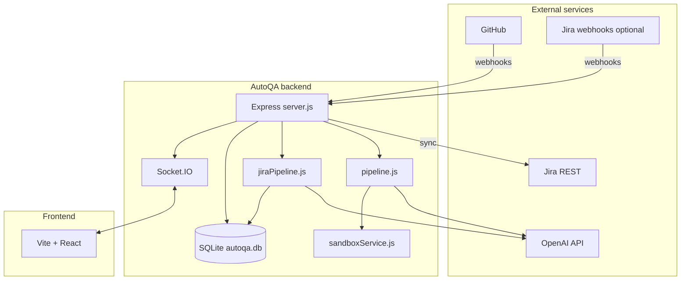
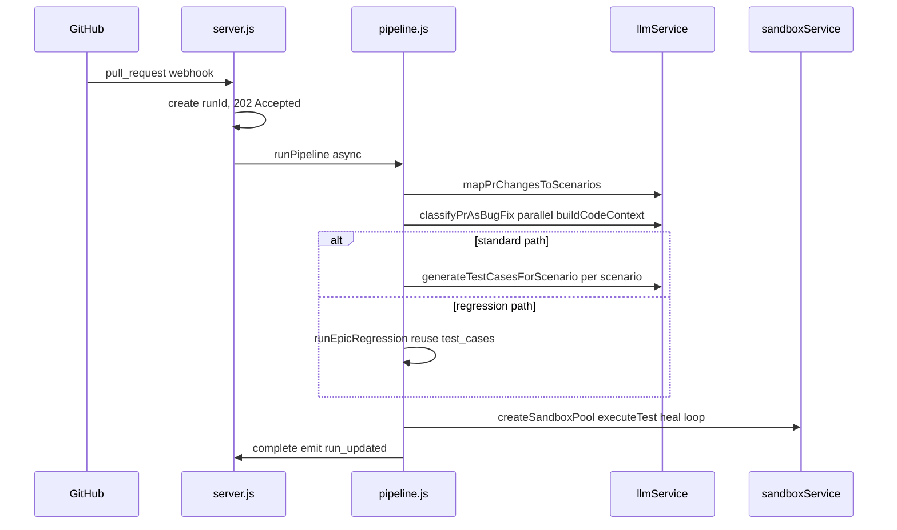

# AutoQA

AutoQA is a local, **AI-assisted quality workflow** for teams that use **Jira** for requirements and **GitHub** for code. It maintains an **RTM-style** catalog of test **scenarios** in SQLite, links each AutoQA **project** to a Jira space and a GitHub repository, and runs a **PR pipeline** that: maps PR changes to relevant scenarios, calls the **OpenAI API** to generate or reuse **executable test scripts**, runs them in an isolated **Docker** sandbox (**Jest**, **Playwright Test**, or **pytest**), and on failure can **heal** (rewrite) the failing script up to a limit. A **React + Vite** dashboard talks to a **Node.js Express** backend over **REST** and **Socket.IO**.

This README is a **deep technical reference**: architecture, **end-to-end flows**, **exactly what each LLM step receives**, **worked examples**, **sandbox / Playwright behavior**, **repository and per-file roles**, configuration, APIs, and operations.

---

## Table of contents

1. [Overview and goals](#overview-and-goals)
2. [High-level architecture](#high-level-architecture)
3. [Worked example: GitHub PR pipeline](#worked-example-github-pr-pipeline-from-webhook-to-complete)
4. [Worked example: Jira to RTM scenarios](#worked-example-jira-to-rtm-scenarios)
5. [Application flow summaries](#application-flow-summaries)
6. [LLM context reference (exhaustive)](#llm-context-reference-exhaustive)
7. [Recent repository changes (structural)](#recent-repository-changes-structural)
8. [Repository layout (tree)](#repository-layout-tree)
9. [File encyclopedia (every source file)](#file-encyclopedia-every-source-file)
10. [Data model](#data-model)
11. [Workflow: Jira to scenarios](#workflow-jira-to-scenarios-rtm)
12. [Workflow: GitHub PR to test run](#workflow-github-pr-to-test-run)
13. [Bug-fix classification and epic regression](#bug-fix-classification-and-epic-regression)
14. [Sandbox execution and test healing](#sandbox-execution-and-test-healing)
15. [Code context pruning (`astPrunerService`)](#code-context-pruning-astprunerservice)
16. [Run outcome semantics](#run-outcome-semantics)
17. [HTTP API reference](#http-api-reference)
18. [Real-time events (Socket.IO)](#real-time-events-socketio)
19. [Frontend map](#frontend-map)
20. [Configuration (environment variables)](#configuration-environment-variables)
21. [First-party Playwright E2E (this repo)](#first-party-playwright-e2e-this-repo)
22. [Local development and operations](#local-development-and-operations)
23. [Failure handling and dead letter queue](#failure-handling-and-dead-letter-queue)
24. [Security notes](#security-notes)
25. [Troubleshooting](#troubleshooting)

---

## Overview and goals

- **Scenarios** (`rtm_scenarios` in SQLite) are the backbone of traceability: they tie Jira epics/stories/ACs to testable conditions consumed by PR mapping and generation.
- **GitHub webhooks** drive PR runs: qualifying `pull_request` events yield **202 Accepted** with a `runId`; [`runPipeline`](code/backend/pipeline.js) continues asynchronously.
- **Jira** feeds scenario generation via REST sync, manual **sync-jira**, and optional **Jira webhooks** (queued via [`jiraWebhookQueueService`](code/backend/services/jiraWebhookQueueService.js)).
- **OpenAI** (official `openai` SDK in [`llmService.js`](code/backend/services/llmService.js)) powers: scenario authoring, PR→scenario mapping, bug-fix classification, per-scenario test generation, and **healing**.
- **Docker** sandboxes clone the PR head (or receive flat file payloads), install dependencies, run the harness, then **cleanup** containers and temp dirs.

**Audience:** developers and QA operating the dashboard, wiring webhooks, or extending prompts and execution.

---

## High-level architecture



- **Single process:** [`server.js`](code/backend/server.js) creates an `http.Server`, mounts Express, attaches Socket.IO (`global.io`).
- **Persistence:** [`db.js`](code/backend/db.js) uses `better-sqlite3` with WAL. Projects also live in **`data/projects.json`** via [`projectStore.js`](code/backend/services/projectStore.js).
- **Orchestration:** [`pipeline.js`](code/backend/pipeline.js) (PRs), [`jiraPipeline.js`](code/backend/jiraPipeline.js) (Jira→scenarios).

---

## Worked example: GitHub PR pipeline (from webhook to complete)

Assume project **P** links `ACME/acme-app` and Jira project **ACME**, with scenarios already in SQLite from a prior Jira sync.

1. **GitHub** sends `pull_request` (`opened` / `synchronize` / `reopened`) to `POST /api/webhooks/github`.
2. [`server.js`](code/backend/server.js) verifies **HMAC** (if `GITHUB_WEBHOOK_SECRET` is set — see [Troubleshooting](#troubleshooting)), finds project P, checks **dedupe** map for same `prUrl`.
3. Handler creates a **`run_history`** row (`runId` UUID), emits **`pr_opened`** and **`run_updated`**, returns **202** with `runId`.
4. **`runPipeline(runId, prUrl, repoFullName)`** starts (same Node process):
   - **Fetch PR** metadata and **files** ([`githubService.js`](code/backend/services/githubService.js)).
   - **Load scenarios** for P’s Jira key into a **catalog JSON** for mapping.
   - **LLM:** `mapPrChangesToScenarios` — variable `input` includes **SCENARIO CATALOG**, **PR title/branch**, **changed files** with **patch** and **content** caps, and **project document** text slices (see [LLM matrix](#call-matrix-instructions-vs-variable-input)).
   - If **no** scenario IDs returned → run completes “success” with warning (nothing to test).
5. **Parallel work:** `classifyPrAsBugFix` (if regression enabled) and **`buildCodeContext`** (full files, inferred tests, **dependency** text). Large files may be **pruned** for the prompt string ([`astPrunerService.js`](code/backend/services/astPrunerService.js)).
6. **Branch — regression vs generation:**
   - If **bug-fix** and **`REGRESSION_ENABLED`:** [`runEpicRegression`](code/backend/pipeline.js) loads **existing** `test_cases` for epic scope, **skips** new LLM generation phase, executes all in sandbox with same heal loop.
   - Else: for each mapped scenario, **`generateTestCasesForScenario`** — instructions are stable for cache; **variable `input`** bundles scenario row, **diff**, **\[FULL FILE CONTENTS\]**, **deps**, optional **refinement** of prior script, **`[REFERENCE EXAMPLES]`** (non-cached few-shot). Results **upsert** `test_cases` with **conversation / response ids** for stateful heals.
7. **Syntax check** ([`validateSyntaxLocal`](code/backend/services/sandboxService.js)): cheap `new Function` / Python `ast` parse before Docker.
8. **Sandbox pool** ([`createSandboxPool`](code/backend/services/sandboxService.js)): per slot, temp dir, **`git clone`** of PR head into container mount, **`npm install`** for app if `package.json`, preinstall **Jest**, **`@playwright/test@` + `PLAYWRIGHT_VERSION`**, **`wait-on`**, etc.
9. **executeTest:** Jest path **or** Playwright path (detected by `@playwright/test` substring). Playwright: writes **`autoqa.spec.js`**, drops **`playwright.autoqa.config.cjs`**, starts **`npm run dev` or `npm start`**, **`wait-on`** the resolved **base URL**, runs **`npx playwright test ...`**, copies **screenshots/traces** to `data/artifacts/...` when configured.
10. On **failure:** **`repairTestCaseScript`** with **HEAL_INSTRUCTIONS** — stateful short message if prior chain exists, else full **`testCase`** + **`codeContextSection`** + failure output. Retry up to **`MAX_HEAL_ATTEMPTS`**.
11. **`cleanupSandboxPool`**, **`complete`** event, final **`run_updated`**, **`refresh_data`**.



---

## Worked example: Jira to RTM scenarios

1. Operator triggers **`POST /api/projects/:id/sync-jira`** or Jira sends **`jira:issue_updated`** to **`/api/webhooks/jira`** with transition into **`JIRA_TRIGGER_STATUS`**.
2. Job hits **[`jiraWebhookQueueService`](code/backend/services/jiraWebhookQueueService.js)** (serialized worker).
3. **`runJiraPipeline`** loads **Jira documents** for the AutoQA project, **`extractTextFromFiles`**, groups stories by epic where applicable.
4. **LLM:** **`generateTestScenariosForEpic`** (batch) or per-story **`generateTestScenarios`** — both use cached **`SCENARIO_SYSTEM_INSTRUCTION`** plus epic/story text and doc chunks (see [matrix](#call-matrix-instructions-vs-variable-input)).
5. **`upsertScenario`** for each structured scenario; optional **`postScenarioComment`** on Jira stories.
6. **`jira_scenarios_generated`**, **`refresh_data`** emitted.

---

## Application flow summaries

### Jira → scenarios ([`runJiraPipeline`](code/backend/jiraPipeline.js))

See [Workflow: Jira](#workflow-jira-to-scenarios-rtm) and the worked example above.

### GitHub PR → tests ([`runPipeline`](code/backend/pipeline.js))

See [Workflow: GitHub](#workflow-github-pr-to-test-run) and the worked example above.

---

## LLM context reference (exhaustive)

Every production LLM step uses the OpenAI **Responses** API (`client.responses.create`): a **fixed `instructions`** string participates in **prompt caching** via **`buildCacheParams`** / **`CACHE_KEYS`** in [`llmService.js`](code/backend/services/llmService.js); the **`input`** field holds variable context. **`emitLlmTrace`** (when enabled) publishes **`llm_trace`** over Socket.IO for the **Agent Console**.

### Cross-cutting mechanics (`llmService.js`)

- **`OPENAI_STATEFUL_MODE`:** `conversation` (default) — thread via **conversation** attachments; `chain` — **`previous_response_id`**; `zdr` — **`store: false`** with encrypted reasoning replay through **`applyStatefulInput`**.
- **Caching:** **`CACHE_KEYS`** (`qa:pr:mapping`, `qa:testcases:generate`, …) and **`prompt_cache_retention`** (e.g. `24h`).
- **Token limits:** **`MAX_TOKENS_ALLOWED`** (30 000) via **tiktoken `o200k_base`**; **`OPENAI_PROMPT_BUDGET`** (~90% of ceiling); **`ensureWithinBudget`** trims **middle** of oversized **`input`** slices with a visible marker.
- **Traces:** **`llm_trace`** events include request/response payloads for debugging.

### Call matrix: `instructions` versus variable `input`

| Trace label | When | Instructions (cached) | Variable `input` (high level) |
|-------------|------|-------------------------|------------------------------|
| **`mapPrChangesToScenarios`** | After PR fetch + doc load in [`pipeline.js`](code/backend/pipeline.js) | [`PR_MAPPING_INSTRUCTIONS`](code/backend/services/prScenarioMappingService.js) | **Scenario catalog** JSON (all RTM rows for the Jira project); **PR title/branch**; **changed files** with `filename`, `status`, **`patch`** capped (~6k) and **`fullContent`** capped (~6k); **project document text** up to 5 slices (non-code extensions omitted from mapping). Implemented in [`mapPrChangesToScenarios`](code/backend/services/prScenarioMappingService.js). |
| **`classifyPrAsBugFix`** | After mapping when `REGRESSION_ENABLED` | [`CLASSIFIER_INSTRUCTIONS`](code/backend/services/prClassificationService.js) | **PR title/body/branch**; **linked Jira issue types** from REST; **`CHANGED FILES`** digest: up to 20 files, **`patch`** truncated ~1500 chars each + note if truncated further ([`buildDiffDigest`](code/backend/services/prClassificationService.js)). Skipped when env disables regression; may skip LLM when Jira says **Bug** unless **`REGRESSION_CLASSIFIER_LLM_EVEN_IF_JIRA_BUG`**. |
| **`generateTestScenarios`** | Single-story path in [`jiraPipeline.js`](code/backend/jiraPipeline.js) | [`SCENARIO_SYSTEM_INSTRUCTION`](code/backend/services/llmService.js) | Epic/story keys and narrative; **acceptance criteria** text; **`Supporting Documents`** extracted text; optional **existing scenario IDs** hint to avoid duplicates ([`generateTestScenarios`](code/backend/services/llmService.js)). |
| **`generateTestScenariosForEpic`** | Batch epic path in [`jiraPipeline.js`](code/backend/jiraPipeline.js) | Same **`SCENARIO_SYSTEM_INSTRUCTION`** | Epic summary line; **concatenated stories** (description + AC); **`Supporting Documents`**; validated **`storyId` / `epicId`** enumerations ([`generateTestScenariosForEpic`](code/backend/services/llmService.js)). Falls back per-story on failure. |
| **`generateTestCasesForScenario`** | PR pipeline per mapped scenario (unless regression-only path) | [`TESTCASE_GENERATION_INSTRUCTIONS`](code/backend/services/llmService.js) plus schema discipline | **Scenario** block: `scenarioId`, narrative, type, priority, **`acceptanceCriteriaRef`**; **`[CHANGED CODE DIFF]`** (`prDiffSection`); **`[FULL FILE CONTENTS]`** (**`codeContextSection`**, possibly AST-pruned); **`[DEPENDENCIES / PACKAGE INFO]`**; **`testData`** rules (injected at runtime — must not be redeclared in scripts); optional **`[REFINEMENT]`** previous `testScript` when superseding; **`alreadyGeneratedSummary`** when relevant; **`[REFERENCE EXAMPLES]`** (**`FEW_SHOT_EXAMPLES`**) — JS/Python structural templates **only in `input`** so they are not part of cached instructions. **Threads** `conversationId` / `previousInteractionId` from DB when continuing a chain. Playwright-specific bullets in instructions: **CommonJS**, **`getByRole`/`getByLabel`**, respect **`AUTOQA_E2E_BASE_URL`** when present for `page.goto` origin, web-first **`expect(locator)...`**. |
| **`repairTestCaseScript`** | After sandbox/syntax failure (≤ **`MAX_HEAL_ATTEMPTS`**) | [`HEAL_INSTRUCTIONS`](code/backend/services/llmService.js) | **Stateful:** minimal user turn — last **`failureOutput`** + failing **`testScript`** only. **Fallback:** full **`testCase`**, **`failureOutput`**, **`attemptHistory`**, **`scenarioDescription`**, **`codeContextSection`**, **`testData`** JSON. |

### JSON / schema outputs

Structured outputs are constrained by **Zod-derived JSON schemas** shipped with each generation path in [`llmService.js`](code/backend/services/llmService.js) (and related helpers). The model must return **valid JSON** matching the active schema (scenario objects, test cases array, mapping result, classifier result, etc.).

---

## Recent repository changes (structural)

These are **engineering refactors** documented for operators upgrading long-lived clones:

| Area | Change |
|------|--------|
| **Dead code removed** | Deleted unused frontend pages/components that were **never routed** or **never imported** (`PipelineRunDetail`, `ExecutionStepper`, `DetailTabs`, `MetricCard`, `RTMMatrix`) and **`selectedRun`** state removed from [`App.jsx`](code/frontend/src/App.jsx). |
| **Alternate Jira service removed** | **`jiraScenarioService.js`** deleted; production Jira RTM uses **`llmService`** only (`generateTestScenarios*`). |
| **`BranchPolicyMatrix`** | No longer reads **empty** placeholder data from `AppContext`; uses a **local** empty list and an explicit **“no policies loaded”** empty state. **`AppContext`** trimmed of unused keys (`dashboardMetrics`, `branchPolicies`, `sandboxMatrix`, `healingHistory`, `auditLogs`). |
| **Dev scripts consolidated** | All hand-run utilities live under **`code/devscripts/`** (see [Local development](#local-development-and-operations)). Root **`start.js`**, **`clear.js`**, **`installbeforerun.js`** are thin **forwarders**. The legacy **`code/backend/scripts/`** directory was removed; **`npm run jira:*`** in [`code/backend/package.json`](code/backend/package.json) invokes **`node ../devscripts/...`**. |
| **Path helper** | **[`code/devscripts/_paths.js`](code/devscripts/_paths.js)** exposes `repoRoot`, `backendRoot`, `frontendRoot`, and **`loadBackendEnv()`** via `createRequire(backend/package.json)` so scripts work when run from any cwd. |
| **Playwright sandbox** | **`PLAYWRIGHT_VERSION`** in [`sandboxService.js`](code/backend/services/sandboxService.js) pins **Docker image** `mcr.microsoft.com/playwright:v{VERSION}-jammy` and **`@playwright/test@{VERSION}`** npm install. **`resolveDevCommandAndTargetUrl`** respects **`AUTOQA_E2E_BASE_URL`**, parses **`vite.config.*` `server.port`** heuristically, and reads **`-p` / `--port` / `PORT=`** from **`package.json` scripts**. Generated **`playwright.autoqa.config.cjs`** supports **`AUTOQA_PLAYWRIGHT_*` timeout/retry** envs and **`baseURL`** from **`AUTOQA_E2E_BASE_URL`**. |
| **First-party E2E** | **[`code/e2e/`](code/e2e/)** hosts **`@playwright/test`** smoke specs; **[`.github/workflows/playwright.yml`](.github/workflows/playwright.yml)** installs **Chromium** only and runs **`npx playwright test`** with **`webServer`** starting the Vite dev server on **`http://localhost:5173`**. |
| **Sayarat seed gitignore** | Path is now **`code/devscripts/seedSayaratJiraIssues.js`** (still **gitignored** for local datasets). |

---

## Repository layout (tree)

```text
QAPipeline/
├── .gitattributes
├── .gitignore
├── README.md
├── start.js                 # forwarder → code/devscripts/start.js
├── clear.js                 # forwarder → code/devscripts/clear.js
├── installbeforerun.js      # forwarder → code/devscripts/installbeforerun.js
├── .github/
│   └── workflows/
│       └── playwright.yml   # CI: Playwright smoke against frontend
└── code/
    ├── backend/
    │   ├── .env.example
    │   ├── db.js
    │   ├── jiraPipeline.js
    │   ├── package-lock.json
    │   ├── package.json
    │   ├── pipeline.js
    │   ├── schemas.js
    │   ├── server.js
    │   └── services/
    │       ├── astPrunerService.js
    │       ├── documentAssociationStore.js
    │       ├── documentParserService.js
    │       ├── githubService.js
    │       ├── jiraService.js
    │       ├── jiraWebhookQueueService.js
    │       ├── llmService.js
    │       ├── prClassificationService.js
    │       ├── prScenarioMappingService.js
    │       ├── projectStore.js
    │       └── sandboxService.js
    ├── devscripts/          # operator utilities (see devscripts README)
    ├── e2e/                  # first-party Playwright (package.json, playwright.config.cjs, tests/)
    └── frontend/
        ├── .env.example
        ├── index.html
        ├── package-lock.json
        ├── package.json
        ├── postcss.config.js
        ├── tailwind.config.js
        ├── vite.config.js
        └── src/
            ├── App.jsx
            ├── index.css
            ├── main.jsx
            ├── components/
            ├── lib/
            └── pages/
```

### Runtime / gitignored artifacts

| Path | Purpose |
|------|---------|
| `**/node_modules/` | npm dependencies |
| `code/frontend/dist/` | Vite production build |
| `code/backend/data/autoqa.db*` | SQLite database + WAL |
| `code/backend/data/*.json` (except `.gitkeep` patterns) | Projects, requirements maps, baselines, run history JSON, Jira doc index |
| `code/backend/uploads/` | Uploaded requirements / Jira docs |
| `code/backend/data/artifacts/` | Failure screenshots & traces surfaced in UI |
| OS temp `autoqa-sandbox/` | Ephemeral clone roots for Docker mounts |
| `code/e2e/playwright-report/`, `code/e2e/test-results/` | Local Playwright output (often gitignored manually) |
| `code/devscripts/seedSayaratJiraIssues.js` | Gitignored seed dataset for Sayarat helpers |

---

## File encyclopedia (every source file)

Numbers map **path → responsibility** (production code and tooling).

### Repository root

| Path | Used for |
|------|----------|
| [`.gitattributes`](.gitattributes) | Line-ending normalization (`text=auto`). |
| [`.gitignore`](.gitignore) | Excludes secrets, `node_modules`, builds, DB, uploads, Sayarat seed script, editor folders. |
| [`README.md`](README.md) | This document. |
| [`start.js`](start.js) | Loads [`code/devscripts/start.js`](code/devscripts/start.js); keeps child dev processes attached. |
| [`clear.js`](clear.js) | Runs [`code/devscripts/clear.js`](code/devscripts/clear.js) with repo root cwd for correct path math. |
| [`installbeforerun.js`](installbeforerun.js) | Forwards to [`code/devscripts/installbeforerun.js`](code/devscripts/installbeforerun.js); backend + frontend `npm install`. |

### `.github/workflows`

| Path | Used for |
|------|----------|
| [`playwright.yml`](.github/workflows/playwright.yml) | CI job: Node 22, `npm ci` in `frontend` + `e2e`, **`playwright install chromium --with-deps`**, **`playwright test`**; uploads HTML report artifact on failure. |

### `code/backend` (application server)

| Path | Used for |
|------|----------|
| [`server.js`](code/backend/server.js) | Express routes (projects, runs, Jira, GitHub, uploads, webhooks), Socket.IO attachment, smee client wiring, signature verification helpers, DLQ publishes on critical failures. |
| [`db.js`](code/backend/db.js) | SQLite schema/init/migrations; CRUD for scenarios, runs, test cases, DLQ, story sync log; artifact URL helpers consumed by routes. |
| [`pipeline.js`](code/backend/pipeline.js) | **`runPipeline`**: PR mapping, classification, code context, generation vs regression branches, sandbox executor with heal loop, event logging to DB + Socket.IO. |
| [`jiraPipeline.js`](code/backend/jiraPipeline.js) | **`runJiraPipeline`**: fetch issues/docs, call scenario LLM(s), upsert scenarios, Jira comments, emit progress. |
| [`schemas.js`](code/backend/schemas.js) | Zod schemas validating API bodies (e.g. webhook payloads, project create). |
| [`package.json`](code/backend/package.json) | Backend dependencies and **`jira:*` npm scripts** pointing at **`../devscripts/`**. |
| [`package-lock.json`](code/backend/package-lock.json) | Deterministic backend dependency tree. |
| [`.env.example`](code/backend/.env.example) | Documented environment variables including **Playwright / AutoQA E2E** tuning. |

### `code/backend/services`

| Path | Used for |
|------|----------|
| [`llmService.js`](code/backend/services/llmService.js) | All OpenAI **Responses** calls: mapping, classification, scenario + test generation, healing; token budget + cache params; **`llm_trace`** emission; instruction constants (`SCENARIO_SYSTEM_INSTRUCTION`, `TESTCASE_GENERATION_INSTRUCTIONS`, `HEAL_INSTRUCTIONS`, …). |
| [`githubService.js`](code/backend/services/githubService.js) | Octokit: PR metadata, diff, file contents, dependency discovery, inferred test companion paths. |
| [`jiraService.js`](code/backend/services/jiraService.js) | Jira REST wrappers, ADF helpers, connectivity checks. |
| [`jiraWebhookQueueService.js`](code/backend/services/jiraWebhookQueueService.js) | Serialized async queue for Jira-triggered jobs. |
| [`prScenarioMappingService.js`](code/backend/services/prScenarioMappingService.js) | **`mapPrChangesToScenarios`**: builds prompts, parses structured mapping JSON. |
| [`prClassificationService.js`](code/backend/services/prClassificationService.js) | **`classifyPrAsBugFix`** with Jira type short-circuit + LLM. |
| [`sandboxService.js`](code/backend/services/sandboxService.js) | **`createSandboxPool`**, **`executeTest`**, **`validateSyntaxLocal`**, **`cleanupSandboxPool`**, Playwright **`buildPlaywrightAutoqaConfigSource`**, artifact **`persistPlaywrightArtifacts`**, Windows-safe **`spawnCapture`**, Babel-assisted **dependency extraction** from test scripts for extra `npm installs`. **`PLAYWRIGHT_VERSION`** pins Docker + npm. |
| [`astPrunerService.js`](code/backend/services/astPrunerService.js) | Structural pruning/summarization of large files before **`[FULL FILE CONTENTS]`** prompts. |
| [`documentParserService.js`](code/backend/services/documentParserService.js) | Text extraction pipeline for PDF/Markdown/Office uploads used in Jira/sync flows. |
| [`documentAssociationStore.js`](code/backend/services/documentAssociationStore.js) | Read/write **`jiraDocuments.json`** associations keyed by AutoQA project id. |
| [`projectStore.js`](code/backend/services/projectStore.js) | CRUD for **`projects.json`** (names, GitHub slug, Jira key). |

### `code/devscripts` (manual operator tools)

| Path | Used for |
|------|----------|
| [`_paths.js`](code/devscripts/_paths.js) | Shared `backendRoot`, `frontendRoot`, `repoRoot`; **`loadBackendEnv()`**. |
| [`start.js`](code/devscripts/start.js) | Spawns **`node server.js`** in backend and **`npm run dev`** in frontend with stdio inherited. |
| [`clear.js`](code/devscripts/clear.js) | Wipes DB, JSON stores, uploads, artifacts, sandbox temp; recreates empty dirs. |
| [`installbeforerun.js`](code/devscripts/installbeforerun.js) | Sequential `npm install` backend then frontend. |
| [`checkJiraApi.js`](code/devscripts/checkJiraApi.js) | CLI: fetch one Jira issue by key (validate env). |
| [`simulateJiraWebhook.js`](code/devscripts/simulateJiraWebhook.js) | POST sample Jira webhook payload to local server. |
| [`deleteJiraStoryComments.js`](code/devscripts/deleteJiraStoryComments.js) | Maintenance: strip AutoQA-tagged Jira comments (dry-run default). |
| [`clearPipelineTestData.js`](code/devscripts/clearPipelineTestData.js) | Calls **`clearAllPipelineExecutionData()`** for dev DB hygiene. |
| [`seedTodoJiraIssues.js`](code/devscripts/seedTodoJiraIssues.js) | Seed “Pro To-Do FRD” structure in Jira (`--apply` to write). |
| [`deleteTodoJiraIssues.js`](code/devscripts/deleteTodoJiraIssues.js) | Deletes Todo seed issues (requires explicit flags). |
| [`deleteSayaratJiraIssues.js`](code/devscripts/deleteSayaratJiraIssues.js) | Deletes Sayarat FRD pairs; **`require`s** seed module. |
| [`seedSayaratJiraIssues.js`](code/devscripts/seedSayaratJiraIssues.js) | **Often gitignored** — local seed content for Sayarat flows. |
| [`README.md`](code/devscripts/README.md) | Short index of devscripts commands. |

### `code/e2e` (first-party Playwright)

| Path | Used for |
|------|----------|
| [`package.json`](code/e2e/package.json) | Declares **`@playwright/test`** dev dependency aligned (by policy) with backend sandbox major. |
| [`package-lock.json`](code/e2e/package-lock.json) | Lockfile for CI `npm ci`. |
| [`playwright.config.cjs`](code/e2e/playwright.config.cjs) | **`webServer`** runs `npm run dev` in **`../frontend`**, waits on **`http://localhost:5173`**, sets reporters, Chromium device profile. |
| [`tests/smoke.spec.cjs`](code/e2e/tests/smoke.spec.cjs) | Minimal smoke: home page heading visible. |

### `code/frontend`

| Path | Used for |
|------|----------|
| [`package.json`](code/frontend/package.json) / [`package-lock.json`](code/frontend/package-lock.json) | React 18 + Vite 5 + Tailwind + router + socket.io-client. |
| [`vite.config.js`](code/frontend/vite.config.js) | React plugin, build to `dist/`. |
| [`tailwind.config.js`](code/frontend/tailwind.config.js) | Tailwind theme/content paths. |
| [`postcss.config.js`](code/frontend/postcss.config.js) | Tailwind + autoprefixer pipeline. |
| [`index.html`](code/frontend/index.html) | HTML shell mounting **`src/main.jsx`**. |
| [`.env.example`](code/frontend/.env.example) | `VITE_JIRA_BASE_URL` and related build-time vars. |
| [`src/main.jsx`](code/frontend/src/main.jsx) | React `createRoot`, StrictMode, global CSS import. |
| [`src/index.css`](code/frontend/src/index.css) | Tailwind directives + app-wide styles / dark tokens. |
| [`src/App.jsx`](code/frontend/src/App.jsx) | Router, **`AppContext`** (`activeRuns`, `settings`, `toast`, `sidebarCollapsed`, `refreshKey`, `llmTraces`, `darkMode`, …), Socket.IO wiring, route table, toast UI. |
| [`src/pages/ProjectsHub.jsx`](code/frontend/src/pages/ProjectsHub.jsx) | `/` — list/create projects (`GET/POST /api/projects`). |
| [`src/pages/ProjectDashboard.jsx`](code/frontend/src/pages/ProjectDashboard.jsx) | `/projects/:projectId` — RTM dashboards, epic metrics, PR run workspace via query params. |
| [`src/pages/ProjectSettings.jsx`](code/frontend/src/pages/ProjectSettings.jsx) | `/projects/:projectId/settings` — Jira/GitHub linking, **`BranchPolicyMatrix`**, sync button. |
| [`src/pages/PipelineRunsList.jsx`](code/frontend/src/pages/PipelineRunsList.jsx) | `/pipelines` — runs table navigation into dashboard + `runId`. |
| [`src/pages/ScriptDetail.jsx`](code/frontend/src/pages/ScriptDetail.jsx) | Generated script inspector for a completed run scenario/test case view. |
| [`src/pages/AgentChatDebug.jsx`](code/frontend/src/pages/AgentChatDebug.jsx) | `/llm-traces` — renders rolling **`llm_trace`** history from context. |
| [`src/components/Sidebar.jsx`](code/frontend/src/components/Sidebar.jsx) | Primary navigation + collapse. |
| [`src/components/Navbar.jsx`](code/frontend/src/components/Navbar.jsx) | Top chrome: search placeholder, theme toggle. |
| [`src/components/BranchPolicyMatrix.jsx`](code/frontend/src/components/BranchPolicyMatrix.jsx) | Policy matrix placeholder UI with empty-state copy (until API-backed policies exist). |
| [`src/components/EpicStackedChart.jsx`](code/frontend/src/components/EpicStackedChart.jsx) | Stacked visualization using **`epicMetrics`**. |
| [`src/lib/env.js`](code/frontend/src/lib/env.js) | **`import.meta.env`** helpers for external URLs. |
| [`src/lib/epicMetrics.js`](code/frontend/src/lib/epicMetrics.js) | Scenario strict status + per-epic aggregates for dashboards/charts. |

---

## Data model

### SQLite (`db.js`)

| Table | Purpose |
|-------|---------|
| **`rtm_scenarios`** | Scenario rows keyed by **`scenarioId`**, linked to **`projectKey`**, epic/story ids, textual fields, statuses, timestamps. |
| **`run_history`** | One row per pipeline execution: **`runId`**, linkage to GitHub URLs, **`status`**, JSON **`events`** / **`logs`**, **`llm_traces`**, **`scenario_statuses`**, optional **`localProjectId`**. |
| **`test_cases`** | Executable artifacts: **`testScript`**, versioning, **`healAttempts`**, **`conversationId`**, **`latestResponseId`**, foreign keys back to **`scenarioId`** and **`runId`**. |
| **`dead_letter_queue`** | Persisted webhook/pipeline failures for inspection. |
| **`story_sync_log`** | Stores per-story hashes to dedupe unchanged Jira content across sync runs. |

### JSON files on disk (`code/backend/data/` — patterns in `.gitignore`)

| File | Owner module | Purpose |
|------|----------------|---------|
| **`projects.json`** | [`projectStore.js`](code/backend/services/projectStore.js) | Canonical AutoQA projects list. |
| **`requirementsMap.json`** | Routes in **`server.js`** | Maps uploaded requirement blobs to repos. |
| **`rtm_baselines.json`** | **`server.js`** | Baseline snapshots for repos. |
| **`jiraDocuments.json`** | [`documentAssociationStore.js`](code/backend/services/documentAssociationStore.js) | Associated Jira document metadata per AutoQA project. |
| **`runHistory.json`** | Parsed by helper in **`server.js`** | **Legacy/auxiliary**; live runs authoritative in **`run_history`**. Still deleted by **`clear.js`** resets. |

### Uploads (`code/backend/uploads/`)

Multipart uploads organized into subfolders; associations recorded through document store routes.

---

## Workflow: Jira to scenarios (RTM)

Detailed behavior (signatures, queue semantics, skipping unchanged stories via **`story_sync_log`**) mirrors the legacy README sections—now backed only by **`llmService` scenario generators**.

- **Manual:** `POST /api/projects/:projectId/sync-jira`
- **Webhook:** `POST /api/webhooks/jira` with **`jira:issue_updated`** transitioning into **`JIRA_TRIGGER_STATUS`**
- Processor calls **`runJiraPipeline`**; emits **`jira_scenarios_generated`**, **`refresh_data`**

Routes of interest remain: `/api/jira/health`, `/api/jira/spaces`, `/api/projects/:id/jira-rtm`, `/api/projects/:id/scenarios`, Jira documents CRUD, `/api/jira/queue`.

---

## Workflow: GitHub PR to test run

- **`POST /api/webhooks/github`** validates optional HMAC (**note:** implementation hashes **`JSON.stringify(req.body)`** when secret set—your GitHub configuration must match that behavior).

| Phase (socket `phase_update`) | Meaning |
|---------------------------------|--------|
| Initializing | Run accepted, metadata loading |
| PR Mapping | `mapPrChangesToScenarios` |
| Classification | Regression classifier (maybe skipped) |
| Code Context | File fetches + prompt assembly |
| Sandbox Setup | Docker pool provisioning |
| Syntax Validation | In-process AST/JS parse gate |
| Test Generation | LLM authoring of `test_cases` (skipped in regression-only path after classification) |
| Sandbox Testing | `executeTest` iterations |
| Test Healing | `repairTestCaseScript` cycles |
| Regression Execution | `runEpicRegression` branch |

Event types (**`run_updated`** `data`): `phase_update`, `log`, `pr_details`, `pr_scenario_mapping`, `pr_classification`, `scenario_execution_updated`, `test_case_attempt`, `test_cases_saved`, `regression_summary`, `run_summary_updated`, **`complete`**, **`error`**.

---

## Bug-fix classification and epic regression

Unchanged logically from prior releases:

- **`REGRESSION_ENABLED`** (string check in pipeline), **`REGRESSION_BUGFIX_CONFIDENCE_THRESHOLD`**, **`REGRESSION_CLASSIFIER_LLM_EVEN_IF_JIRA_BUG`**
- **`classifyPrAsBugFix`** merges Jira **Bug** shortcut with LLM textual classification
- **`runEpicRegression`** replays existing **`test_cases`** across epic scope under PR head with heal loop; tracks **`clean_pass`**, **`adapted`**, **`regression_fail`** style outcomes internally

Refer to [`prClassificationService.js`](code/backend/services/prClassificationService.js) and **`runEpicRegression`** inside [`pipeline.js`](code/backend/pipeline.js).

---

## Sandbox execution and test healing

### Pool creation (`createSandboxPool`)

See [`sandboxService.js`](code/backend/services/sandboxService.js): Windows temp base vs POSIX `/tmp`; **`git clone --depth 1`** with optional tokenized HTTPS; overlay **`mock_data.json`** PR files when flagged; **`docker run`** with **`mcr.microsoft.com/playwright:v${PLAYWRIGHT_VERSION}-jammy`**; **`npm install`** for target app plus harness packages (**`jest`**, **`supertest`**, **`jest-environment-node`**, **`@playwright/test@` + pinned version**, **`wait-on`**).

### Playwright path (`executeTest` branch)

Detection: **`@playwright/test` substring** in authored script ⇒ write **`autoqa.spec.js`** (with injected preamble exposing **`testData`**) plus generated **`playwright.autoqa.config.cjs`** exporting:

| Setting | Meaning |
|---------|---------|
| `testMatch` | Locks to **`autoqa.spec.js`** |
| `forbidOnly` | Fail CI-ish misuse of `test.only` |
| `fullyParallel`, `workers: 1` | Deterministic serialized tests with CLI `--workers=1` echo |
| `screenshot`, `trace` | Failure screenshots always; traces per **`AUTOQA_PLAYWRIGHT_TRACE`** |
| **`timeout` / `retries` / `expect.timeout` / `actionTimeout`** | Optional env-driven (see Configuration) |
| **`baseURL`** | From forwarded **`AUTOQA_E2E_BASE_URL`** |

**Dev server inference:** **`resolveDevCommandAndTargetUrl`**: **`AUTOQA_E2E_BASE_URL`** wins; otherwise parse **`vite.config.*`** / npm script port flags / dependency heuristic (Vite ⇒ 5173, Next/Cra ⇒ 3000 fallback). Starts **`npm run dev` or `npm start`** **`docker exec -d`**, then **`wait-on`** **`targetUrl`** (30 s unless overridden by infra). Finished with **`killPlaywrightBackgroundProcesses`** (`pkill -f node`) when a dev server actually started (**broad** kill).

**Artifacts:** zipped traces + PNGs harvested into **`code/backend/data/artifacts/<runId>/<testCaseSlug>/`** for REST + UI embedding.

### Jest path

Default when Playwright substring absent: **`jest`**, **`runInBand`**, **`--forceExit`**, **30 s test timeout**.

### Healing

[**`MAX_HEAL_ATTEMPTS`**](code/backend/pipeline.js) retries with **`repairTestCaseScript`** preserving OpenAI conversational context when configured.

---

## Code context pruning (`astPrunerService`)

When a source file destined for **`[FULL FILE CONTENTS]`** exceeds **`LARGE_FILE_CHARS`** (~5000), Babel JSX/TS parses collapse long function bodies while preserving important top-level JSX returns for locator discovery. Python uses lightweight **`def` / `class`** body truncation. Parsing failure returns **original source** untouched.

Budget trimming via **`ensureWithinBudget`** remains a **secondary** scissors on the aggregated prompt after pruning.

---

## Run outcome semantics

- **`overallSuccess`** flips true on **first passing** sandbox attempt across the run; earlier success is **sticky** even if later cases fail ⇒ interpret per-scenario tables carefully.
- **Zero-map** runs may still **`complete` success:true** as an intentional noop.
- **Regression** inherits the same “any green sets success” guideline.

---

## HTTP API reference

Base URL **`http://localhost:3001`** unless `PORT` changed.

### Projects

| Method | Path | Description |
|--------|------|-------------|
| GET | `/api/projects` | List |
| POST | `/api/projects` | Create |
| GET | `/api/projects/:projectId` | Fetch |
| DELETE | `/api/projects/:projectId` | Delete |
| PATCH | `/api/projects/:projectId/jira-link` | Attach Jira project |
| PATCH | `/api/projects/:projectId/github-link` | Attach GitHub slug |
| POST | `/api/projects/:projectId/sync-jira` | Enqueue sync |

### Jira / scenarios

| Method | Path | Description |
|--------|------|-------------|
| GET | `/api/jira/spaces` | Space picker feed |
| GET | `/api/projects/:projectId/jira-rtm` | RTM JSON |
| GET | `/api/projects/:projectId/scenarios` | Scenario list |
| GET/POST/DELETE | `/api/projects/:projectId/jira-documents` | Doc associations |

### GitHub helpers

Common routes: repos listing, requirements mapping upload/delete, branch tree (`/api/github/repos/:owner/:repo/branch-tree`), baseline fetch.

### Runs & tests

| Method | Path |
|--------|------|
| GET | `/api/runs`, `/api/runs/:runId`, `/api/runs/:runId/test-cases` |
| DELETE | `/api/runs/:runId` |

### Webhooks

| Path | Purpose |
|------|---------|
| `POST /api/webhooks/github` | PR pipeline ingress |
| `POST /api/webhooks/jira` | Jira enqueue ingress |

### Jira telemetry

`/api/jira/health`, `/api/jira/queue`

**Admin gap:** DLQ inspection is via DB helpers (**`getDLQEvents`**), not a stock REST listing.

---

## Real-time events (Socket.IO)

**Authoritatively emitted:** `pr_opened`, **`run_updated`** (rich sub-types), **`jira_story_triggered`**, **`jira_scenarios_generated`**, **`refresh_data`**, **`llm_trace`**, and ancillary GitHub lifecycle events emitted from **`server.js`** (for example **`repo_created`**, **`branch_created`**—see [`server.js`](code/backend/server.js) for exact conditions).

**Frontend listeners without matching emitters in stock backend:** `jira_rtm_updated`, `jira_run_updated` are **reserved** hooks—rely on `refresh_data` / HTTP today.

---

## Frontend map

### Routes ([`App.jsx`](code/frontend/src/App.jsx))

| Path | Page component |
|------|----------------|
| `/` | **`ProjectsHub`** |
| `/projects/:projectId` | **`ProjectDashboard`** |
| `/projects/:projectId/settings` | **`ProjectSettings`** |
| `/pipelines` | **`PipelineRunsList`** |
| `/projects/:projectId/run/:runId/scripts` | **`ScriptDetail`** |
| `/llm-traces` | **`AgentChatDebug`** |

**Run drill-through:** **`PipelineRunsList`** navigates to **`ProjectDashboard`** with query params (`workspace`, `runId`)—there is **no dedicated run detail route** after removal of unused alternate pages.

### `AppContext` fields (consumers rely on subset)

Exports (non-exhaustive): `activeRuns`, **`setActiveRuns`**, `settings`, `updateSettings`, **`showToast`**, `sidebarCollapsed`, `setSidebarCollapsed`, **`refreshKey`**, **`llmTraces`**, **`setLlmTraces`**, `darkMode`, `toggleDarkMode`.  
**Historical placeholder metrics** (**`dashboardMetrics`**, **`branchPolicies`**, **`sandboxMatrix`**, **`healingHistory`**, **`auditLogs`**) were removed as unused wiring.

---

## Configuration (environment variables)

Copy **`code/backend/.env.example` → `.env`** and fill secrets.

### Core infra

| Variable | Role |
|---------|------|
| `PORT` | HTTP listener (default **3001**) |
| `GITHUB_TOKEN` | Octokit operations + authenticated sandbox **`git clone`** |
| `GITHUB_WEBHOOK_SECRET` | Enables GitHub webhook HMAC (must match hashing scheme in `verifyGitHubSignature`) |
| Jira **`JIRA_*`** block (`JIRA_BASE_URL`, `JIRA_USER_EMAIL`, `JIRA_API_TOKEN`, `JIRA_PROJECT_KEY`, **`JIRA_TRIGGER_STATUS`**) | Connectivity + webhook gating semantics |
| `JIRA_WEBHOOK_SECRET` | Optional signature validation |
| `OPENAI_*` cluster | Models, reasoning effort tiers, verbosity, caching retention, **`OPENAI_STATEFUL_MODE`**, classifier effort |
| `REGRESSION_*` | Regression classifier toggles/threshold |

### Sandbox & Playwright forwarding

| Variable | Role |
|----------|------|
| `SANDBOX_TIMEOUT_MS` | Docker/exec/spawn budget (default **120000**) |
| **`AUTOQA_E2E_BASE_URL`** | Overrides dev-server **`wait-on` target** AND Playwright **`baseURL`** inside generated **`playwright.autoqa.config.cjs`** (omit trailing slash) |
| `AUTOQA_PLAYWRIGHT_TRACE` | `off` / `on` / `retain-on-failure` / `on-first-retry` |
| `AUTOQA_PLAYWRIGHT_HEADED` | `1` / `true` for headed chromium (mostly unusable headless infra) |
| `AUTOQA_PLAYWRIGHT_SLOWMO_MS` | `slowMo` ms |
| `AUTOQA_PLAYWRIGHT_HTML_REPORT` | `1` adds HTML reporter under sandbox `test-results/playwright-html` |
| **`AUTOQA_PLAYWRIGHT_TEST_TIMEOUT_MS`** | Playwright **`defineConfig.timeout`** (per-test ceiling) |
| **`AUTOQA_PLAYWRIGHT_EXPECT_TIMEOUT_MS`** | **Web-first assertion** default timeout |
| **`AUTOQA_PLAYWRIGHT_ACTION_TIMEOUT_MS`** | Locator **`actionTimeout`** |
| **`AUTOQA_PLAYWRIGHT_RETRIES`** | Playwright **`retries`** integer |

Forwarded into **`docker exec -e`** for the **`npx playwright test`** invocation when set on the **host** backend process environment.

Frontend optional **`VITE_JIRA_BASE_URL`** (also documented in **`code/frontend/.env.example`**) for clickable Jira deeplinks.

---

## First-party Playwright E2E (this repo)

| Command | cwd | Effect |
|---------|-----|--------|
| `npm ci && npx playwright install chromium && npx playwright test` | `code/e2e` | Mirrors CI; **`webServer`** boots Vite. |

**CI:** [.github/workflows/playwright.yml](.github/workflows/playwright.yml) installs **only Chromium + OS deps**.

**Important:** Prefer **`http://localhost:5173`** (not `127.0.0.1`) for **Windows** parity with default Vite bind semantics during local troubleshooting.

---

## Local development and operations

### Canonical script locations

Everything you run manually for setup / resets / integrations should assume paths under **`code/devscripts/`** ([`README`](code/devscripts/README.md)).

| Goal | Typical invocation |
|------|---------------------|
| Install deps | `node installbeforerun.js` (root) |
| Reset state | `node clear.js` (root) |
| Run stack | `node start.js` (root) |
| Jira sanity | `cd code/backend && npm run jira:check -- QPT-1` |

### Backend developer scripts (`code/backend/package.json`)

| npm script | Target file |
|-----------|-------------|
| `jira:check` | [`../devscripts/checkJiraApi.js`](code/devscripts/checkJiraApi.js) |
| `jira:simulate-webhook` | [`../devscripts/simulateJiraWebhook.js`](code/devscripts/simulateJiraWebhook.js) |
| `jira:delete-story-comments` | [`../devscripts/deleteJiraStoryComments.js`](code/devscripts/deleteJiraStoryComments.js) |
| `jira:seed-todo` / `jira:delete-todo` | [`seedTodoJiraIssues.js`](code/devscripts/seedTodoJiraIssues.js) / [`deleteTodoJiraIssues.js`](code/devscripts/deleteTodoJiraIssues.js) |
| `jira:seed-sayarat` / `jira:delete-sayarat` | Require local [`seedSayaratJiraIssues.js`](code/devscripts/seedSayaratJiraIssues.js) (often gitignored) + [`deleteSayaratJiraIssues.js`](code/devscripts/deleteSayaratJiraIssues.js) |

Pipeline data wipe standalone: **`node code/devscripts/clearPipelineTestData.js`** (loads backend `.env` via `_paths.js`).

### Docker requirement

Sandbox execution **requires Docker** locally or in CI for remote workers (this repo's **Playwright harness** differs from sandbox images).

---

## Failure handling and dead letter queue

- GitHub webhook `catch` ⇒ **`publishToDLQ('github_webhook', ...)`**
- Jira fatal handler ⇒ **`publishToDLQ('jira_webhook', ...)`**
- Inspect **`dead_letter_queue`** table via tooling / future admin route.

---

## Security notes

- Never commit real **`.env`**
- Webhook URLs on **smee** are demo-grade—use locked-down endpoints in prod
- **Avoid logging** authenticated git clone URLs with embedded **`GITHUB_TOKEN`**

---

## Troubleshooting

| Symptom | Checks |
|---------|--------|
| PR ignored | `githubRepoFullName` + **`jiraProjectKey`** linkage; webhook signature scheme |
| Mapping empty | Scenarios absent or LLM unrelated diff |
| Sandbox clone fails | **`GITHUB_TOKEN`**, network, **`SANDBOX_TIMEOUT_MS`** |
| Playwright `wait-on` timeout | **`AUTOQA_E2E_BASE_URL`**, **`scripts.dev`/`start`** presence, **`resolveDevCommandAndTargetUrl`** heuristic vs real `vite.config` port |
| **`better-sqlite3` ABI mismatch** after Node upgrade | `npm rebuild better-sqlite3` inside `code/backend` |
| First-party e2e `webServer` timeout (Windows) | Use **`localhost`**, bump timeout in **`playwright.config.cjs`** |
| Double runs | Dedupe **`Map`** only in single Node process |

---

## License / maintenance

[`code/backend/package.json`](code/backend/package.json) declares **`"license": "ISC"`** until changed upstream.

Keep this **`README.md`** synchronized with edits to prompts, **`PLAYWRIGHT_VERSION`**, sandbox layout, Socket events, REST paths, `.env.example`, and **devscripts**.
