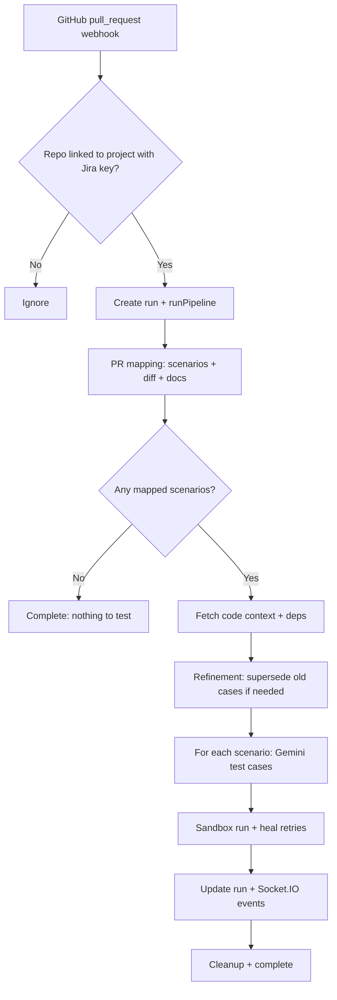

# AutoQA

AutoQA is an AI-assisted quality workflow that links **Jira** (stories, epics, acceptance criteria), **GitHub** (PRs and file context), and **Google Gemini** to generate structured test scenarios, persist them, optionally comment back on Jira, and run a **PR test pipeline** (mapping scenarios, generating test cases, sandbox runs, and heal retries). A **React** dashboard talks to a **Node.js** backend over REST and **Socket.IO** for live updates.

---

## Example PR pipeline flow

This is the path implemented in `code/backend/pipeline.js`, normally started when GitHub sends a **`pull_request`** webhook (`opened`, **`synchronize`**, or **`reopened`**) to `POST /api/webhooks/github`. The repository must already be **linked to a local AutoQA project** that has a **Jira project key**; otherwise the webhook is ignored. Scenarios for that Jira project should exist (for example from a prior **Sync Jira** / Jira pipeline run) so the mapper has something to attach to the PR.

**Concrete example:** a developer opens a PR against `acme/widget-app` that changes the checkout module. AutoQA already has a project linking `acme/widget-app` to Jira project `WID`, and several scenarios were synced from Jira earlier.

1. **Webhook received** — GitHub delivers the PR payload. The backend responds `202 Accepted`, creates a new **run** id, emits **`pr_opened`** over Socket.IO for the dashboard, and starts **`runPipeline(runId, prUrl, repoFullName)`** in the background.

2. **Initializing** — Run status is set to *running*; the UI can show the new pipeline run row.

3. **PR mapping** — The backend loads **Jira scenarios** stored for the linked project, fetches **PR metadata and diffs** from GitHub, optionally pulls text from **uploaded project documents**, and calls **`mapPrChangesToScenarios`** (Gemini-assisted) to produce a list of **which scenarios this PR is intended to cover**. If the list is empty, the run completes with a warning and **no tests** are generated.

4. **Code context** — For the PR’s head branch, the pipeline fetches **full contents of changed files**, **likely related test files** (inferred paths), and **dependency hints** (for example `package.json`). These are assembled into prompts for the next phase.

5. **Refinement (optional)** — If existing **test cases** in the DB already reference files touched by this PR, they are marked **superseded** so new versions can replace them; generation can treat those as **refinement** with the previous script as context.

6. **Test generation (per mapped scenario)** — For each mapped scenario, **Gemini** generates a small set of concrete **test cases** (steps, data, executable script, language). Each case is **saved to SQLite** and linked to the run and PR.

7. **Sandbox testing and healing** — A **shared sandbox directory** is created once per run. For each generated test case, the script runs in the **sandbox** (Node or Python). On failure, the pipeline asks Gemini to **repair the script** and retries, up to **three attempts** per test case. Pass/fail is written back to the DB; events and summaries stream to the UI.

8. **Per-scenario rollup** — After all test cases for a scenario finish, the run records whether that scenario **passed**, **failed**, or **partially** passed.

9. **Finish** — Sandbox files are cleaned up, final phases (including a **Test Healing** marker reflecting whether any retries occurred) are emitted, and the run is marked **completed** or **failed** according to whether anything passed overall.



---

## Repository layout

```text
AutoQA/
├── start.js                 # Starts backend + Vite dev (convenience)
├── package.json             # Root-level deps (e.g. smee, socket.io-client)
├── config/                  # Misc tooling config
├── code/
│   ├── backend/             # Express API + pipelines + SQLite
│   │   ├── server.js        # HTTP server, routes, webhooks, Socket.IO
│   │   ├── db.js            # SQLite (scenarios, runs, test cases, DLQ, sync log)
│   │   ├── pipeline.js      # GitHub PR test generation & sandbox execution
│   │   ├── jiraPipeline.js  # Jira sync → scenarios → DB + Jira comments
│   │   ├── schemas.js       # Zod validation helpers for APIs / webhooks
│   │   ├── data/            # autoqa.db, projects.json (created at runtime)
│   │   ├── uploads/         # Uploaded project documents
│   │   ├── scripts/         # CLI helpers (Jira checks, webhooks, cleanup)
│   │   └── services/        # GitHub, Jira, Gemini, sandbox, documents, etc.
│   └── frontend/            # Vite + React + Tailwind UI
│       ├── src/
│       │   ├── App.jsx
│       │   ├── main.jsx
│       │   ├── components/  # Dashboard UI (stepper, metrics, layout, …)
│       │   ├── pages/       # Projects hub, dashboard, runs, settings, …
│       │   └── lib/         # Env helpers, client utilities
│       └── vite.config.js   # Build output: dist/
└── README.md
```

---

## Prerequisites

- **Node.js** (LTS recommended) and **npm**
- Backend **environment** variables: copy `code/backend/.env.example` to `code/backend/.env` and set at least **Jira**, **GitHub**, and **Gemini** values as needed for your environment.

---

## Running the app (development)

### Option A — one command from the repo root

Starts the API on **http://localhost:3001** and the Vite dev server for the UI (default Vite port, often **5173**).

```bash
node start.js
```

### Option B — backend and frontend separately

**Backend** (from `code/backend`):

```bash
cd code/backend
npm install
node server.js
```

**Frontend** (from `code/frontend`):

```bash
cd code/frontend
npm install
npm run dev
```

The UI is configured to call the API at **http://localhost:3001**; keep the backend running while you use the dashboard.

---

## Testing the production build with `npx serve`

To serve the **built** static frontend (useful for smoke tests or checking the production bundle without Vite’s dev server):

```bash
cd code/frontend
npm install
npm run build
npx serve dist -s
```

- **`-s`** (single-page application mode) rewrites unknown routes to `index.html`, which matches how a React router app is usually hosted.
- **`npx serve`** runs the [`serve`](https://github.com/vercel/serve) static file server without adding it as a permanent dependency; you can pass a port with **`-l 3000`** (or another port) if needed.

For full end-to-end behaviour (API + WebSockets + static UI), run **`node server.js`** in `code/backend` **in parallel** with `npx serve`, since the built UI still expects the backend at **http://localhost:3001**.

---

## Optional backend scripts

From `code/backend` (see `package.json`):

- `npm run jira:check` — Jira API connectivity
- `npm run jira:simulate-webhook` — local webhook simulation
- `npm run jira:delete-story-comments` — managed-comment cleanup utility

---

## Security note

Never commit real **`.env`** files or API tokens. Use `.env.example` as a template only.
