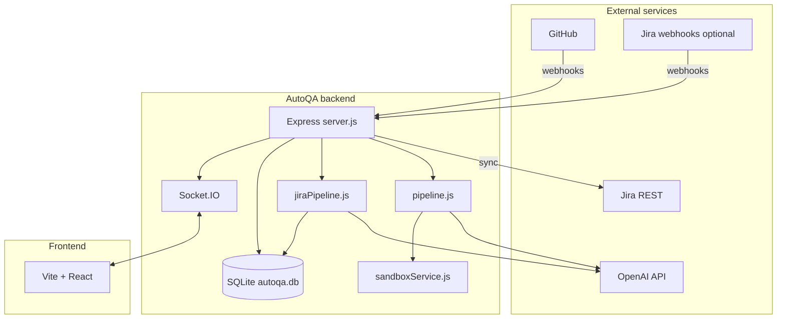
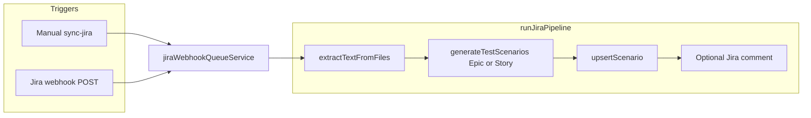
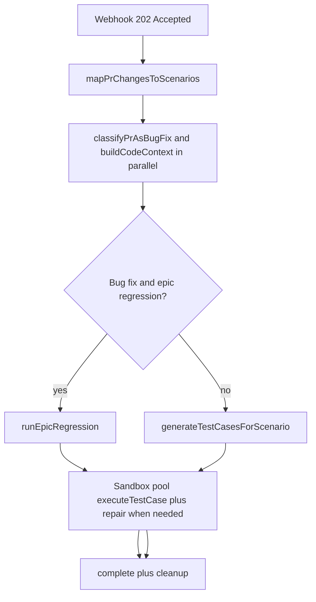
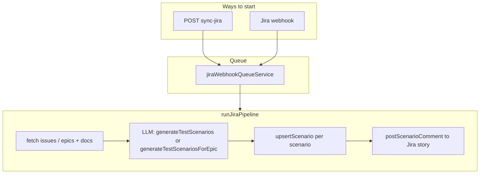
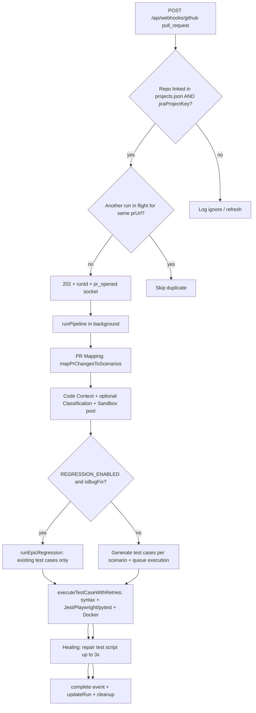
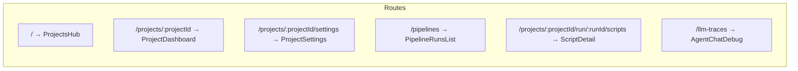

# AutoQA

AutoQA is a local, AI-assisted quality workflow for teams that use **Jira** for requirements and **GitHub** for code. It maintains a **requirements traceability matrix (RTM)–style** catalog of test scenarios, links each AutoQA “project” to a Jira space and a GitHub repository, and runs a **pull request (PR) pipeline** that: maps PR changes to relevant scenarios, uses the **OpenAI API** to generate or reuse executable test scripts, runs them in an isolated **Docker** sandbox, and on failure can **heal** (automatically repair) the generated test script a limited number of times. A **React** dashboard (Vite) talks to a **Node.js** backend over REST and **Socket.IO** for live run updates.

This document is a technical reference: architecture, **application flow**, **what each LLM call receives**, **full repository file index**, data model, workflows, API surface, configuration, and operations.

---

## Table of contents

1. [Overview and goals](#overview-and-goals)
2. [High-level architecture](#high-level-architecture)
3. [Application flow (end-to-end)](#application-flow-end-to-end)
4. [LLM context reference](#llm-context-reference)
5. [Repository layout](#repository-layout) — tracked tree, root scripts, full file index
6. [Data model](#data-model)
7. [Workflow: Jira to scenarios (RTM)](#workflow-jira-to-scenarios-rtm)
8. [Workflow: GitHub PR to test run](#workflow-github-pr-to-test-run)
9. [Bug-fix classification and epic regression](#bug-fix-classification-and-epic-regression)
10. [Sandbox execution and test healing](#sandbox-execution-and-test-healing) — Jest, Playwright E2E, pytest; dev server; syntax check
11. [Code context pruning (`astPrunerService`)](#code-context-pruning-astprunerservice)
12. [Run outcome semantics](#run-outcome-semantics)
13. [HTTP API reference](#http-api-reference)
14. [Real-time events (Socket.IO)](#real-time-events-socketio)
15. [Frontend map](#frontend-map)
16. [Configuration (environment variables)](#configuration-environment-variables)
17. [Local development and operations](#local-development-and-operations)
18. [Failure handling and dead letter queue](#failure-handling-and-dead-letter-queue)
19. [Security notes](#security-notes)
20. [Troubleshooting](#troubleshooting)

---

## Overview and goals

- **Scenarios in SQLite** (`rtm_scenarios`) represent testable conditions derived from or aligned with Jira (stories, epics, acceptance criteria). They are the backbone of the RTM and of PR mapping.
- **GitHub webhooks** drive PR runs: when a linked repo receives a qualifying `pull_request` event, AutoQA spawns a **run** (UUID), streams progress to the UI, and executes [`runPipeline`](code/backend/pipeline.js) asynchronously after responding **202 Accepted** to GitHub.
- **OpenAI** (via the official `openai` SDK in [`llmService.js`](code/backend/services/llmService.js)) powers: Jira → scenario generation, PR → scenario mapping, per-scenario test case generation, test script **repair** (healing), and optional **bug-fix vs feature** classification for regression mode.
- **Execution** is not in-process: a pool of **Docker** containers with the PR branch cloned and dependencies installed runs **Jest** or **Playwright Test** (JavaScript—Playwright is used when the generated script imports [`@playwright/test`](https://playwright.dev/docs/test-api)) or **pytest** (Python) for each test file. See [Sandbox execution and test healing](#sandbox-execution-and-test-healing).

**Who uses it:** A developer or QA engineer configures projects in the UI, keeps Jira in sync, and uses the dashboard to watch PR runs, inspect test cases, and read logs.

---

## High-level architecture



- **Single HTTP server** ([`code/backend/server.js`](code/backend/server.js)) wraps Express and attaches Socket.IO to the same `http.Server`. `global.io` is set so pipeline and Jira code can broadcast.
- **Persistence:** [`better-sqlite3`](code/backend/db.js) with WAL mode. Projects are also stored in [`code/backend/data/projects.json`](code/backend/services/projectStore.js) (JSON on disk, not a SQL table).
- **Pipelines:** [`pipeline.js`](code/backend/pipeline.js) (PR test flow); [`jiraPipeline.js`](code/backend/jiraPipeline.js) (Jira-driven scenario generation).

---

## Application flow (end-to-end)

**Actors:** operators using the React dashboard; **GitHub** (repos, API, PR webhooks); **Jira** (REST, optional webhooks); **OpenAI** via [`llmService.js`](code/backend/services/llmService.js); **Docker** for sandbox execution. The backend owns orchestration ([`server.js`](code/backend/server.js)), SQLite ([`db.js`](code/backend/db.js)), and real-time UI updates (Socket.IO).

### Jira to RTM scenarios ([`runJiraPipeline`](code/backend/jiraPipeline.js))

Triggered by manual **`POST .../sync-jira`**, **`POST .../webhooks/jira`**, or the queue processor after an accepted job. The pipeline loads the AutoQA project’s **associated Jira project documents**, extracts text (`extractTextFromFiles`), then calls **`generateTestScenariosForEpic`** (batch epic path) or **`generateTestScenarios`** per story from [`llmService.js`](code/backend/services/llmService.js)—not [`jiraScenarioService.js`](code/backend/services/jiraScenarioService.js) (see [LLM context reference](#llm-context-reference)). Each scenario is **`upsertScenario`**’d into SQLite and optional **`postScenarioComment`** updates Jira stories. Completion emits **`jira_scenarios_generated`** / **`refresh_data`** over Socket.IO.



### GitHub PR to tests ([`runPipeline`](code/backend/pipeline.js))

A qualifying **`pull_request`** webhook returns **202** immediately with a **`runId`**; **`runPipeline`** continues asynchronously. It **loads scenarios from SQLite**, fetches **PR metadata and files** plus **optional project document text**, then calls **`mapPrChangesToScenarios`** to choose **`scenarioId`s**. Next, **`classifyPrAsBugFix`** (if regression mode is enabled) runs **in parallel with** **`buildCodeContext`** (full files on the PR head, inferred test paths, dependency text). The **[FULL FILE CONTENTS]** prompt string is optionally **pruned** for very large JS/TS/PY files (**`astPrunerService`** — see [Code context pruning](#code-context-pruning-astprunerservice)). Depending on regression rules, either **epic regression** reuses existing **`test_cases`** or **generateTestCasesForScenario** runs **per mapped scenario**. Tests execute in a **sandbox pool**; failures invoke **`repairTestCaseScript`** until success or **max heals**. Progress streams via **`run_updated`** events.



In the diagram, **`REG`** is taken when **`REGRESSION_ENABLED`** is on and **`classifyPrAsBugFix`** classifies the PR as a bug fix—then **new generation may be skipped** (see [Bug-fix classification and epic regression](#bug-fix-classification-and-epic-regression)). Otherwise the **`no`** branch runs **`GEN`** then **sandbox** execution.

---

## LLM context reference

Every production LLM step uses the OpenAI **Responses** API (`client.responses.create`): a **fixed `instructions`** string is kept stable for **prompt caching** (**`buildCacheParams`** / **`CACHE_KEYS`** in [`llmService.js`](code/backend/services/llmService.js)); the **`input`** field carries variable PR/Jira/context text. **`emitLlmTrace`** publishes **`llm_trace`** Socket.IO events (paired request/response) for the Agent Console.

### Call matrix: `instructions` versus variable `input`

| Caller (trace label) | When it runs | Instructions constant | Variable `input` contains |
|---------------------|--------------|----------------------|---------------------------|
| `mapPrChangesToScenarios` | PR pipeline after **`fetchPRDetails`** + project docs ([`pipeline.js`](code/backend/pipeline.js)) | [`PR_MAPPING_INSTRUCTIONS`](code/backend/services/prScenarioMappingService.js) | **`SCENARIO CATALOG`** — JSON of normalized RTM scenarios from DB; **`PULL REQUEST CONTEXT`** — title, branch; **`CHANGED FILES`** — JSON per file `filename`, `status`, **`patch` (≤ ~6000 chars)** and **`fullContent` (≤ ~6000 chars)**; **`PROJECT DOCUMENTS`** — text blobs **≤ 5** slices ([`prScenarioMappingService.js`](code/backend/services/prScenarioMappingService.js)). Non-code extensions are omitted from mapping. |
| `classifyPrAsBugFix` | After mapping; **skipped** when **`REGRESSION_ENABLED`** is **`false`** ([`pipeline.js`](code/backend/pipeline.js)); **LLM skipped entirely** when any linked Jira issue is typed **Bug** unless **`REGRESSION_CLASSIFIER_LLM_EVEN_IF_JIRA_BUG`** ([`prClassificationService.js`](code/backend/services/prClassificationService.js)) | [`CLASSIFIER_INSTRUCTIONS`](code/backend/services/prClassificationService.js) | **`PR TITLE`**, **`PR BRANCH`**, **`PR BODY`**; **`LINKED JIRA ISSUES`** (types from REST); **`CHANGED FILES`** — **`buildDiffDigest`**: up to **20** files, **`patch`** truncated to **1500** chars each, plus truncation note if more files exist ([`prClassificationService.js`](code/backend/services/prClassificationService.js)). |
| `generateTestScenarios` | **`runJiraPipeline`** per story (single-story loop) ([`jiraPipeline.js`](code/backend/jiraPipeline.js)) | [`SCENARIO_SYSTEM_INSTRUCTION`](code/backend/services/llmService.js) | Epic key/summary, Story key/title/description, AC, **`Supporting Documents`** (`localDocsText`), optional **already-assigned scenario IDs** to avoid duplicates ([`generateTestScenarios`](code/backend/services/llmService.js)). |
| `generateTestScenariosForEpic` | **`runJiraPipeline`** batch epic path ([`jiraPipeline.js`](code/backend/jiraPipeline.js)) | [`SCENARIO_SYSTEM_INSTRUCTION`](code/backend/services/llmService.js) | Epic line, **`Supporting Documents`**, concatenated stories (description + AC), valid **`storyId`/`epicId`** lists ([`generateTestScenariosForEpic`](code/backend/services/llmService.js)); on failure falls back to **`generateTestScenarios`** per story. |
| `generateTestCasesForScenario` | PR pipeline per **mapped scenario** ([`pipeline.js`](code/backend/pipeline.js)) — **skipped** when going straight to **`runEpicRegression`** | [`TESTCASE_GENERATION_INSTRUCTIONS`](code/backend/services/llmService.js) | Same as listed in [`generateTestCasesForScenario`](code/backend/services/llmService.js), plus **`[REFERENCE EXAMPLES]`** — curated **few-shot** JS/Python harness snippets (`FEW_SHOT_EXAMPLES`), injected only in variable `input`, not cached `instructions`. Scenario — `ID`, description, type, priority, **`acceptanceCriteriaRef`** if present; **`[CHANGED CODE DIFF]`** (`prDiffSection` from PR files); **`[FULL FILE CONTENTS]`** concatenated **`codeContextSection`** (possibly pruned — see [Code context pruning](#code-context-pruning-astprunerservice)); **`[DEPENDENCIES / PACKAGE INFO]`**; optional **`[REFINEMENT]`** previous **`testScript`** plus version when superseding; optional **`alreadyGeneratedSummary`**. Threads **`conversationId`** / **`previousInteractionId`** from superseded **`test_cases`** ([`pipeline.js`](code/backend/pipeline.js)). |
| `repairTestCaseScript` | After sandbox **failure** (`executeTestCaseWithRetries`); up to **`MAX_HEAL_ATTEMPTS`** ([`pipeline.js`](code/backend/pipeline.js)) | [`HEAL_INSTRUCTIONS`](code/backend/services/llmService.js) | **Stateful path** (prior conversation or **`previous_response_id`):** minimal user message — last failure output + failing **`testScript`** only ([`repairTestCaseScript`](code/backend/services/llmService.js)). **Stateless fallback:** full **`testCase`**, **`failureOutput`**, **`attemptHistory`**, **`scenarioDescription`**, **`codeContextSection`**, **`testData` JSON**. |

### Alternate / unused path: [`jiraScenarioService.js`](code/backend/services/jiraScenarioService.js)

**[`generateScenariosFromJiraContext`](code/backend/services/jiraScenarioService.js)** uses **`JIRA_SCENARIO_INSTRUCTIONS`** plus a **`buildPrompt`** payload (epic/story/descriptions + optional extracted doc chunks). Nothing in **`jiraPipeline.js`** **`require`**s this module today—it is an **alternate** implementation you could wire in; production RTM sync uses **`llmService`** scenario generators above.

### Cross-cutting mechanics ([`llmService.js`](code/backend/services/llmService.js))

- **`OPENAI_STATEFUL_MODE`** — **`conversation`** (Conversation API attachment), **`chain`** (**`previous_response_id`**), **`zdr`** (**`store: false`**; prior reasoning replay via **`applyStatefulInput`** and encrypted reasoning items).
- **Prompt caching** — **`CACHE_KEYS`** per caller (`qa:pr:mapping`, `qa:testcases:generate`, …), **`prompt_cache_retention`** (e.g. **`24h`** vs **`in_memory`**).
- **Token limits** — **`MAX_TOKENS_ALLOWED`** (**30 000**) enforced by **`assertTokenLimit`** (tiktoken **`o200k_base`**); **`OPENAI_PROMPT_BUDGET`** (**~90 %** of ceiling by default) plus **`ensureWithinBudget`**, which trims oversized variable **`input`** slices from the **middle** with a visible marker; **`[REFERENCE EXAMPLES]`** few-shot snippets for **`generateTestCasesForScenario`** sit only in **`input`**, not in cached **`instructions`**.
- **Traces** — Every request/response emits **`llm_trace`** for UI debugging (see [Frontend map](#frontend-map) Agent Console).

---

## Repository layout

There is **no root `package.json`** and **no `config/` directory** in this repository: dependencies are installed per app under [`code/backend`](code/backend) and [`code/frontend`](code/frontend).

### Tracked file tree

Every path below is tracked by git (run `git ls-files` to regenerate). Comment lines are documentation only and are not part of the filesystem.

```text
QAPipeline/
├── .gitattributes
├── .gitignore
├── README.md
├── clear.js
├── installbeforerun.js
├── start.js
└── code/
    ├── backend/
    │   ├── .env.example
    │   ├── db.js
    │   ├── jiraPipeline.js
    │   ├── package-lock.json
    │   ├── package.json
    │   ├── pipeline.js
    │   ├── schemas.js
    │   ├── server.js
    │   ├── scripts/
    │   │   ├── checkJiraApi.js
    │   │   ├── clearPipelineTestData.js
    │   │   ├── deleteJiraStoryComments.js
    │   │   ├── deleteSayaratJiraIssues.js
    │   │   ├── deleteTodoJiraIssues.js
    │   │   ├── seedTodoJiraIssues.js
    │   │   └── simulateJiraWebhook.js
    │   └── services/
    │       ├── astPrunerService.js
    │       ├── documentAssociationStore.js
    │       ├── documentParserService.js
    │       ├── githubService.js
    │       ├── jiraScenarioService.js
    │       ├── jiraService.js
    │       ├── jiraWebhookQueueService.js
    │       ├── llmService.js
    │       ├── prClassificationService.js
    │       ├── prScenarioMappingService.js
    │       ├── projectStore.js
    │       └── sandboxService.js
    └── frontend/
        ├── .env.example
        ├── index.html
        ├── package-lock.json
        ├── package.json
        ├── postcss.config.js
        ├── tailwind.config.js
        ├── vite.config.js
        └── src/
            ├── App.jsx
            ├── index.css
            ├── main.jsx
            ├── components/
            │   ├── BranchPolicyMatrix.jsx
            │   ├── DetailTabs.jsx
            │   ├── EpicStackedChart.jsx
            │   ├── ExecutionStepper.jsx
            │   ├── MetricCard.jsx
            │   ├── Navbar.jsx
            │   ├── RTMMatrix.jsx
            │   └── Sidebar.jsx
            ├── lib/
            │   ├── env.js
            │   └── epicMetrics.js
            └── pages/
                ├── AgentChatDebug.jsx
                ├── PipelineRunDetail.jsx
                ├── PipelineRunsList.jsx
                ├── ProjectDashboard.jsx
                ├── ProjectSettings.jsx
                ├── ProjectsHub.jsx
                └── ScriptDetail.jsx
```

### Runtime and gitignored artifacts

These are **not** listed in the tree above but appear when you run or build locally:

| Location | Purpose |
|---------|---------|
| `code/backend/node_modules/`, `code/frontend/node_modules/` | npm dependencies |
| `code/frontend/dist/` | Production build output (`npm run build`) |
| [`code/backend/data/`](code/backend/data) | SQLite `autoqa.db` (+ WAL/SHM) and JSON files (ignored except `.gitkeep` patterns in [`.gitignore`](.gitignore)) |
| `code/backend/uploads/` | Uploaded requirement and Jira documents |
| **`code/backend/scripts/seedSayaratJiraIssues.js`** | Referenced by `npm run jira:seed-sayarat`; the file itself is **`gitignored`** so local seed datasets are not committed. [`deleteSayaratJiraIssues.js`](code/backend/scripts/deleteSayaratJiraIssues.js) `require`s the same module — keep a local copy or adjust paths if you use Sayarat scripts. |

### Root scripts and repository metadata

| File | Role |
|------|------|
| [`.gitattributes`](.gitattributes) | `* text=auto` — Git performs LF normalization for text files. |
| [`.gitignore`](.gitignore) | Ignores editor folders, `node_modules`, `dist`, backend `.env`, dynamic `data/*.json`, uploads, DB files, and the private Sayarat seed script. |
| [`start.js`](start.js) | Spawns `node server.js` in `code/backend` and `npm run dev` in `code/frontend`; forwards SIGINT/SIGTERM to both children. |
| [`installbeforerun.js`](installbeforerun.js) | Runs `npm install` sequentially in `code/backend` and `code/frontend`. |
| [`clear.js`](clear.js) | Deletes SQLite DB + WAL/SHM, JSON files under `data/` (including `projects.json`, `requirementsMap.json`, `rtm_baselines.json`, `runHistory.json`, `jiraDocuments.json`), removes `uploads/` and the OS temp sandbox root `autoqa-sandbox`, then recreates empty `data/` and upload subfolders. |

### Complete file index (by area)

**Root**

- [`README.md`](README.md) — This technical reference.

**Backend — core**

- [`code/backend/server.js`](code/backend/server.js) — Express HTTP API (projects, Jira, GitHub, runs, webhooks), `multer` uploads, Socket.IO on the same HTTP server, optional smee.io GitHub forwarding, `getRunHistory` helper for `runHistory.json` (see [Data model](#data-model)).
- [`code/backend/db.js`](code/backend/db.js) — `better-sqlite3` schema, migrations, CRUD for scenarios, runs, test cases, DLQ, `story_sync_log`, helpers used by pipelines and routes.
- [`code/backend/pipeline.js`](code/backend/pipeline.js) — GitHub PR pipeline: mapping, classification, generation, sandbox execution, healing, regression; emits `run_updated` / `refresh_data` via Socket.IO.
- [`code/backend/jiraPipeline.js`](code/backend/jiraPipeline.js) — Jira-driven scenario generation; upserts scenarios, optional Jira comments; emits `jira_scenarios_generated` and `refresh_data`.
- [`code/backend/schemas.js`](code/backend/schemas.js) — Zod schemas for validated request bodies (e.g. webhooks, project create).
- [`code/backend/.env.example`](code/backend/.env.example) — Documented environment variables for the backend.

**Backend — services**

- [`llmService.js`](code/backend/services/llmService.js) — OpenAI SDK (Responses API), token budgeting, prompt caching params, scenario/test generation, PR mapping, healing, traces; emits `llm_trace` when configured.
- [`githubService.js`](code/backend/services/githubService.js) — Octokit: repos, PR metadata, diffs, file contents, dependency discovery, inferred test paths.
- [`jiraService.js`](code/backend/services/jiraService.js) — Jira REST: issues, transitions, comments, health, ADF/plain text helpers.
- [`jiraWebhookQueueService.js`](code/backend/services/jiraWebhookQueueService.js) — Serialized async queue for Jira webhook jobs so concurrent runs do not stampede Jira/OpenAI.
- [`jiraScenarioService.js`](code/backend/services/jiraScenarioService.js) — Alternate Jira scenario generator (**`generateScenariosFromJiraContext`**, `JIRA_SCENARIO_INSTRUCTIONS`); **not used** by [`jiraPipeline.js`](code/backend/jiraPipeline.js) in the stock app (see [LLM context reference](#llm-context-reference)).
- [`prScenarioMappingService.js`](code/backend/services/prScenarioMappingService.js) — Maps PR diffs/context to `scenarioId` list via OpenAI.
- [`prClassificationService.js`](code/backend/services/prClassificationService.js) — Bug-fix vs feature classification for regression mode (Jira issue types + LLM).
- [`sandboxService.js`](code/backend/services/sandboxService.js) — Docker (**Playwright** base image **`mcr.microsoft.com/playwright:v1.44.0-jammy`**) pool, **`git`** clone into temp, **`npm`** / **`pip`** installs, **`validateSyntaxLocal`**, **`executeTest`** (**Jest** vs **Playwright Test** branching, optional **dev-server** **`wait-on`**, teardown), **`cleanupSandboxPool`**.

**AST / trimming**

- [`astPrunerService.js`](code/backend/services/astPrunerService.js) — Structural pruning for **LLM `[FULL FILE CONTENTS]`** when files are large (**`LARGE_FILE_CHARS`**); JSX-aware React bodies for Playwright; Python heuristic.
- [`documentParserService.js`](code/backend/services/documentParserService.js) — Extracts text from uploaded PDF/Office/etc. for prompts.
- [`documentAssociationStore.js`](code/backend/services/documentAssociationStore.js) — Persists associations in `data/jiraDocuments.json` keyed by AutoQA project id.
- [`projectStore.js`](code/backend/services/projectStore.js) — CRUD for `data/projects.json` (AutoQA project records linked to Jira/GitHub).

**Backend — scripts**

- [`checkJiraApi.js`](code/backend/scripts/checkJiraApi.js) — `npm run jira:check` — Prints issue metadata for `ISSUE_KEY` to validate Jira credentials.
- [`simulateJiraWebhook.js`](code/backend/scripts/simulateJiraWebhook.js) — POSTs a sample `jira:issue_updated` payload to local AutoQA for integration testing.
- [`deleteJiraStoryComments.js`](code/backend/scripts/deleteJiraStoryComments.js) — Finds/removes AutoQA-tagged comments on Jira stories (dry-run unless `--apply`).
- [`clearPipelineTestData.js`](code/backend/scripts/clearPipelineTestData.js) — Wipes test cases, run history, DLQ, and scenario run fields via `clearAllPipelineExecutionData()` (see script header).
- [`seedTodoJiraIssues.js`](code/backend/scripts/seedTodoJiraIssues.js) / [`deleteTodoJiraIssues.js`](code/backend/scripts/deleteTodoJiraIssues.js) — Seed or delete the “Pro To-Do FRD” epic/story set in Jira (`jira:seed-todo` / `jira:delete-todo`).
- [`deleteSayaratJiraIssues.js`](code/backend/scripts/deleteSayaratJiraIssues.js) — Deletes Sayarat FRD epic/story pairs (`jira:delete-sayarat`); requires [`seedSayaratJiraIssues.js`](code/backend/scripts/) (gitignored locally).

**Backend — locks**

- [`code/backend/package-lock.json`](code/backend/package-lock.json) — Lockfile for backend npm installs.

**Frontend — config and shell**

- [`code/frontend/package.json`](code/frontend/package.json), [`package-lock.json`](code/frontend/package-lock.json) — React/Vite dependencies and scripts.
- [`vite.config.js`](code/frontend/vite.config.js) — Vite + `@vitejs/plugin-react`, build output `dist`.
- [`tailwind.config.js`](code/frontend/tailwind.config.js), [`postcss.config.js`](code/frontend/postcss.config.js), [`src/index.css`](code/frontend/src/index.css) — Tailwind/PostCSS and global styles (including `.dark`).
- [`index.html`](code/frontend/index.html) — HTML shell: title “AutoQA”, mounts `src/main.jsx`.
- [`code/frontend/.env.example`](code/frontend/.env.example) — `VITE_*` variables (e.g. Jira base URL for links).

**Frontend — application source**

- [`main.jsx`](code/frontend/src/main.jsx) — React 18 `createRoot`, StrictMode, imports `index.css`.
- [`App.jsx`](code/frontend/src/App.jsx) — `BrowserRouter`, `AppContext` (settings, toasts, `refreshKey`, `llmTraces`, dark mode, sidebar state), Socket.IO client to `http://localhost:3001`, route table (see [Frontend map](#frontend-map)).
- **Pages** — See the [Frontend map](#frontend-map) table for routes; [`PipelineRunDetail.jsx`](code/frontend/src/pages/PipelineRunDetail.jsx) is **not registered** in `App.jsx` (standalone component; run drill-down uses **ProjectDashboard** with query params from **PipelineRunsList**).
- **Components** — Layout and feature UI: [`Sidebar.jsx`](code/frontend/src/components/Sidebar.jsx) (nav: Projects, Pipeline Runs, Agent Console), [`Navbar.jsx`](code/frontend/src/components/Navbar.jsx) (search UI, dark-mode toggle), [`ExecutionStepper.jsx`](code/frontend/src/components/ExecutionStepper.jsx), [`DetailTabs.jsx`](code/frontend/src/components/DetailTabs.jsx), [`RTMMatrix.jsx`](code/frontend/src/components/RTMMatrix.jsx), [`BranchPolicyMatrix.jsx`](code/frontend/src/components/BranchPolicyMatrix.jsx), [`EpicStackedChart.jsx`](code/frontend/src/components/EpicStackedChart.jsx), [`MetricCard.jsx`](code/frontend/src/components/MetricCard.jsx).
- [`lib/env.js`](code/frontend/src/lib/env.js) — Exports `JIRA_BASE_URL` from `import.meta.env.VITE_JIRA_BASE_URL` (trimmed).
- [`lib/epicMetrics.js`](code/frontend/src/lib/epicMetrics.js) — Normalizes test-case status, strict scenario pass/fail/pending, per-epic aggregates for charts and coverage.

---

## Data model

### SQLite tables (see [`db.js`](code/backend/db.js))

| Table | Purpose |
|--------|---------|
| `rtm_scenarios` | Scenarios: `scenarioId`, `projectKey`, `epicId`, `storyId`, title, description, acceptance references, type, priority, status, run metadata, etc. |
| `run_history` | Pipeline runs: `runId`, `repoFullName`, `prUrl`, `status`, timestamps, `events`, `logs`, `llm_traces`, `scenario_statuses`, `localProjectId` |
| `test_cases` | Generated or refined tests: `testCaseId`, `scenarioId`, `testScript`, `language`, `version`, `healAttempts`, `conversationId`, `latestResponseId`, links to `runId` / `prUrl` |
| `dead_letter_queue` | Failed webhook or pipeline work for inspection (`source`, `payload`, `error`, `retryCount`, `status`) |
| `story_sync_log` | Per-story content hash and sync time to avoid reprocessing unchanged Jira issues |

Migrations in `initDb()` add columns when missing (e.g. `localProjectId` on `run_history`, conversation columns on `test_cases`).

### File-backed stores

| File path | Owned by | Purpose |
|-----------|----------|---------|
| **`data/projects.json`** | [`projectStore.js`](code/backend/services/projectStore.js) | AutoQA projects: id, name, `jiraProjectKey`, `githubRepoFullName`, timestamps. |
| **`data/requirementsMap.json`** | Routes in [`server.js`](code/backend/server.js) (GitHub requirements upload/delete) | Maps requirement uploads to repos for association UIs. |
| **`data/rtm_baselines.json`** | Baseline route in [`server.js`](code/backend/server.js) | Per-repo RTM baseline snapshots (`GET /api/github/repos/:owner/:repo/baseline`). |
| **`data/jiraDocuments.json`** | [`documentAssociationStore.js`](code/backend/services/documentAssociationStore.js) | Per–AutoQA-project lists of associated Jira document metadata. |
| **`data/runHistory.json`** | Parser in [`server.js`](code/backend/server.js) (`getRunHistory`) | Read-only JSON structure; **not referenced elsewhere** in the stock server — effectively **legacy / unused** for live runs (authoritative history is **`run_history`** in SQLite). [`clear.js`](clear.js) still deletes this file for a clean reset. |

### Uploads

- Requirements and Jira-related uploads land under `code/backend/uploads/` (subfolders such as `requirements/`, `jira-docs/`), with associations tracked via [`documentAssociationStore`](code/backend/services/documentAssociationStore.js).

---

## Workflow: Jira to scenarios (RTM)

> See also: [Application flow (end-to-end)](#application-flow-end-to-end) and [LLM context reference](#llm-context-reference) for sequence and model inputs.



### Manual sync: `POST /api/projects/:projectId/sync-jira`

- Requires a **linked Jira space** (`jiraProjectKey` on the project).
- Fetches Jira issues in the **configured trigger status** (see `JIRA_TRIGGER_STATUS` in [`.env.example`](code/backend/.env.example), defaulting to a string like "Selected for Development" when not set in code paths that reference it).
- **Skips** stories whose **content hash** matches the last sync ([`computeStoryHash`](code/backend/db.js), `story_sync_log`).
- **Groups** changed stories by **parent epic** and enqueues **one job per epic** with `storyKeys` for batch scenario generation, or enqueues **orphan** stories individually ([`jiraPipeline.js`](code/backend/jiraPipeline.js) batch mode vs single-story mode).

### Jira webhooks: `POST /api/webhooks/jira`

- **Signature:** Optional `JIRA_WEBHOOK_SECRET` via `X-Hub-Signature` (HMAC-SHA256 over **raw** body) — see `verifyJiraWebhookSignature` in [`server.js`](code/backend/server.js). If no secret is set, signature check is skipped.
- **Events processed:** `jira:issue_updated` only, with a **status transition to** the configured `JIRA_TRIGGER_STATUS`, project linked in AutoQA, and issue type **Story** or **Epic** (other types are ignored with `received: false` and a reason string).
- Enqueues work into [`jiraWebhookQueueService`](code/backend/services/jiraWebhookQueueService.js). The job processor (registered in `server.js`) calls **`runJiraPipeline`** with the issue key, project id, and optional `storyKeys` for epics.
- On handler failure, the payload is written to the **DLQ** via `publishToDLQ('jira_webhook', ...)`.

### Jira pipeline behavior ([`jiraPipeline.js`](code/backend/jiraPipeline.js))

- Loads **Jira project documents** for the AutoQA project, extracts text, and calls the LLM to produce structured scenarios.
- **Persists** each scenario with `upsertScenario`.
- **Comments** on Jira story issues with the generated scenario summary when configured (`postScenarioComment`).
- Emits Socket.IO: `jira_scenarios_generated`, `refresh_data`.

### Useful Jira-related HTTP routes

- `GET /api/jira/health` — Connectivity, config, webhook readiness, last trigger state, queue snapshot.
- `GET /api/jira/spaces` — List Jira projects/spaces for linking.
- `GET /api/projects/:projectId/jira-rtm` — RTM-style payload for the project dashboard.
- `GET /api/projects/:projectId/scenarios` — Scenarios for a project.
- `GET/POST/DELETE /api/projects/:projectId/jira-documents` — Associate or remove Jira project documents.
- `GET /api/jira/queue` — Webhook queue status.

---

## Workflow: GitHub PR to test run

> See also: [Application flow (end-to-end)](#application-flow-end-to-end) and [LLM context reference](#llm-context-reference) for sequence and model inputs.



### Webhook: `POST /api/webhooks/github`

- **Signature:** If `GITHUB_WEBHOOK_SECRET` is set, `X-Hub-Signature-256` must match an HMAC-SHA256 of **`JSON.stringify(req.body)`** (see `verifyGitHubSignature` — note: some GitHub examples hash raw body; the implementation here uses `JSON.stringify` of the parsed body, so the GitHub “secret” and delivery format must match this behavior).
- **PR events** that start the pipeline: `action` in `opened`, `synchronize`, `reopened`.
- **Precondition:** The repository `full_name` must match a project with **`githubRepoFullName` and `jiraProjectKey` both set** — otherwise the webhook is ignored (logged) and no pipeline runs.
- **Deduplication:** A module-level `Map` `_activePipelineRuns` keys **PR URL** to **runId** while `runPipeline` is in progress; duplicate events for the same `prUrl` are skipped. This applies **per Node process** only (not shared across multiple server instances).
- **Async execution:** The handler returns **202** immediately, then `require('./pipeline').runPipeline(...)` is invoked. Rejected pipeline promises publish to the DLQ with source `github_webhook`.

### Phases and streaming ([`createEventLogger` in `pipeline.js`](code/backend/pipeline.js))

`sendEvent` updates SQLite `run_history` and emits Socket.IO `run_updated` with `{ runId, type, data }`, plus `refresh_data` for list refresh.

| Phase (examples) | `phase_update` values |
|------------------|------------------------|
| Initializing | `running` then `completed` |
| PR Mapping | `running` then `completed` |
| Classification | (if regression enabled) `running` then `completed` or skip via env |
| Code Context | `running` then `completed` |
| Sandbox Setup | `running` then `completed` |
| Syntax Validation | per test attempt (`failed` before Docker when JS/Python invalid) |
| Test Generation / Sandbox Testing | Standard path: both run; bug-fix path may **skip** Test Generation |
| Regression Execution | Bug-fix path only |
| Test Healing | Marker phase; may note whether retries ran |
| Pass | `completed` or `failed` (reflects `overallSuccess` at end) |

Other event types: `log`, `pr_details`, `pr_scenario_mapping`, `pr_classification`, `scenario_execution_updated`, `test_case_attempt`, `test_cases_saved`, `regression_summary`, `run_summary_updated`, `complete` (`success: true/false`), `error`.

### PR scenario mapping

- Loads all **Jira scenarios** for the project key from the DB, fetches **PR metadata, diff, and files** from GitHub, and may merge **project document** text. Calls [`mapPrChangesToScenarios`](code/backend/services/prScenarioMappingService.js) (OpenAI) to return which `scenarioId`s this PR is intended to cover, with rationale and confidence.
- If **mappings is empty** (or after enrichment nothing runnable): the run logs a **warning** and calls `complete` with `success: true` — **no test generation**, run status still completes “successfully” with nothing to test.

### Code context

- Fetches **full file contents** for changed files, **inferred test paths** ([`githubService.js`](code/backend/services/githubService.js): `fetchFullFileContents`, `inferTestFilePaths`), and **dependency text** (e.g. `package.json`) for prompts.

When assembling the **`[FULL FILE CONTENTS]`** string for the LLM ([`codeContextSection` in `pipeline.js`](code/backend/pipeline.js)), each file body may be passed through [`pruneFileContentForContext`](code/backend/services/astPrunerService.js) if it exceeds a size threshold — see [Code context pruning (`astPrunerService`)](#code-context-pruning-astprunerservice). The in-memory objects returned by **`buildCodeContext`** are unchanged; only the prompt text is shortened.

- If there are **existing test cases in the DB** whose referenced files overlap with the PR’s changed file list, they are **marked superseded** so new generated cases can replace them; generation may receive the **previous script** as **refinement** context and bump **version** numbers.

### Test generation and persistence

- For each **mapped scenario** (merged with full RTM row for title, description, AC refs), the LLM [`generateTestCasesForScenario`](code/backend/services/llmService.js) returns concrete cases with **steps, test data, and executable `testScript`**, and language (JavaScript or Python).
- Rows are **upserted** to `test_cases` with `conversationId` and `latestResponseId` (or `generationInteractionId`) for stateful follow-up and healing.
- A **concurrent executor** waits for a **sandbox pool** and runs each test case with retries/healing (see below).

---

## Bug-fix classification and epic regression

Controlled by **environment** (see [`.env.example`](code/backend/.env.example)):

- `REGRESSION_ENABLED` — Default is effectively **on** (only disabled when set to the string `false` in the check in `pipeline.js` which uses `String(...).toLowerCase() !== 'false'` for the feature flag). When disabled, classification is skipped and the standard “generate new tests” path always runs.
- `REGRESSION_BUGFIX_CONFIDENCE_THRESHOLD` — Default **0.6**; used when combining LLM `isBugFix` with confidence.
- `REGRESSION_CLASSIFIER_LLM_EVEN_IF_JIRA_BUG` — If `true`, still calls the LLM for rationale when a Jira **Bug** is linked (by default, Jira Bug short-circuits without an LLM call).

### `classifyPrAsBugFix` ([`prClassificationService.js`](code/backend/services/prClassificationService.js))

1. **Extracts Jira keys** from PR title, body, and branch (pattern like `ABC-123`).
2. **Fetches each issue** from Jira. If **any** linked issue has `issueType` **Bug** (case-insensitive), the PR is treated as a **bug fix** with high confidence (`source: 'jira'` or `'both'`).
3. Otherwise the **LLM** classifies the PR from title, body, and a **truncated file/diff digest**.
4. **Final `isBugFix`:** Jira Bug wins. Else LLM must return `isBugFix: true` **and** `confidence >= threshold`.

### `runEpicRegression` ([`pipeline.js`](code/backend/pipeline.js))

- When **regression is enabled** and the PR is classified as a **bug fix**:
  - **Test Generation phase is skipped** (marked `skipped` in the UI log stream).
  - Resolves **epic ids** from the **mapped** scenarios, finds **all non-obsolete scenarios** under those epics, and loads the **latest version** of each **non-superseded** `test_case` with a non-empty `testScript`.
  - **Re-executes** all of them against the **PR’s head** in the sandbox pool (with the same **heal retry** logic, `regressionMode: true`).
  - Emits `regression_summary` with counts and `scenario_execution_updated` for each scenario.
- Test case final outcomes include **`clean_pass`**, **`adapted`** (passed only after a heal), and **`regression_fail`** (still failing after all attempts), as recorded in the pipeline logic.

If **no epics** can be resolved from mapped scenarios, or **no existing test cases** exist, regression may **no-op** with warnings and a successful empty result where applicable.

---

## Sandbox execution and test healing

### Pool creation ([`createSandboxPool` in `sandboxService.js`](code/backend/services/sandboxService.js))

- For each pool slot, creates a directory under the OS temp (on Windows, `C:\tmp\autoqa-sandbox\...`), **clones** the **GitHub head** of the PR with depth 1 and branch `headRef` when `prDetails` includes `headRepoFullName` and `headRef`. If `GITHUB_TOKEN` is set, the clone URL is authenticated.
- If clone fails, the code may **fall back** to writing only **flat file payloads** from the webhook when present.
- Starts a long-lived **Docker** container: image **`mcr.microsoft.com/playwright:v1.44.0-jammy`** (Playwright-maintained Ubuntu image with **Node.js** matching the stack and browsers preinstalled). Working dir **`/app`**, sandbox directory mounted as a volume, command **`tail -f /dev/null`** to keep the container up.
- If `package.json` exists in the clone, runs **`npm install`** for the app (no lockfile commit) inside the container, then pre-installs **Jest**, **supertest**, **jest-environment-node**, **`@playwright/test@1.44.0`** (aligned with the Docker image tag), **`wait-on`** (plus other packages resolved by **`npm`** from that dependency set).

### Syntax validation ([`validateSyntaxLocal` in `sandboxService.js`](code/backend/services/sandboxService.js))

- Before **`executeTest`** ([`executeTestCaseWithRetries` in `pipeline.js`](code/backend/pipeline.js)), the current test script string is validated in-process (**no Docker**).
- **JavaScript:** `new Function(script)` — rejects invalid syntax early.
- **Python:** parses via `python3` / `python` / **`py -3`** with `ast.parse` (stdin), or override **`PYTHON_SYNTAX_BIN`**. Failures emit phase **`Syntax Validation`** with status **`failed`** and follow the **same heal loop** shape as sandbox failures.

### `executeTest`

- Writes the script with an injected **preamble** so `testData` from the DB is available as **`testData`** (JS) or **`test_data`** (Python).
- **Resets** known JSON fixture files in the sandbox if they exist for sample apps: `todos.json` → `[]`, `users.json` → `[]`, `sessions.json` → `{}`.
- **`testLanguage`: JavaScript**

  **Path A — Unit-style (default): Jest.** If `testLanguage === 'javascript'` and the **`testScript` body** (before preamble) does **not** contain the substring **`@playwright/test`**, the file is named per the caller (e.g. `test_<id>_attempt<n>.spec.js`). Extra npm deps from AST/import extraction are installed when not listed in **`PREINSTALLED`**. Runs **`./node_modules/.bin/jest <filename> …`** (**no coverage**, **`runInBand`**, **`testEnvironment=node`**, 30 s timeout) via **`spawnCapture`** (merged stdout/stderr).

  **Path B — E2E: Playwright Test.** Detection: **`testScript` includes `'@playwright/test'`**. The file written to **`/app/autoqa.spec.js`** (fixed name). Loads **`package.json`** from the clone: **`scripts.dev`** → detached **`npm run dev`**, else **`scripts.start`** → **`npm run start`**; if neither exists → **early error**: `Dev server failed to start: missing scripts.dev or scripts.start in package.json`.

  Waits after each run for HTTP readiness (**`wait-on`**): **`targetUrl`** is **`http://localhost:<port>`** with port **5173** if **`vite`** appears in **`dependencies`** / **`devDependencies`**, else **3000** if **`next`**, **`@next/next`**, or **`react-scripts`** appears; otherwise **5173** (heuristic).

  Starts the dev command with **`docker exec -d`**; then **`npx wait-on <url> -t 30000`**. Runs **`npx playwright test autoqa.spec.js --workers=1`** (see [Playwright CLI](https://playwright.dev/docs/test-cli)). **`finally`:** teardown via **`docker exec … pkill -f node`** (`killPlaywrightBackgroundProcesses`) whenever the detached server was started (`didStartDevServer`) — avoids leaving dev servers tied to ports between cases on the pool slot (**broad matcher**).

- **`testLanguage`: Python** — installs `pytest`, `flask`, `requests`, **`pytest-cov`**, detected imports (**minus builtins**); runs **`pytest`** on the file.

- **`Timeout`:** **`SANDBOX_TIMEOUT_MS`** (default **120 000**) applies to **`docker`** operations and **`spawnCapture`** for the harness (dev-server wait adds its own capped timeout).

### Healing ([`MAX_HEAL_ATTEMPTS` = 3](code/backend/pipeline.js))

- On **failure**, the last failure output is sent to [`repairTestCaseScript`](code/backend/services/llmService.js). The model returns an updated `testScript`.
- The process **repeats** until success or max attempts. **Syntax validation failures** consume an attempt before Docker; **sandbox** failures/healing behave the same. If the healer or LLM throws, the attempt is logged and the run may still eventually record failure.
- **Important:** The **application under test is not modified** by healing — only the **generated test** code changes.

### Cleanup

- [`cleanupSandboxPool`](code/backend/services/sandboxService.js) stops/removes containers and deletes sandbox directories (order matters on **Windows**: stop container **before** unlinking mounts).

---

## Code context pruning (`astPrunerService`)

Implemented in [`astPrunerService.js`](code/backend/services/astPrunerService.js) and wired from [`pipeline.js`](code/backend/pipeline.js) (`pruneFileContentForContext` on each **`codeContextSection`** file line — optional DEBUG log **`onPrune`** per file).

- Applies only when a file exceeds **`LARGE_FILE_CHARS`** (**5000** characters).
- **`.js` / `.jsx` / `.ts` / `.tsx`:** Parses with **`@babel/parser`** ( **`typescript`** + **`jsx`** ), traverses **`FunctionDeclaration`**, **`FunctionExpression`** / **`ArrowFunctionExpression`** (block bodies), **`ClassMethod`** / **`ClassPrivateMethod`**. **`BlockStatement`s** spanning **more than five lines** collapse to stubs (`void 0` + block comment **`Implementation hidden to save tokens`**) unless a **top-level JSX return** is detected (~React): then leading statements replaced with **`/* Component logic hidden */`** preserving the **`return (… JSX …)`** for Playwright **`data-testid`** / locator hints. Parse errors **return original** source.
- **`.py`:** Heuristic line scan for **`def`** / **`class`** bodies **over five lines**, replaced by **`pass  # Implementation hidden to save tokens`**.
- **`ensureWithinBudget`** in [`llmService.js`](code/backend/services/llmService.js) remains **separate**, last-resort truncation of oversized prompt **`input`** for token budgeting.

---

## Run outcome semantics

- **`overallSuccess` (standard path):** Set to `true` the **first time any single test case** returns **pass** after sandbox + healing. It is **not** reset if later test cases fail. So a run can end with `complete: { success: true }` while some scenarios show **failed** or **partial** and some test cases are red.
- **`complete` with `success: false`:** Thrown **fatal** errors in `runPipeline` (e.g. uncaught exception during sandbox pool creation) may emit `error` and `complete: { success: false }`. **Zero** mapped scenarios with an early return still returns **`success: true`** with a warning.
- **Bug-fix / regression path:** The same “any pass flips success” idea applies: `runEpicRegression` sets `overallSuccess` when **any** re-run passes.

Interpreting the dashboard: **read per-scenario totals and per-test-case status**, not only the final run checkmark.

---

## HTTP API reference

All routes are under the backend base URL (default `http://localhost:3001`).

### Projects

| Method | Path | Description |
|--------|------|-------------|
| GET | `/api/projects` | List AutoQA projects |
| POST | `/api/projects` | Create project (body: `name` / `projectKey`) |
| GET | `/api/projects/:projectId` | Get one project |
| DELETE | `/api/projects/:projectId` | Delete project and related data |
| PATCH | `/api/projects/:projectId/jira-link` | Link Jira project key and name |
| PATCH | `/api/projects/:projectId/github-link` | Link `owner/repo` full name |
| POST | `/api/projects/:projectId/sync-jira` | Manual Jira → queue flow (see Jira section) |

### Jira and scenarios

| Method | Path | Description |
|--------|------|-------------|
| GET | `/api/jira/spaces` | Jira project list for picker |
| GET | `/api/projects/:projectId/jira-rtm` | RTM payload |
| GET | `/api/projects/:projectId/scenarios` | Scenarios for project |
| GET/POST/DELETE | `/api/projects/:projectId/jira-documents` | Jira project document uploads and removal |

### GitHub and requirements (selection)

| Method | Path | Description |
|--------|------|-------------|
| GET | `/api/github/repos` | List repos (linked account via token) |
| GET | `/api/github/repos/requirements` | Requirements doc mapping list |
| POST | `/api/github/repos/requirements` | Upload requirement file |
| DELETE | `/api/github/repos/requirements` | Remove requirement |
| GET | `/api/github/repos/:owner/:repo/branch-tree` | Branch tree (UI) |
| GET | `/api/github/repos/:owner/:repo/baseline` | Read RTM baselines for repo |

### Webhooks (integrations)

| Method | Path | Description |
|--------|------|-------------|
| POST | `/api/webhooks/github` | GitHub events; PR pipeline when conditions match |
| POST | `/api/webhooks/jira` | Jira issue updates; filtered as described |

### Runs and test cases

| Method | Path | Description |
|--------|------|-------------|
| GET | `/api/runs` | List runs from `run_history` |
| GET | `/api/runs/:runId` | Single run document |
| DELETE | `/api/runs/:runId` | Delete run and associated data |
| GET | `/api/runs/:runId/test-cases` | Test cases for a run |

### Jira health and queue

| Method | Path | Description |
|--------|------|-------------|
| GET | `/api/jira/health` | Jira + webhook + queue summary |
| GET | `/api/jira/queue` | Webhook queue status |

**Note:** There is **no** public HTTP route in `server.js` for listing the **dead_letter_queue**; use [`getDLQEvents`](code/backend/db.js) from a script or a REPL, or add an admin route in a fork if needed.

---

## Real-time events (Socket.IO)

The browser connects to the backend (default `http://localhost:3001` from [`App.jsx`](code/frontend/src/App.jsx); CORS is open on the server).

### Emitted by the backend (authoritative)

These event names are broadcast from [`server.js`](code/backend/server.js), [`pipeline.js`](code/backend/pipeline.js), [`jiraPipeline.js`](code/backend/jiraPipeline.js), or [`llmService.js`](code/backend/services/llmService.js):

| Event | When / payload (typical) |
|-------|---------------------------|
| `pr_opened` | GitHub PR webhook accepted; includes `runId`, repo names, etc. |
| `jira_story_triggered` | Jira webhook job accepted before `runJiraPipeline` (includes `issueKey`, `runId`). |
| `jira_scenarios_generated` | Jira pipeline finished scenario generation for an issue. |
| `run_updated` | Pipeline progress: `{ runId, type, data }` — phases, logs, test attempts, `complete`, etc. |
| `llm_trace` | Development trace object when LLM calls opt in to tracing. |
| `repo_created` / `branch_created` | Non-PR GitHub webhook paths in `server.js` (e.g. create events). |
| `refresh_data` | Emitted often after mutations; clients bump `refreshKey` to refetch lists. |

### Subscribed in the frontend only (not emitted by stock backend)

[`App.jsx`](code/frontend/src/App.jsx) also registers `socket.on('jira_rtm_updated', …)` and `socket.on('jira_run_updated', …)`. **No `global.io.emit` for these names exists** in the checked-in backend; they are **placeholders** for future or forked server code. RTM and run UIs still update via `refresh_data`, `run_updated`, and HTTP fetches.

---

## Frontend map

### React routes (registered in [`App.jsx`](code/frontend/src/App.jsx))



- **Run detail UX:** [`PipelineRunsList`](code/frontend/src/pages/PipelineRunsList.jsx) navigates to **`/projects/:id?workspace=github-runs&runId=...`** on the project dashboard, not to a dedicated `/runs/:id` route. [`PipelineRunDetail.jsx`](code/frontend/src/pages/PipelineRunDetail.jsx) implements an alternate run-detail view but is **not imported in the router** — add a `<Route>` if you want that page reachable.

### Global UI behavior ([`AppContext`](code/frontend/src/App.jsx))

- **Socket.IO** — Subscribes to the events in the previous section; shows **toasts** for PR opened, run completion/failure, Jira triggers, etc.
- **Dark mode** — `darkMode` toggles the `dark` class on `<html>` and persists to `localStorage`.
- **Client-only “settings”** — `settings.reasoningModel`, `codingModel`, `largeContextModel` are stored in **`localStorage`** under `settings`. They are **not sent to the backend** in the stock app; they are UI presets only.
- **`refreshKey`** — Incremented on `refresh_data` and `jira_rtm_updated` so child pages refetch.
- **`llmTraces`** — Appends up to 200 `llm_trace` events for the Agent Console page.

### Pages

| File | Route | Role |
|------|-------|------|
| [`ProjectsHub.jsx`](code/frontend/src/pages/ProjectsHub.jsx) | `/` | List and create AutoQA projects. |
| [`ProjectDashboard.jsx`](code/frontend/src/pages/ProjectDashboard.jsx) | `/projects/:projectId` | Project home: RTM, metrics, GitHub runs workspace (query `workspace`, `runId`). |
| [`ProjectSettings.jsx`](code/frontend/src/pages/ProjectSettings.jsx) | `/projects/:projectId/settings` | Link Jira space and GitHub repo, manual Jira sync. |
| [`PipelineRunsList.jsx`](code/frontend/src/pages/PipelineRunsList.jsx) | `/pipelines` | All runs table; click navigates to ProjectDashboard with `runId`. |
| [`ScriptDetail.jsx`](code/frontend/src/pages/ScriptDetail.jsx) | `/projects/:projectId/run/:runId/scripts` | Generated test script content, status, and metadata for a run. |
| [`AgentChatDebug.jsx`](code/frontend/src/pages/AgentChatDebug.jsx) | `/llm-traces` | “Agent Console”: paired request/response **LLM traces** from `llm_trace` events. |
| [`PipelineRunDetail.jsx`](code/frontend/src/pages/PipelineRunDetail.jsx) | *(none — not in `Routes`)* | Alternative run detail (stepper + tabs); wire up if needed. |

### Components

| File | Role |
|------|------|
| [`Sidebar.jsx`](code/frontend/src/components/Sidebar.jsx) | Fixed nav: Projects, Pipeline Runs (optional badge), Agent Console; collapse toggle. |
| [`Navbar.jsx`](code/frontend/src/components/Navbar.jsx) | Top bar: search field, dark-mode toggle, user placeholder. |
| [`ExecutionStepper.jsx`](code/frontend/src/components/ExecutionStepper.jsx) | Phase timeline for a pipeline run. |
| [`DetailTabs.jsx`](code/frontend/src/components/DetailTabs.jsx) | Tabbed detail panels for runs. |
| [`RTMMatrix.jsx`](code/frontend/src/components/RTMMatrix.jsx) | Requirements traceability matrix table. |
| [`BranchPolicyMatrix.jsx`](code/frontend/src/components/BranchPolicyMatrix.jsx) | Branch / policy visualization. |
| [`EpicStackedChart.jsx`](code/frontend/src/components/EpicStackedChart.jsx) | Stacked bar chart over epics (uses epic metrics helpers). |
| [`MetricCard.jsx`](code/frontend/src/components/MetricCard.jsx) | Reusable statistic cards. |

### Lib

| File | Role |
|------|------|
| [`env.js`](code/frontend/src/lib/env.js) | `JIRA_BASE_URL` from `VITE_JIRA_BASE_URL` for deep links to Jira. |
| [`epicMetrics.js`](code/frontend/src/lib/epicMetrics.js) | `normalizeTestCaseStatus`, `scenarioStrictStatus`, `computeEpicMetrics` — aggregates pass/fail and scenario strict status per epic for charts and dashboards. |

**Frontend env:** [`code/frontend/.env.example`](code/frontend/.env.example) documents `VITE_JIRA_BASE_URL` for Jira issue links in the UI.

---

## Configuration (environment variables)

Copy [`code/backend/.env.example`](code/backend/.env.example) to `code/backend/.env` and set at least the pieces you use.

| Variable | Role |
|----------|------|
| `PORT` | API port (default 3001) |
| `GITHUB_TOKEN` | GitHub API and authenticated sandbox **git clone** (token embedded in HTTPS URL — keep secrets out of logs) |
| `GITHUB_WEBHOOK_SECRET` | If set, enables GitHub webhook HMAC verification |
| `JIRA_BASE_URL` | e.g. `https://company.atlassian.net` |
| `JIRA_USER_EMAIL` / `JIRA_API_TOKEN` | Jira REST auth |
| `JIRA_PROJECT_KEY` / `JIRA_TRIGGER_STATUS` | Health checks and default trigger status strings |
| `JIRA_WEBHOOK_SECRET` | Jira webhook HMAC; omit to skip |
| `OPENAI_API_KEY` | Required for LLM features |
| `OPENAI_MODEL` | e.g. `gpt-5.4-mini` |
| `OPENAI_SCENARIO_EFFORT` / `OPENAI_TESTCASE_EFFORT` / `OPENAI_HEAL_EFFORT` | Reasoning **effort** for scenario gen, test gen, heal (see .env comments) |
| `OPENAI_STATEFUL_MODE` | `conversation` (default) vs `chain` vs `zdr` — affects how state is retained across calls |
| `OPENAI_REASONING_SUMMARY` | e.g. `auto` |
| `OPENAI_CLASSIFIER_EFFORT` | PR bug-fix classification |
| `OPENAI_OUTPUT_VERBOSITY` | Structured output verbosity |
| `OPENAI_PROMPT_CACHE_RETENTION` | e.g. `24h` for long pipelines |
| `REGRESSION_ENABLED` | `true` (default) / `false` to disable bug-fix path |
| `REGRESSION_BUGFIX_CONFIDENCE_THRESHOLD` | 0–1, default 0.6 |
| `SANDBOX_TIMEOUT_MS` | Default 120000; increase if Jest or npm install is slow in Docker |
| `AUTOQA_PLAYWRIGHT_TRACE` | `off` (default), `on`, `retain-on-failure`, or `on-first-retry` — Playwright traces under `test-results/`; copied into the dashboard when present |
| `AUTOQA_PLAYWRIGHT_HEADED` | `1` / `true` to disable headless in Docker (often impractical on Docker Desktop for Windows without a display) |
| `AUTOQA_PLAYWRIGHT_SLOWMO_MS` | Optional slow motion in ms when headed (e.g. `100`) |
| `AUTOQA_PLAYWRIGHT_HTML_REPORT` | Set `1` to add Playwright `html` reporter output under `test-results/playwright-html` in the sandbox |

**Playwright failure screenshots:** `@playwright/test` runs use a generated config with `screenshot: 'only-on-failure'`. PNGs (and trace ZIPs when enabled) are copied to `code/backend/data/artifacts/<runId>/<sanitizedTestCaseId>/` and shown in **Pipeline run → test case → Attempts**.

**Frontend:** optional `VITE_API_BASE_URL` (default `http://localhost:3001`) for screenshot/trace links if the API is not on localhost.

## Local development and operations

### First-time dependency install (repo root)

```bash
node installbeforerun.js
```

Runs `npm install` in `code/backend`, then `code/frontend` ([`installbeforerun.js`](installbeforerun.js)).

### Reset local DB and file stores (repo root)

```bash
node clear.js
```

Deletes SQLite, JSON stores, uploads, **run artifact screenshots** (`data/artifacts/`), and temp sandbox directories, then recreates empty folders ([`clear.js`](clear.js)). Use before a clean manual test cycle.

### One command (dev servers)

```bash
node start.js
```

This spawns the backend with `node server.js` in `code/backend` and Vite in `code/frontend` (see [`start.js`](start.js)). SIGINT kills both.

### Split terminals

**Backend**

```bash
cd code/backend
npm install
node server.js
```

**Frontend**

```bash
cd code/frontend
npm install
npm run dev
```

The Vite app typically calls `http://localhost:3001` (configure as needed for your dev proxy).

### Production-like static UI

```bash
cd code/frontend
npm run build
npx serve dist -s
```

Run `node server.js` in parallel; the static build still expects the API on port 3001 unless you reconfigure the frontend build-time env.

### Docker

- **Required** for PR test **execution** (sandbox). Install Docker Desktop (Windows/macOS) or the Docker engine on Linux.

### Smee (development webhook tunnel)

[`server.js`](code/backend/server.js) instantiates `smee-client` by default, forwarding a public **smee.io** channel to `http://localhost:PORT/api/webhooks/github` (Jira smee is created but not started in the snippet; console notes point GitHub to the smee URL). Replace the hardcoded `source` URL with your own smee channel for a secure demo.

### Backend npm scripts ([`code/backend/package.json`](code/backend/package.json))

| npm script | Command | Purpose |
|------------|---------|---------|
| `jira:check` | [`scripts/checkJiraApi.js`](code/backend/scripts/checkJiraApi.js) | Fetch one issue key; validates Jira env. |
| `jira:simulate-webhook` | [`simulateJiraWebhook.js`](code/backend/scripts/simulateJiraWebhook.js) | POST sample Jira webhook to local AutoQA. |
| `jira:delete-story-comments` | [`deleteJiraStoryComments.js`](code/backend/scripts/deleteJiraStoryComments.js) | Strip AutoQA-managed Jira comments (dry-run by default). |
| `jira:seed-todo` | [`seedTodoJiraIssues.js`](code/backend/scripts/seedTodoJiraIssues.js) | Seed **Pro To-Do FRD** epics/stories (`-p PROJECT`, `--apply`). |
| `jira:delete-todo` | [`deleteTodoJiraIssues.js`](code/backend/scripts/deleteTodoJiraIssues.js) | Delete those issues (requires `--apply --yes`). |
| `jira:seed-sayarat` | `seedSayaratJiraIssues.js` | **Not in git** (see [Repository layout](#repository-layout)); add locally to use. |
| `jira:delete-sayarat` | [`deleteSayaratJiraIssues.js`](code/backend/scripts/deleteSayaratJiraIssues.js) | Deletes Sayarat FRD issues; **requires** the seed module at `scripts/seedSayaratJiraIssues.js`. |

## Failure handling and dead letter queue

- **Pipeline `runPipeline` rejection** from the GitHub webhook `catch` calls [`publishToDLQ('github_webhook', { runId, prUrl, repoFullName }, err.message)`](code/backend/db.js).
- **Jira webhook** processing errors can publish `publishToDLQ('jira_webhook', body, error.message)`.
- Rows are stored in **`dead_letter_queue`**. `getDLQEvents(status)` can read them programmatically; there is **no** dedicated REST list in the stock `server.js`.

The repo includes a maintenance script [code/backend/scripts/clearPipelineTestData.js](code/backend/scripts/clearPipelineTestData.js) (header comment) for wiping test data during development; read it before running.

---

## Security notes

- **Never commit** `code/backend/.env` with real API keys, tokens, or webhook secrets.
- **GitHub and Jira webhooks** should use **secrets** in production; treat smee public URLs as **development only** unless the channel and repository allow it.
- **Sandbox clone URL** with embedded `GITHUB_TOKEN` can leak in logs if you add verbose network logging; avoid logging the full URL.

---

## Troubleshooting

| Symptom | What to check |
|--------|----------------|
| **PR ignored** | `findProjectByGithubRepo` must find the repo and `jiraProjectKey` must be set. Webhook `repository.full_name` must match `githubRepoFullName` in `projects.json` exactly. |
| **“No scenarios mapped”** / nothing to test | Jira project must have **scenarios in DB**; PR mapping may return an empty list if the model finds no link between diff and any scenario. |
| **Jira pipeline “disabled”** | Console **warns** on startup if `JIRA_*` env vars in `REQUIRED_JIRA_ENV_VARS` are missing (`warnMissingJiraEnvVars`). |
| **Sandbox / Docker errors** | Docker running? Disk space? `SANDBOX_TIMEOUT_MS` high enough? Private repo needs `GITHUB_TOKEN` for clone. |
| **Webhooks 401** | Signature mismatch: verify secret bytes, and that the GitHub app matches how `verifyGitHubSignature` builds the HMAC. |
| **Double runs** | Same PR URL re-delivered: dedupe only works **in-process**; two Node instances will not share `_activePipelineRuns`. |
| **Syntax validation fails** | Inspect `phase_update` **`Syntax Validation`**. Broken **`testScript`** from the generator may need **`repairTestCaseScript`**; ensure JS is valid **`new Function`**, Python parses as **`ast`**. |
| **Playwright: dev server fails** | Sandbox requires **`scripts.dev`** or **`scripts.start`** in the cloned repo **`package.json`**. Errors like **`wait-on` timeout**, wrong port heuristic (**vite** ⇒ 5173, **next** / **`react-scripts`** ⇒ 3000), or orphaned processes — check SANDBOX logs; **`SANDBOX_TIMEOUT_MS`** affects **`docker`**/install. |
| **Regression when you expected generation** | `REGRESSION_ENABLED` and `classifyPrAsBugFix` — a linked **Jira Bug** or high-confidence “bug fix” from the LLM triggers **epic regression** and **skips** new test generation. |

## License and documentation

- Project license: see [`code/backend/package.json`](code/backend/package.json) (`"license": "ISC"`).

- This README is **descriptive of the current codebase** (including [Repository layout](#repository-layout), [Application flow (end-to-end)](#application-flow-end-to-end), [LLM context reference](#llm-context-reference), [Sandbox execution](#sandbox-execution-and-test-healing), and [Code context pruning](#code-context-pruning-astprunerservice)); if you change event names, routes, env flags, LLM prompts, sandbox images, or add/remove files, update this document in the same commit when possible.
